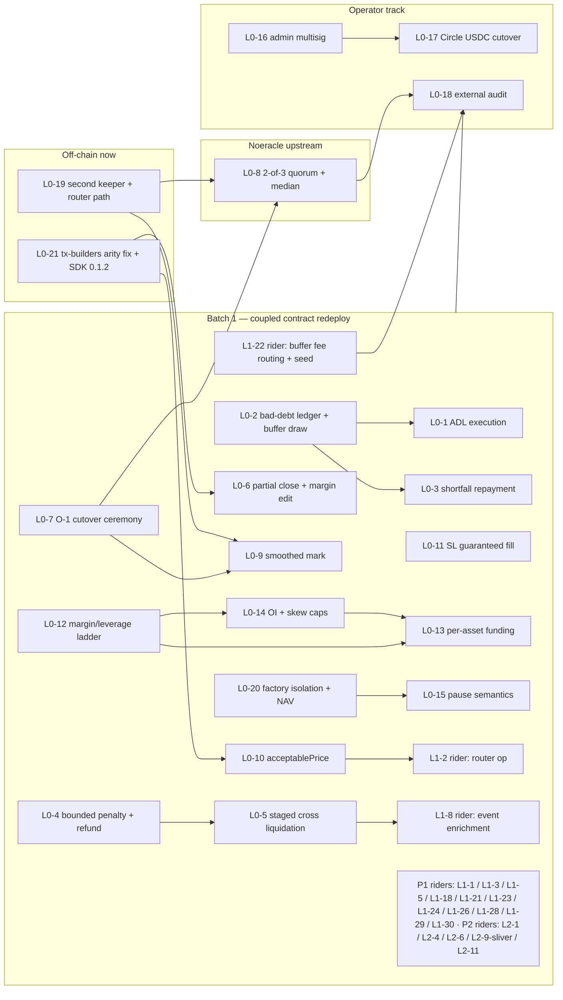

# P0 — Mainnet Gates (Build Plan)

> **EXECUTION STATUS (2026-07-21):** Phase 0 + Waves 1-5 contract items are DONE **including L1-18 referral** (5d7dc4c + 1e779d9) **and the Noeracle L0-8/L0-9 consumption** (shim twap + market smoothed mark 63471ea, router quorum relay bcd1ecf, off-chain dual-ABI d23be68/0a31536/3e3b7bc — see the 2026-07-21 checkpoint blockquote). 387 workspace contract tests; WASM all < 131 KB; everything self-detects the pre-Batch-1 chain and stays inert. Still ahead: the Batch-1 FRESH deploy + operator steps (L0-7 runbook), Noeracle-side fresh deploy, per-item leftovers in the checkpoint blockquotes. Per-item status lives in the tracking table below.

> Source analysis: docs/LIGHTER-GAP-2026-07.md (2026-07-17) · Companion files: docs/plans/P0-mainnet-gates.md, P1-launch-parity.md, P2-differentiators.md · Cross-refs cite TASKS.md / docs/AUDIT-2026-06.md / KNOWN_ISSUES.md — those ledgers are not modified.

## How to track

- Status values: `todo | in-progress | done | dropped`. Edit status inline in BOTH the tracking table and the item header — keep them in agreement.
- IDs are stable — never renumber.
- Baseline tags PROD / STAGING / CODE-COMPLETE are used as defined in the gap doc preamble (PROD = the 2026-07-06 production stack; STAGING = the 2026-07-10 staging stack; CODE-COMPLETE = built and tested, deployed nowhere).

## Execution decisions (locked 2026-07-17)

- **Cadence:** contract work lands on staging in five serialized waves — 1 solvency spine (L0-3 → L0-4 → L0-5+L1-8 → L0-2 → L0-1), 2 risk config (L0-12 → L0-14 → L0-13+L1-29), 3 execution safety (L0-6 → L0-10 → L0-11 → L1-3 → L1-5), 4 pause/custody + factory (L0-15 → L0-20 → L1-30), 5 riders (L1-18, L1-21/22/23 fee-path trio as one merge, L1-24, L1-26, L1-28, L1-20 constants, then P2 riders last) — with a **checkpoint review at each wave boundary** before the next starts. Per-item conventional commits; cargo test + WASM size ledger after every merge.
- **Trim order at the freeze** (WASM/audit pressure): P2 riders first (L2-1 → L2-4/L2-6 → L2-9 sliver), then L1-29, then optional views (L1-12/L1-13 slivers). Core solvency/oracle/config items are never trim candidates.
- **Noeracle upstream (L0-8/L0-9):** built by Claude in `/Users/yahya/Desktop/Stellar/Noeracle`, reviewed + deployed by Yahya; runs parallel with Wave 1. See the scout notes in the Noeracle manifest section below.
- **Phase 0 (before Wave 1):** plan docs committed · L0-21 shipped (off-chain, production-broken) · coordination registries locked (below) · operator drafts delivered (L0-18 audit email, L0-16 multisig staging drill).

> **Wave 1 checkpoint (2026-07-17).** The solvency spine's CONTRACT surface is done and committed on staging in five per-item commits (L0-3 → L0-4 → L0-5 → L0-2 → L0-1): shortfall claims + amortizer, bounded-penalty liquidation with residual refunds, staged cross liquidation, bad-debt ledger + buffer draw + cross account-funds cap, and ADL (trigger + permissionless adl_close + shortfall auto-flip + router adl_with_price). 238 workspace contract tests green (+42 this wave); market.wasm 79,994 B OPTIMIZED vs the 131,072 B limit (~51 KB headroom). Noeracle L0-8/L0-9 contract side is parallel-complete on that repo's `feat/l08-l09-quorum-ring` (40 tests, ~13 KB optimized) awaiting founder review.
>
> **Off-chain sweep DONE (2026-07-17, commits 18fb457 + a20421d):** indexer decoders + types for all six new events, migration `003_bad_debt` + idempotent projection, `adl_executed` position-removal + `kind:adl` trade + bus fan-out, topics registered (inert until the redeploy emits them); `/v1/trades` `kind:adl`; `/v1/markets/stats` `solvency` object (cumulative bad debt covered vs LP-absorbed, market-scoped); keeper #83 grace-window skips (isolated + cross) + `adlRank` parity helper; `TradeKind` += `cross_liquidation`/`adl` (canonical + vendored). 46 indexer + 114 api tests green, keeper tsc clean + smoke 28/28, sdk-ts 39 green incl. the vendored-type drift guard.
>
> **Wave 2 checkpoint (2026-07-18).** Per-market risk config done and committed on staging in three items (L0-12 → L0-14 → L0-13). **L0-12** per-market margin/leverage ladder: `AssetRiskParams` in market storage, epoch-gated (unset = legacy global, tests unchanged; stamped = per-asset with fail-closed #88 on unconfigured assets + grandfathered legacy MM for pre-epoch positions), 25× enable = one setter call. **L0-14** absolute OI caps + net-skew cap (#89): `reserve_for_position` gains net-skew args (market+vault ABI break), skew-reducing opens always pass. **L0-13** per-asset funding: `FundingState(Symbol)` replaces the global index, SIP-279 velocity (36%/day) clamped per class, time-weighted skew with the M-7 retroactive-window killed two ways, `migrate_funding` preserves pending by delta-continuity. 266 workspace tests green (+28 this wave); market.wasm 88,323 B optimized vs 131,072 (~43 KB headroom). **L1-29 (utilization borrow fee) deferred** to its own rider — separable P1, avoids compounding the funding rewrite's blast radius; per the spec's own trim guidance. Off-chain halves (keeper per-asset MM parity, api specs/caps endpoints, web PAIR_RISK + slider) pending the same integration pass as Wave 1's.
>
> **Wave 3 checkpoint (2026-07-18).** Execution-safety wave done and committed on staging in five items (L0-6 → L0-10 → L0-11 → L1-5 → L1-3). **L0-6** partial close + add/remove collateral + partial reduce-only (isolated), `settle_partial_close` shrinks-in-place + `position_reduced` event, IM-floor on removal, #27 PositionTooSmall dust guard; router `close_partial_with_price`. **L0-10** GMX-style acceptable-price bound on market open/close (#87), `check_close_bound`, 0 = unbounded — router threading deferred to L0-8's PriceAttestation restructure (10-param limit). **L0-11** stop-loss guaranteed fill: `enforce_slippage_band` gates the slippage-cancel branch so SL/trailing/TP-market fill at oracle price while LimitEntry/StopLimit-phase-1/take-limit keep band-and-cancel — no event/ABI change. **L1-5** account initial-margin band: withdraw + cross-open gates move MM→IM via price-free `calculate_cross_used_margin` (Σ size/leverage); MM stays solely the liq trigger, leaving the IM→MM de-risk band; #77 reused; L0-5 staged-liq tests re-funded with a fee buffer + compensated drop to preserve bands. **L1-3** auto-net at open: `net_against_opposites` full-closes opposite same-asset/mode legs at the strict entry price then opens the scaled remainder (fee on R only, OI released before reserve); #91 NetsToZero on G≥S / >MAX_NET_LEGS(4) / sub-min remainder; v1 has NO partial leg (a proceed always has G<S ⇒ all legs fully consumed), so the spec's partial-leg + cross-partial-settlement tasks are provably N/A at open — recorded, not skipped. 297 workspace contract tests green (+31 this wave, 135 market); market.wasm 95,950 B optimized vs 131,072 (~35 KB headroom). Error codes 83-89 + 91 back-propagated into web + api decoders (closing the earlier gap). Off-chain halves (tx-builders/api/sdk for L0-6 add/remove-collateral + partial-close + acceptable-price, web margin modal + close-size slider + opposite-position/netting UX, #91 friendly copy) pending the same integration pass as Waves 1-2.


> **Wave 4 checkpoint (2026-07-18).** The two P0 gates are done and committed on staging — led with **L0-20** to close L0-15's dependency. **L0-20** vault_factory fund isolation (V-1) + full-NAV valuation (V-4): deleted the cross-vault-draining sync_total_usdc → per-op measured balance deltas + PositionVault/OrderVault ownership maps gating leader_close/cancel with #16; market-side `get_position_equity` + executed-order position_id writeback for trustless reconcile; full_nav (fail-closed #18) reprices deposit/withdraw/claim with a #17 liquid cap; reconcile_order (permissionless); create_vault allowlist + max-vaults (#20) + the factory's first upgrade(). Also fixed latent open/close arity bugs vs the L0-10 market. errors 16-20 (spec text #84/#16 was stale). **L0-15** two-tier pause: PauseState (mode, since) replaces the bool — mode 1 halt-open is EXIT-ONLY (opens/#4 blocked; close, cross deposit-to-defend, stops, liquidate all work), mode 2 full-freeze (#90 Frozen, cancel-only) auto-degrades to mode 1 after 72h; require_can_increase_risk/require_can_reduce_risk across 12 market sites + liquidate/apply_funding/execute_order branches. Vault: withdraw exit-only + emergency_withdraw DELETED → 48h timelocked recovery (fixed pre-declared destination). Factory: exit-only withdraw; the interim #21 PositionsOpen block is SUPERSEDED by L0-20's #17 (partial exits stay allowed). 321 workspace contract tests green (+24 this wave; 141 market / 34 vault / 49 factory); market.wasm 98,790 B, vault 53,555 B, vault_factory 46,639 B — all well under 131,072. Codes 16-20 (factory) + #90 (market) propagated to web + api decoders. **L1-30** (P1 leader protective-order proxies + TIF passthrough) is the remaining Wave-4 rider — its keeper-executed-close reconciliation is the subtle part, deferred to a focused pass. Off-chain halves (indexer factory + pause decoders, api navFull + pause-state, web full-NAV + pause banner + reconcile/recovery UX, keeper reconcile + #90 skip, INCIDENT_RUNBOOK §3) pending the integration sweep.
> **Integration sweep checkpoint (2026-07-20).** The deferred keeper + web + gateway halves are BUILT (fixture-tested, live-verify at Batch-1; 12 commits on staging 6677809…4575b6b): keeper AdlManager phase + factory reconcile duty + per-asset mm parity + L0-19 router execution path w/ dead-man + Noeracle boot guard (66/66 smoke); web capability-gated Batch-1 UI (partial close + margin modal, pause banner, full-NAV, netting notice, per-asset leverage caps, cross protective-order ungate) + notification inbox + shortfall claim card + first web vitest; gateway /v1/adl/queue + adlQuintile merge + /v1/account/shortfall + /v1/account/volume web seeding (120 api tests). CONTRACTS: **L1-1 lift-#80 DONE** (settle_cross_close keeper-fee/skip-order legs, reduce-only cross full-cover targets, conservation property test) + **get_trader_fee_info view RESTORED**; 359 workspace tests, market.wasm 104,710 B optimized. Everything self-detects the pre-Batch-1 chain and stays inert until the flip. Remaining before Batch-1: L1-18 referral, Noeracle L0-8/9 consumption, L0-9 smoothed mark; leftovers per item: L1-9/L1-10 WS client + docs waterfall page, api navFull/pause-state fields, keeper v2-copy port (operator-gated), L0-19 ops/api halves (runbook: docs/plans/operator/L0-7-prod-keeper-noeracle-repoint.md).
>
> **L0-8/L0-9 consumption checkpoint (2026-07-21).** The Noether-side consumption of the hardened Noeracle (quorum + ring/TWAP, upstream branch `feat/l08-l09-quorum-ring`) is CODE DONE across every layer, all dual-ABI and inert against the deployed chain. **Contracts** (63471ea + bcd1ecf + fb4e087): shim `twap(asset, records)` (mode-0 upstream mean + newest-ring timestamp, mode-1 SEP-40 vendor); market L0-9 "trigger on smoothed, settle on fresh" — `get_smoothed_price` (kill switch `twap_records=0`, age-bound), #86 LiquidationNotConfirmed gate in `liquidate` + `liquidate_cross_account` (spot-equity>0 only — bankrupt never waits), smoothed trigger eval in `execute_order` (SL/trailing/TP-market), settlement always fresh; router L0-8 — `PriceAttestation.prices` per-publisher vec, all six `*_with_price` entrypoints take a struct tail + thread L0-10 `acceptable_price`, `refresh_price` forwards `Vec<PublisherRound>` to `update_quorum_ed25519_persistent` (alignment #5, allowlist + O-7 band on every price), guards judge the bundle MEDIAN, per-asset `StorkStrictAssets` fail-closed list, `sep40_guard` Reflector third source (fail-open missing/stale/disabled, #81 live divergence). 387 workspace tests (38 router, +9); market 120,768 B pre-optimize. **Off-chain** (d23be68 tx-builders v2-only [no live consumers], 0a31536 web, 3e3b7bc keeper): web branches on `marketHasBatch1Features()` (router struct path + direct/cross acceptable_price appends); keeper probes the router generation once via `get_reflector_config` (same fn names, different args — missing-export detection can't tell) and picks v1/v2 builders; keeper L0-9 interim = `KEEPER_TRIGGER_CONFIRM_READS` two-strike (default 2, locally-bankrupt skips, iso+cross via `crossEquity`) + `KEEPER_SPIKE_ALERT_PCT` alert-only spike flag (default 1.5%, 5-min throttle); 75 smoke assertions. Keeper direct publish stays on `update_batch_ed25519_persistent` (retained upstream; valid at quorum=1). Remaining for L0-8 closure: Noeracle fresh deploy + repoint (operator, runbook L0-7), vendor-guard arming (set_stork_strict_assets, set_reflector_config — THE mainnet posture per the 2026-07-21 founder descope; quorum stays 1, multi-key publish loop OFF the roadmap), OrderPanel acceptable-price UI (done later same day, b3f5754).
>
> **Batch-1 prep checkpoint (2026-07-21, second block).** The pre-ceremony tail is CLOSED: indexer Batch-1 decoders (paused mode/since, pause_degraded, asset_halt_set, collateral_added/removed, factory leader-order/protective/reconcile topics — 1babfa6), the L0-10 OrderPanel acceptable-price UI + 1% close bounds (b3f5754), api `market.pauseState` on /v1/health + vault `navFull` (b7a3e91), and the **Batch-1 ceremony tooling** (7675341): `scripts/deploy_batch1.sh staging|prod` (resumable; full 28-field MarketConfig; ladder ×14 at the im-400/mm-200 floor — **mm 1%→2%, parity impossible by L0-12 design**; guard arming staging-armed/prod-disabled; NOE pre-mint; deposit-based funding) + `docs/plans/operator/BATCH1-DEPLOY.md`. Noeracle repo (branch): batch-publish path closes at quorum>1 (fcec0ee), founder review brief `REVIEW-L08-L09.md`, deploy script verifies the quorum export surface (9375910). Remaining = the D2 founder review, then the two ceremonies (D3 staging → D4 prod per the runbook).
>
> **Deferred to the live-chain integration pass (needs a running stack to build/verify, not silently dropped):** the keeper **AdlManager cycle phase** (local trigger mirror off the CycleSnapshot + ranked `adl_close` walk while `is_adl_active` — the `adlRank` helper + #83 skips are the landed groundwork); the gateway **ADL-queue service** (`/v1/adl/queue` + per-position `adlQuintile` via bulk `getLedgerEntries` Position reads — the projection lacks collateral/leverage, so it needs live ledger reads); **`GET /v1/account/shortfall`** + the portfolio claim card (chain reads of the L0-3 views); on-chain **`insuranceBuffer`** on stats (contractReader + vault addr wiring into StatsService); SDK **`/v1/trades` + funding/shortfall wrappers** (this is L1-14's scope); web liquidation/ADL/shortfall copy + toasts (L1-10). Item statuses stay `in-progress` until these land; table rows carry the interim status.

## Tracking table

| ID | Title | Effort | Lane | Ships in | Needs | Status |
|----|-------|--------|------|----------|-------|--------|
| L0-1 | ADL execution mechanism (pool-model auto-deleveraging) | L | mixed | batch-1-redeploy | L0-2 | in-progress — contracts+tests done 2026-07-17 (commit 06b6a05-ish, see git log); off-chain halves pending sweep |
| L0-2 | Bad-debt ledger + insurance-buffer draw at liquidation | M | mixed | batch-1-redeploy | — | in-progress — contracts+tests done 2026-07-17; off-chain halves pending sweep |
| L0-3 | Shortfall repayment path (claimable liabilities) | M | mixed | batch-1-redeploy | L0-2 | in-progress — contracts+tests done 2026-07-17; off-chain halves pending sweep |
| L0-4 | Non-confiscatory liquidation (bounded penalty + residual refund) | M | contracts | batch-1-redeploy | — | in-progress — contracts+tests done 2026-07-17; off-chain halves pending sweep |
| L0-5 | Staged cross-margin liquidation (tranches + close-out tier) | M | mixed | batch-1-redeploy | L0-4 | in-progress — contracts+tests done 2026-07-17; off-chain halves pending sweep |
| L0-6 | Partial close + add/remove margin on open positions (PROMOTED to P0, founder decision 2026-07-17) | L | mixed | batch-1-redeploy | L0-21 | in-progress — contracts+tests done 2026-07-18 (Wave 3, commit 5b93beb); off-chain (tx-builders/api/sdk/web slider+modal) pending sweep |
| L0-7 | O-1 production cutover to authenticated Noeracle writes (operator) | S | operator | batch-1-redeploy | — | **DONE 2026-07-21** — Batch-1 ceremonies executed on BOTH stacks (staging ~02-05Z, prod ~05-06Z): fresh quorum Noeracle per env (staging CB2D6BDZ…, prod CBTO5K2N…; legacy unauthenticated CAYIP67… retired from serving), prod keeper REPLACED with noether-keeper-t3:v3 (keeper-prod-1), api v6/indexer v5/web images rolled, on-chain smoke green both stacks (router quorum relay, #87, partial close, pause drill). Re-faucet = Yahya |
| L0-8 | Multi-source price integrity: multi-VENDOR guards + dormant publisher-quorum capability (founder descope 2026-07-21) | L | mixed | noeracle-upstream | L0-7, L0-19 | in-progress — Noether consumption CODE DONE 2026-07-21 (router quorum relay bcd1ecf + tx-builders d23be68 + web 0a31536 + keeper 3e3b7bc, all dual-ABI/inert pre-Batch-1); **DESCOPED by founder decision 2026-07-21: multi-key publish loop + quorum>1 arming are OFF the roadmap** — quorum capability stays in-contract, dormant at 1 (audit answer + future optionality; fcec0ee closes the batch path if ever raised). **relay_stork wiring DONE 2026-07-21** (893bd25 + keeper-t3:v4 on BOTH apps): Fast WS → dedicated-key relay loop (40s) → on-chain verify; validated end-to-end (live payload accepted, ≤0.07% vs Noeracle); **staging strict [BTC,ETH] RE-ARMED + inverse probe green**; prod guard ENABLED fail-open (relays landing) — prod strict awaits founder go after soak. Cadence fix rode along (~150s → ~40s pushes). Remaining: prod strict arming (founder go), Reflector third source (needs contract address), publisher-key opsec runbook. XLM stays non-strict (no Fast feed) |
| L0-9 | Smoothed liquidation/trigger mark (TWAP/median eligibility, fresh settlement) | L | mixed | batch-1-redeploy | L0-7, L0-19 | in-progress — CODE DONE 2026-07-21: market #86 gate + shim twap (63471ea), keeper two-strike + spike alert interim (3e3b7bc); live-verify at Batch-1 |
| L0-10 | acceptablePrice bound on market open/close | M | mixed | batch-1-redeploy | L0-21 | in-progress — market side done 2026-07-18 (Wave 3, commit ea35db9, #87); router threading DONE 2026-07-21 in the L0-8 restructure (bcd1ecf); web/tx-builders pass the bound (0 = unbounded) — OrderPanel slippage-bound UI still open |
| L0-11 | Stop-loss guaranteed execution (kill silent cancel-on-slippage-breach) | S | contracts | batch-1-redeploy | — | done — 2026-07-18 (Wave 3, commit cf52c49); enforce_slippage_band, no ABI/event change |
| L0-12 | Per-market margin/leverage ladder (wire the tested risk config) | M | mixed | batch-1-redeploy | — | in-progress — contracts+tests done 2026-07-18; off-chain (keeper parity, api specs) pending |
| L0-13 | Per-asset funding + real magnitude with clamps (SIP-279) | L | mixed | batch-1-redeploy | L0-12, L0-14 | in-progress — contracts+tests done 2026-07-18; off-chain (keeper parity, api specs) pending |
| L0-14 | Absolute per-market OI caps + net-skew cap | S | mixed | batch-1-redeploy | L0-12 | in-progress — contracts+tests done 2026-07-18; off-chain (keeper parity, api specs) pending |
| L0-15 | Pause & emergency semantics (exit-only pause, trader symmetry, timelocked recovery) | M | contracts | batch-1-redeploy | L0-20 | in-progress — contracts+tests done 2026-07-18 (Wave 4, commits 199a5bc market two-tier pause/#90, a282cbb vault exit-only+recovery, 49e177c factory exit-only, f065d38 err-map; 11 tests). #21 interlock superseded by L0-20 #17. Off-chain (indexer paused-payload/pause_degraded, api pause-state, web banner+RiskDisclosure, keeper #90 skip, RUNBOOK §3) pending sweep |
| L0-16 | Admin multisig + key hygiene (SEC-3 ceremony) (operator) | M | operator | operator-track | — | todo |
| L0-17 | Circle USDC collateral cutover (operator/config) | S | mixed | operator-track | L0-16 | todo |
| L0-18 | External audit, published (operator/process — the mainnet critical path) | L | operator | operator-track | L0-1..L0-6, L0-8..L0-15, L0-20, L1-1..L1-3, L1-5, L1-8, L1-18, L1-20..L1-24, L1-26, L1-28..L1-30, L2-1, L2-4, L2-6, L2-11 | todo |
| L0-19 | Second keeper + router execution path (liveness) | M | mixed | offchain-now | — | todo |
| L0-20 | vault_factory fund isolation (V-1) + NAV valuation (V-4) — or hard launch gate | M | mixed | batch-1-redeploy | — | in-progress — Path A contracts+tests done 2026-07-18 (Wave 4, commits 5f74a96 market, 9e1fb73 factory, 49aaaa9 web err-map; 49 factory tests, errors 16-20, upgrade() added); off-chain (indexer/api/keeper/ops) pending sweep |
| L0-21 | tx-builders arity fix + SDK republish (ships NOW, no redeploy needed) | S | offchain | offchain-now | — | done (2026-07-17, code + CI guard; npm/PyPI 0.1.2 publish = operator step, tracked in L1-14) |

## Redeploy Batch 1 manifest

Batch 1 is the ONE coupled contract redeploy: market + vault + vault_factory (fresh deploy) + referral (fresh deploy, L1-18) + noether_router + noeracle_shim promote together via the blue-green ceremony (L0-7's runbook is the prod leg). Everything below is contract surface that must land in this batch, verify on staging, and then freeze for audit — including the P1 riders (P1 §Batch-1 riders) and the P2 rows tagged batch-1-redeploy (L2-1, L2-4, L2-6, L2-11, L2-9's isolated_only sliver); those sections extend this manifest and freeze with it.

**contracts/market** — shared budget: 70,044 B optimized today vs the 131,072 B (128 KB) limit; keep ONE size ledger and re-measure per merged item. Error enum at 42 of the ~48-variant ceiling (errors.rs:5).

- L0-1 — `DataKey::AdlActive(Symbol)`; `check_adl_trigger` / `adl_close` / `is_adl_active`; `flag_adl_on_shortfall` hooks after every `settle_with_vault`; `settle_cross_close` refactored out of `close_position_cross`; opens gated with #82 while ADL active; config `adl_trigger_ratio_bps` / `adl_clear_ratio_bps` / `adl_compensation_bps`; events `adl_executed` / `adl_triggered` / `adl_cleared`; errors #84 AdlNotActive / #85 AdlNotEligible.
- L0-2 — `record_bad_debt` helper hooked at all three bankrupt settle paths; cross-liq loss-transfer cap fixed to account funds; event `bad_debt_recorded`.
- L0-3 — `settle_with_vault(env, vault, trader, pnl)`: trader threaded through all three call sites (ABI-coupled with the vault `settle_pnl` change; land FIRST inside the batch).
- L0-4 — config `liquidation_penalty_bps` / `penalty_keeper_share_bps` (and `insurance_buffer_share_bps` set to 0 at migration); isolated full-liq penalty/refund rewrite; partial-tranche reward basis swap; cross residual stays on `CrossMarginBalance`; event `liq_refund`.
- L0-5 — `DataKey::CrossPartialLiqTs(Address)`; config `cross_liq_restore_target_bps` / `cross_close_out_bps`; `close_cross_leg` extraction; three-branch staged `liquidate_cross_account` emitting per-leg `position_liquidated` + the `cross_liq` summary.
- L0-6 — `close_position_partial` / `add_collateral` / `remove_collateral`; reduce-only partial rework; error #27 PositionTooSmall; events `position_reduced` / `collateral_added` / `collateral_removed`.
- L0-9 — config `twap_records` / `twap_max_age_secs`; `get_smoothed_price` (try_invoke, never traps); smoothed confirmation gate in `liquidate` + `liquidate_cross_account`; smoothed close-trigger eval in `execute_order`; error LiquidationNotConfirmed.
- L0-10 — `acceptable_price: i128` on `open_position` / `open_position_cross` / `close_position` / `close_position_cross`; error #84 AcceptablePriceExceeded.
- L0-11 — `enforce_slippage_band` helper: SL / trailing / TP-market become fill-guaranteed; band-and-cancel retained only for LimitEntry / StopLimit phase-1 / take-limit.
- L0-12 — `DataKey::AssetRisk(Symbol)` + `RiskEpochTs`; `set_asset_risk` / `get_asset_risk`; `mm_bps_for` grandfather helper; per-asset enforcement at every consumption site; error #85 AssetRiskNotConfigured; event `asset_risk_set`.
- L0-13 — `DataKey::FundingState(Symbol)` + `SkewIntegral(Symbol)`; per-asset PAIR_TAGS `apply_funding` rewrite (velocity + rate clamp + 1h dt cap + time-weighted skew); `migrate_funding`; `funding_applied` becomes a 4-tuple (asset first); nine settlement/snapshot sites re-pointed.
- L0-14 — `reserve_with_vault` computes and passes `net_skew_before` / `net_skew_after`; error #84 SkewCapExceeded.
- L0-15 — two-tier `PauseState` (halt-open / full-freeze, 72h auto-degrade); `require_can_increase_risk` / `require_can_reduce_risk` across all gates incl. liquidations and `apply_funding`; error #84 Frozen; events `paused(mode, since)` / `unpaused` / `pause_degraded`.
- L0-20 — executed entry orders persist `order.position_id`; new view `get_position_equity`.
- P1 riders — L1-1 settle_cross_close + #80-gate removal; L1-3 netting phase in `do_open` + error #85 NetsToZero; L1-5 IM gate (`calculate_cross_used_margin`); L1-8 event enrichment; L1-18 referral hook (`set_referral` / `apply_referral` / `get_trader_volume` view + `finalize_open` payout param); L1-20 slice: trading.rs mainnet tier thresholds ($1M/$5M/$25M, rates unchanged); L1-21 fee restructure (keeper fee into MarketConfig, maker ≤ taker); L1-22 `finalize_open` rewire (transfer cut → vault + `route_protocol_fee`); L1-23 MarketConfig `min_liq_bounty` + `pay_bounty` topup at both liquidation sites; L1-24 per-asset halt (`AssetHalted` + `set_asset_halt` + error #85); L1-26 MarketConfig `lenient_clamp_bps` + `get_oracle_price` lenient clamp; L1-29 utilization borrow fee (second per-asset lazy index, rides L0-13's machinery); L1-11/L1-6 fallback view `get_funding_state()` ONLY if the ledger-key fixture fails.
- L2-1 (P2 rider) — `DataKey::AgentGrant(trader, agent)` + `authorize_agent`/`revoke_agent` + `agent_open_cross` (pool-funded only) / `agent_close` / `agent_cancel_orders` + events `agent_authorized`/`agent_revoked` + error #84 AgentUnauthorized.
- L2-4 (P2 rider) — `Order.expires_at` + placement arity bumps (10→11, 11→12) + expiry branch in `execute_order` + permissionless `cancel_expired` (error #85 OrderNotExpired) + `cancel_orders(Vec<u64>)` (25-id cap).
- L2-6 (P2 rider) — inline same-tx IOC fill in `place_limit_order` (taker fee, keeper_fee=0) + reject IOC on `place_stop_limit_order`.
- L2-9 sliver (decide at freeze) — `MarketConfig.isolated_only: bool` + rejects in `open_position_cross`/`deposit_cross_margin`.

Coordinate ONCE before any of the above merges: (a) the final MarketConfig shape — one agreed JSON, ONE migrate_config call (the config-shape trap bricks `get_config` between upgrade and migrate_config); fields added by L0-1 (adl_trigger/clear/compensation bps), L0-4 (liquidation_penalty_bps, penalty_keeper_share_bps), L0-5 (cross_liq_restore_target_bps, cross_close_out_bps), L0-9 (twap_records, twap_max_age_secs), L1-21 (keeper_fee_base, keeper_fee_deci_bps), L1-23 (min_liq_bounty), L1-26 (lenient_clamp_bps), L1-29 (borrow dual-slope params), L2-9 (isolated_only) — plus L0-12/L0-13's ladder/funding fields if folded into MarketConfig rather than AssetRisk/FundingState storage. This list is the SINGLE cross-file census; P1:§Batch-1 integration checkpoints points here. (b) error-code numbers — **CORRECTED 2026-07-18: the ceiling is REAL, not fiction.** `#[contracterror]` panics `LengthExceedsMax` past ~50 VARIANTS (hit at 52 during Wave 5); the enum was AT the cap. Dead LiquidationFailed=51 + SlippageExceeded=63 were removed to fit #92/#93. Adding any future code requires removing a dead one first. (Earlier note wrongly claimed:) The "~48-variant" figure is only a prose comment at errors.rs:5; nothing enforces it — codes are plain u32, all decode paths verified assumption-free (web contractErrors.ts regex `#(\d+)` any width, plain Record lookup; api scErrorContractCode raw u32 + object map with UnknownContractError fallback; zero arithmetic/digit-width/bitmask assumptions on codes anywhere in api/indexer/web). All 14 new variants fit with NO consolidation. **FINAL NoetherError assignments (locked — never renumber):** #27 PositionTooSmall (L0-6, fills the 26-29 gap) · #84 AdlNotActive (L0-1) · #85 AdlNotEligible (L0-1) · #86 LiquidationNotConfirmed (L0-9) · #87 AcceptablePriceExceeded (L0-10) · #88 AssetRiskNotConfigured (L0-12) · #89 SkewCapExceeded (L0-14) · #90 Frozen (L0-15) · #91 NetsToZero (L1-3) · #92 AssetHalted (L1-24) · #93 WithdrawCooldownActive (L1-28) · #94 AgentUnauthorized (L2-1) · #95 OrderNotExpired (L2-4) · #96 NoeSupplyExhausted (L2-11). **FINAL FactoryError assignments** (current max = 15, contiguous): 16-20 reserved for L0-20's five (as specced there) · 21 PositionsOpen (L0-15 — moved off the 16 collision). Wave-1 chore riding the first errors.rs touch: replace the false ceiling comment at errors.rs:5 with "codes are u32; keep numbers stable forever; next free block starts at #97". Propagation rule per new code: same merge updates web/lib/utils/contractErrors.ts AND api/src/services/contractErrors.ts NOETHER_ERROR_NAMES (note: the api map is missing existing #43 DepositCapExceeded today — fixed opportunistically in the L0-21 change; #83 mapping is L1-10's). (c) indexer migration numbers — migration ids are the numeric filename prefix, PK-tracked in schema_versions (indexer/src/migrations.ts:41-100; verified 2026-07-17). Exact duplicate behavior: a prefix already applied in a PRIOR run is silently skipped (`already.has(id) → continue`, keyed on id only — editing a file's body under a kept prefix means the new SQL never runs); two unapplied files sharing a prefix in the SAME run hit the id PRIMARY KEY → unique violation → rollback + abort (first file's commit persists). Either way: unique numbers, always. **LOCKED registry:** 003_bad_debt.sql (L0-2) · 004_lp_vault.sql (L1-19) · 005_orders_projection.sql (L1-9) · 006_funding_rates.sql (L1-11) · 007_points.sql (L1-17). Ship in any order (numbers ≠ landing order; the runner sorts lexically and skips holes).

**contracts/vault** — 37,458 B baseline, ample headroom.

- L0-1 — `pay_from_buffer(to, amount)` (market-only auth); event `buffer_paid`.
- L0-2 — `draw_buffer(amount)` accounting-only draw (buffer → total_usdc); `CumBadDebtCovered` / `CumBadDebtLpAbsorbed` ledgers + views; event `buffer_drawn`; the shared `spendable_buffer()` helper used by ALL buffer spenders.
- L0-3 — `settle_pnl(env, trader, pnl)` signature change (coupled ABI break with the market); `ShortfallOwed(Address)` registry + `Shortfall` becomes outstanding total; `ShortfallReserve` bucket + `ShortfallInflowBps` routing in `fund_buffer` / `seed_buffer`; `claim_shortfall`; LP-exit floor extended to `ReservedPayout + ShortfallReserve`; `payout_shortfall` SHAPE CHANGE (trader prepended) + new `shortfall_repaid`; `buffer_funded` gains `to_reserve`.
- L0-14 — `AssetCapAbs(Symbol)` / `SkewCapBps(Symbol)`; `set_asset_cap_abs` / `set_skew_cap` / `get_asset_caps`; `reserve_for_position` gains two skew args + effective-cap min() + skew gate.
- L0-15 — withdraw becomes pause-exempt (exit-only pause); `emergency_withdraw` DELETED, replaced by `init_recovery` / `propose_recovery` / `execute_recovery` / `cancel_recovery` (48h timelock, fixed pre-declared destination).
- L1-22 (P1 rider) — `BufferTargetBps` + `set_buffer_target`/`get_buffer_target_bps` + `get_reserve_cap`/`get_asset_cap` views + `route_protocol_fee(amount, overflow_to)` (market-only) + event `protocol_fee_routed`.
- L1-23 (P1 rider) — `pay_bounty(keeper, amount)` (market-only, capped min(amount, buffer, balance)) + event `bounty_paid`.
- L1-28 (P1 rider) — `LastDepositTs`/`WithdrawCooldownSecs` + withdraw cooldown gate (error #84 WithdrawCooldownActive).
- L1-13 (optional P1 rider, decide at freeze) — `get_reserve_cap_bps()`/`get_asset_cap_bps(asset)` views.
- L2-11 (P2 rider) — deposit-side NOE-exhaustion error NoeSupplyExhausted = #86 (withdraw paths keep #40).

**contracts/vault_factory** — fresh deploy (no upgrade hook exists today); gains `upgrade()` in this batch.

- L0-20 — delete `sync_total_usdc`; measured-delta accounting around every market invoke; `PositionVault` / `OrderVault` / `VaultPositions` / `VaultOrders` ownership maps; `reconcile_order`; full-NAV share pricing for deposit/withdraw/claim; `LiquidityDeployed` withdraw gate; leader allowlist + `MaxActiveVaults`; FactoryError 16-20; event `order_reconciled`.
- L0-15 — withdraw drops the paused early-return + gains the open-position interlock (`PositionsOpen`); deposit and leader ops stay pause-gated; `upgrade(new_wasm_hash)`. NOTE: L0-15 assigns FactoryError 16 to PositionsOpen while L0-20 assigns 16 to NotVaultPosition — allocate the FactoryError range once when both land.
- L1-30 (P1 rider) — leader protective-order proxies: `leader_set_stop_loss` / `leader_set_take_profit` / `leader_place_trailing_stop` / `leader_place_stop_limit` (mirroring the `require_leader_call` + `authorize_as_current_contract` + post-call sync/check_invariant pattern) + `time_in_force` pass-through on `leader_place_limit_order` (currently hardcoded 0=GTC at lib.rs:408).

**contracts/noether_router**

- L0-1 — `adl_with_price` (relay attestation → `adl_close` in one tx).
- L0-6 — `close_partial_with_price`.
- L0-8 — `StorkStrictAssets` + `set_stork_strict_assets` (per-asset fail-closed strictness); `ReflectorConfig` + `sep40_guard`; attestation tail of all five `*_with_price` entrypoints → `Vec<PublisherRound>` (ONE coordinated ABI update with L0-10's arity bump).
- L0-10 — `acceptable_price` threaded through `open_with_price` / `close_with_price`.
- L0-19 (rider) — `open_cross_with_price` / `close_cross_with_price` mirroring lib.rs:172-225.
- L1-2 (P1 rider) — router op `open_with_price_and_tpsl`.
- L1-24 (P1 rider) — `DataKey::PriceBand(Symbol)` + `set_price_band`/`get_price_band`; `price_bounds()` = storage override → compiled BANDS fallback.
- L1-12 (optional P1 rider, decide at freeze) — `get_price_bounds(asset)` view.
- L2-1 (P2 rider) — `agent_open_with_price` passthrough (relay attestation → `market.agent_open_cross`).

**contracts/noeracle_shim** — in-place `upgrade()`, address unchanged.

- L0-9 — `twap(asset, records)` view: mode-0 Noeracle passthrough (tag derivation + rescale), mode-1 SEP-40 passthrough.

**Noeracle repo** — external dependency, inside the L0-18 audit scope.

- L0-8 — publisher set grows to 3 keys, `set_quorum` (default 2), `update_quorum_ed25519_persistent` with per-feed median storage, `publisher_prices` view. *(2026-07-21: quorum entrypoint + set_quorum BUILT, default 1; the 3-key growth is DESCOPED — see the L0-8 section banner.)*
- L0-9 — per-feed ring buffer (RING_CAP=32) + `prices(feed, records)` / `twap(feed, records)` views.

> **Scout notes (2026-07-17, repo at `/Users/yahya/Desktop/Stellar/Noeracle`, main @ 75fe297, clean):** L0-8/L0-9 are GREENFIELD there — no quorum/threshold param exists (single instance key `Publishers: Vec<BytesN<32>>`, one-pubkey batch entrypoints, `is_publisher` linear scan), no ring/history (latest-only `PriceEntry{price, timestamp, round_id}` per feed per tier — no conf field), and NO SEP-40 surface at all (the shim is Noether-side; only `get_price`/`get_price_pers` exist). `oracle_v0` has **no `upgrade()` entrypoint** — every change is a fresh deploy + full repoint (shim `set_noeracle_oracle`, router `set_noeracle`, keeper env, contracts.json — checklist already in `scripts/deploy_oracle_v0.sh:124-128`); ADD `upgrade()` in the L0-8 change so this is the last forced redeploy. The hardened `update_batch_ed25519_persistent` (S-1, commit f1bf3b8) is exactly as assumed: registered-publisher check, 60s staleness, monotonic round_id silent no-op; the legacy unauthenticated path survives only behind the off-by-default `bench` feature and the deploy script bans it from production wasm. **The deployed testnet instance CAYIP67U… predates S-1** (still exposes the unchecked write path — confirms L0-7's fresh-deploy requirement verbatim). Off-chain: the keeper service (`scripts/keeper/`, Fly.io api.noeracle.org) is single-key end-to-end (one `NOERACLE_PUBLISHER_SECRET_HEX`; aggregation is cross-EXCHANGE weighted-average with 3σ outlier drop, not cross-publisher) — L0-8 needs the multi-key signing loop + N-publisher payload shape + SDK `updateArgs` change. WASM budget is a non-issue (7,253 B built). Noeracle's own ARCHITECTURE.md targets 3-of-5 for its v1 — implement quorum as `set_quorum(m)` config over the publisher set so 2-of-3 now / 3-of-5 later is a config change, not a redeploy. Tests: 18 contract tests + JS golden-vector conformance pattern to extend (`test.rs` helpers `msg_bytes`/`sign_round`).

**Referral hook (market)**

- L1-18 (P1 rider) — market honours `discount_bps` from `record_trade` on-chain, closing the off-chain gateway-discount divergence (founder-decided Batch-1 referral activation, per L0-18 freeze scope).

> **Freeze rule.** The L0-18 audit freeze (`audit-freeze-1` tag + CI freeze-guard) happens AFTER this batch lands and verifies on staging. NOTHING touching contract surface merges after the freeze; a post-freeze contract diff requires advancing the tag with a written auditor re-scope ack. In-batch ordering: L0-3's `settle_pnl` signature lands first; L0-4/L0-5 restructure the liquidation paths BEFORE L0-2's `record_bad_debt` hooks; market + vault (+ factory) always promote together; indexer images with new decoders deploy BEFORE contract promotion.

## Operator track (start today, no code)

- L0-7 — O-1 prod cutover: update docs/ORACLE_CUTOVER_RUNBOOK.md Part B to the final Batch-1 config shape now; the ceremony itself executes inside the Batch-1 prod promote.
- L0-16 — admin multisig: staging drill (Variant B), then the mainnet 2-of-3 SetOptions ceremony, faucet split, timed pause drill, powers disclosure.
- L0-17 — Circle USDC cutover: two-source issuer verification, mainnet deploy-script guards, parity-script assertions, faucet strip, trustline UX (rides the mainnet ceremony, after L0-16).
- L0-18 submission — SEND the sorobanaudits@stellar.org application NOW (the 2-4 month lead overlaps Batch-1 development); run the cargo scout-audit pre-clean; tag + CI-guard the freeze when Batch 1 verifies on staging; publish the PDF + remediation table before announcing a mainnet date.
- L0-19 second-keeper deployment — provision keeper-2 on Azure Container Apps (own funded key, different RPC primary, poll offset, instance id), healthchecks.io dead-man monitors, failover drill.
- L1-22 seed (rider) — insurance-buffer seeding / fee-stream policy: must account for L0-4's regime change (`insurance_buffer_share_bps`=0; buffer inflows become 50%-of-penalty) or the buffer starves. Tracked in the P1 file.

## Off-chain track (ships independently)

- L0-21 FIRST — POST /v1/orders/prepare is broken TODAY for 3 of 10 ops against both live deployments (arity drift); the Azure gateway image roll alone un-breaks every existing SDK install. Also lands the simulation-based arity CI that L0-6 and L0-10 depend on.
- L0-19 — keeper → router execution switch (fresh-price executions), signed-round caching + fallbacks, triggered-but-stuck dead-man, gateway prepare-via-router, second keeper. No contract change required (the router cross-op rider goes to Batch 1).
- L0-9 interim — keeper two-strike trigger confirmation + single-heartbeat spike alert — ✅ DONE 2026-07-21 (3e3b7bc: KEEPER_TRIGGER_CONFIRM_READS / KEEPER_SPIKE_ALERT_PCT; the on-chain smoothed gate supersedes it at Batch 1, the two-strike stays as simulation-cost hygiene).
- L0-8 interim leg (a) — keeper `relay_stork` on-chain relay + operator arming of the fail-closed Stork guard (quorum/median and router changes ride noeracle-upstream / Batch 1).
- Indexer pre-deploys (inert until the events exist; MUST be live before contract promotion): adl_* decoders (L0-1), bad_debt migration + decoder (L0-2), liq_refund decoder (L0-4), cross-liq trades de-dup (L0-5), position_reduced / collateral_* decoders (L0-6), funding_applied arity branch + funding_rates table (L0-13), paused payload decode (L0-15), factory topics incl. order_reconciled (L0-20), arity-tolerant order-event decoders + cross-liq trade de-dup (L1-8), trade_recorded 6-field decoder + referral_trades.volume column (L1-18), agent_authorized/agent_revoked decode (L2-1), same-tx placed+executed handling (L2-6).

## Dependency graph

Needs edges only (A → B means B needs A), grouped by batch. L0-18's needs are every contract-surface item in Batch 1 (all but the L0-7 ceremony itself) plus L0-8 and the P1 riders in its needs list — drawn as subgraph-level edges.



## Group A — Solvency & liquidation (L0-1..L0-6)

### L0-1 · ADL execution mechanism (pool-model auto-deleveraging)

**Status:** todo · **Effort:** L · **Lane:** mixed · **Ships in:** batch-1-redeploy · **Needs:** L0-2 · **Blocks:** L0-18, L2-8
**Cross-refs:** TASKS P5-7 (ADL ranking done; execution = the coordinated-refit piece) · TASKS P5-6 (insurance buffer waterfall the trigger reads) · TASKS P2-9 (keeper simulate-first pipeline the ADL walk reuses) · TASKS reference param sheet "waterfall margin→buffer→ADL→LP" (TASKS.md Reference table, Insurance row) · AUDIT M-4 (vault-as-counterparty solvency gap) · AUDIT V-3 (vault oversubscription + solvency cliff) · KNOWN_ISSUES G-4 (indexer registers handlers only for contracts present in contracts.json — relevant if the risk contract is deployed for ranking) · Gap doc §Risk engine (ADL row), §LP & vault products (solvency-waterfall row), §Amendments PARITY-NOTES baseline declaration · AUDIT Part-2.2 #5 (ADL design: trigger conditions, PnL%×leverage ranking, contract must re-verify ranking on-chain, build before 25x — docs/AUDIT-2026-06.md:525)
**Gap rows:** Risk engine — Auto-Deleveraging (ADL): no executable mechanism; the pool has no last-resort de-risking step between insurance depletion and short-paying winners [P0/L] · LP & vault products — complete the solvency waterfall (explicit bad-debt ledger, shortfall repayment, terminal backstop), clause (c) terminal backstop / ADL execution · Risk engine PARITY row — "the ADL ranking algorithm is already written and unit-tested … only execution wiring is missing" (absorbed as the starting point) · P0 build list A.1 (ADL execution mechanism)

**Current state (verified):** CODE-COMPLETE (undeployed): ranking math exists and is tested — adl_rank = (pnl*10_000/collateral) * leverage, 0 for non-positive PnL, at contracts/risk/src/risk.rs:185-191; `rank_adl(Vec<AdlCandidate>)` sorts descending and drops losers at contracts/risk/src/lib.rs:149-176 with `AdlCandidate{position_id, pnl, collateral, leverage}` at lib.rs:37-42. The risk contract has no entry in contracts.json (verified: keys are market/vault/noeToken/noetherRouter/vaultFactory/referral/noeracleShim/noeracle/usdcToken only). STAGING+PROD: the market has NO force-close entrypoint against profitable positions — only trader-authed close_position (contracts/market/src/lib.rs:421-447) / close_position_cross (lib.rs:893-974) and health-gated keeper liquidate (lib.rs:471-674, gate at :494) / liquidate_cross_account (lib.rs:980-1132, gate at :996-1000); the terminal waterfall state is vault settle_pnl capping payouts at buffer+total_usdc and booking an unpayable Shortfall (contracts/vault/src/lib.rs:340-371). The keeper has zero ADL wiring (grep of scripts/keeper/src returns no adl matches) but already owns the needed infrastructure: per-cycle CycleSnapshot of all positions + local price map + simulate-first submit (scripts/keeper/src/index.ts:811-847). Trigger inputs already exist on-chain: per-asset exposure aggregates (lk, ls, sk, ss) under DataKey::AssetExposure (market storage.rs:79-82) maintained by adjust_oi (lib.rs:2209-2261) with exposure_upnl (lib.rs:2272-2274), and vault views get_buffer_balance (vault lib.rs:700-702) / get_total_usdc (lib.rs:549-551). /v1/trades kind enum is ['open','close','liquidation','cross_liquidation'] (api/src/routes/trades.ts:17, api/src/services/stats.ts:52); the `account.events.<owner>` WS channel exists (api/src/services/liveTailer.ts:8,121).

**Design:**

**Decision:** prefer targeted ADL over pro-rata winner haircuts (deterministic, industry-standard). In the pool model the vault is every winner's counterparty, so ADL = force-realizing the highest-ranked WINNERS at oracle mark — they are paid IN FULL through the normal close waterfall and lose only future upside. All amounts 7-decimal (PRECISION=10_000_000); ratios in bps (BASIS_POINTS=10_000).

**Config** (3 new MarketConfig fields; on the fresh batch-1 deploy they arrive via initialize; for in-place upgrades run pause → upgrade → migrate_config → unpause per the lib.rs:206-209 warning): `adl_trigger_ratio_bps: u32 = 12_500` (flag when coverage < 1.25x payable uPnL), `adl_clear_ratio_bps: u32 = 15_000` (hysteresis: clear only above 1.5x), `adl_compensation_bps: u32 = 0` (bps of closed notional paid from buffer to the ADL'd trader; 0 = disabled at launch, enable by config later — Lighter's prelaunch better-than-mark analog). migrate_config validation adds: `adl_clear_ratio_bps >= adl_trigger_ratio_bps`, `adl_compensation_bps <= 100`.

**Storage (market):** `DataKey::AdlActive(Symbol) -> bool`, persistent, TTL-extended.

**Entrypoint 1 — `pub fn check_adl_trigger(env, asset: Symbol) -> Result<bool, NoetherError>`:** permissionless, no auth, pause-exempt. price = get_oracle_price(env, &asset, false) (lenient — must work in stress); (lk, ls, sk, ss) = get_asset_exposure; long_upnl = price*lk/PRECISION − ls; short_upnl = ss − price*sk/PRECISION; payable_upnl = max(long_upnl, 0) + max(short_upnl, 0) [NOTE: the per-side clamp understates true winner totals when a side is mixed — accepted; the shortfall auto-flip below backstops it]; coverage = vault.get_buffer_balance() + vault.get_total_usdc() (two cross-contract view calls — mirrors settle_pnl's "coverable" at vault lib.rs:341). If payable_upnl > 0 && coverage * (BASIS_POINTS as i128) < payable_upnl * (adl_trigger_ratio_bps as i128): set AdlActive=true, emit adl_triggered. If the flag is set && (payable_upnl == 0 || coverage * BASIS_POINTS >= payable_upnl * adl_clear_ratio_bps): set false, emit adl_cleared. Returns the flag.

**Auto-flip on shortfall:** shared helper `flag_adl_on_shortfall(env, asset, pnl, paid)` called after every `paid = settle_with_vault(...)` — settle_isolated_close (lib.rs:2153), close_position_cross (lib.rs:925), liquidate_cross_account per-position settle (lib.rs:1042): if pnl > 0 && paid < pnl → AdlActive(asset)=true + adl_triggered(reason=1). Any payout_shortfall therefore activates ADL with no keeper involvement.

**Entrypoint 2 — `pub fn adl_close(env, caller: Address, position_id: u64) -> Result<i128, NoetherError>`:** permissionless (caller.require_auth() for tx submission only, no ownership check), pause-EXEMPT (same class as liquidate — coordinate with L0-15 pause semantics). Gates (consensus; keeper ranking is advisory): position exists (#20 PositionNotFound); AdlActive(pos.asset) else NEW error #84 AdlNotActive; price = get_oracle_price(env, &pos.asset, false); net = calculate_pnl(&pos, price)? − calculate_cumulative_funding(...); require net > 0 else NEW error #85 AdlNotEligible. Settlement reuses the existing close cores: margin_mode==0 → settle_isolated_close(&pos, price, 0, None, None) (winner paid via the buffer-first waterfall, collateral+pnl−funding to the trader wallet, attached orders cancelled, OI/reservation released via adjust_oi); margin_mode==1 → settle_cross_close(&pos, price) — a NEW internal fn refactored out of close_position_cross's body (lib.rs:912-974: settle, transfer loss/funding, credit remainder to the CROSS POOL at :946-954, adjust_oi, cleanup, position_closed event) so trader close and ADL share one compiled body (WASM discipline); close_position_cross keeps its auth+pause gates and delegates. Optional compensation: comp = pos.size * adl_compensation_bps / BASIS_POINTS; if comp > 0: paid_comp = vault.pay_from_buffer(pos.trader, comp) — NEW vault entrypoint `pub fn pay_from_buffer(env, to: Address, amount: i128) -> Result<i128, _>`: market-only auth (mirror fund_buffer at vault lib.rs:687-697), transfers min(amount, spendable buffer per L0-2/L0-3 bucket rules) USDC vault→to, decrements BufferBalance, emits buffer_paid(to, requested, paid). Compute score = the adl_rank formula inlined (3 lines) for the event. Emit adl_executed. Returns realized pnl. Additionally: do_open (lib.rs:292) rejects new opens with #82 OpenInterestCapExceeded while AdlActive(asset) — no new exposure during a solvency event, no new error code.

**View:** `pub fn is_adl_active(env, asset: Symbol) -> bool`.

**Events** (add to the CLAUDE.md contract-event table — index drift breaks the frontend): adl_executed: (position_id: u64, trader: Address, asset: Symbol, direction: Direction, size: i128, price: i128, pnl: i128, score: i128); adl_triggered / adl_cleared: (asset: Symbol, reason: u32 [0=coverage, 1=shortfall], payable_upnl: i128, coverage: i128); buffer_paid (vault): (to, requested, paid).

**Keeper (ranking authority):** new AdlManager phase per cycle. Mirror the trigger math locally from the CycleSnapshot + local prices; submit check_adl_trigger(asset) (simulate-first) only when local math says the flag should flip either way. While is_adl_active(asset): build candidates from the snapshot (filter asset, pnl at local price > 0), rank with the INLINED pure adl_rank formula (DECISION: inline in the keeper, do NOT block on deploying contracts/risk — ranking is advisory, the on-chain gate is the consensus; if L0-12 deploys the risk contract anyway the keeper MAY switch to rank_adl; keep a fixture test pinning parity either way), submit adl_close top-down simulate-first (skip on #84/#85/#20), re-check the trigger between closes, stop when cleared. Fire the existing Discord/Telegram alert channel (P2-7) on every activation/execution — ADL is a five-alarm event.

**Router (recommended, same coupled batch):** `pub fn adl_with_price(caller, position_id, attestation: PriceAttestation)` mirroring liquidate_with_price (contracts/noether_router/src/lib.rs:231) — relays one fresh signed price then calls adl_close in the same tx, so forced realizations settle on a fresh mark rather than a stale lenient-path print (staleness never BLOCKS adl_close; this bounds mispricing until L0-9).

**Gateway ADL queue:** new api/src/services/adlQueue.ts — per asset every 30s: position ids from the positions projection, bulk-hydrate full Position structs via getLedgerEntries on DataKey::Position(u64) contract-data keys (batched, ≤200 keys/request — the positions projection lacks collateral/leverage, api/src/routes/positions.ts:12-21, and position_opened doesn't carry them either, so ledger-entry reads are the only cheap source), pnl at the oracleTicker mark, score = pnl>0 ? (pnl*10_000/collateral)*leverage : 0, sort desc, assign quintiles 1..5 among positive-pnl positions. Serve GET /v1/adl/queue?asset=&trader= and merge adlQuintile: number|null into /v1/positions/open rows. UI shows the queue BEFORE ADL ever fires (Binance-style).

**Implementation**

**contracts/market**
- [ ] Add DataKey::AdlActive(Symbol) + get/set helpers with TTL extension in storage.rs
- [ ] Add adl_trigger_ratio_bps / adl_clear_ratio_bps / adl_compensation_bps to MarketConfig (noether_common/src/types.rs:158-198) + Default impl values (12_500 / 15_000 / 0) + migrate_config validation (lib.rs:224-238)
- [ ] Add errors #84 AdlNotActive, #85 AdlNotEligible to noether_common/src/errors.rs (after #83)
- [ ] Implement check_adl_trigger(asset) using get_asset_exposure + exposure_upnl per side + vault get_buffer_balance/get_total_usdc cross-calls, with trigger/clear hysteresis + adl_triggered/adl_cleared events
- [ ] Refactor close_position_cross body (lib.rs:912-974) into internal settle_cross_close(env, pos, price) with auth/pause gates left in the public fn
- [ ] Implement adl_close(caller, position_id): flag gate, net-winner gate, dispatch to settle_isolated_close / settle_cross_close, optional pay_from_buffer compensation, inline score, adl_executed event, pause-exempt
- [ ] Add flag_adl_on_shortfall helper and call it after settle_with_vault in settle_isolated_close (lib.rs:2153), close_position_cross (lib.rs:925), liquidate_cross_account (lib.rs:1042)
- [ ] Gate do_open with #82 while AdlActive(asset)
- [ ] Add is_adl_active view
- [ ] Tests: test_adl_close_rejected_when_flag_inactive, test_check_adl_trigger_flips_on_low_coverage, test_check_adl_trigger_clears_with_hysteresis, test_adl_close_pays_isolated_winner_in_full, test_adl_close_credits_cross_pool, test_adl_close_rejects_losing_position, test_shortfall_settle_auto_flags_adl, test_adl_close_works_while_paused, test_open_blocked_while_adl_active, test_adl_event_shape
- [ ] cargo check + cargo test -p market; record market.wasm size delta vs the 70,044 B baseline (contracts/target/wasm/, 128KB = 131,072 B limit)

**contracts/vault**
- [ ] Add pay_from_buffer(to, amount) -> i128 (market-only auth, USDC transfer + BufferBalance decrement respecting L0-3's ShortfallReserve carve-out, buffer_paid event) — only exercised when adl_compensation_bps > 0
- [ ] Tests: pay_from_buffer_market_only_auth, pay_from_buffer_caps_at_spendable_buffer

**contracts/noether_router**
- [ ] Add adl_with_price(caller, position_id, attestation) mirroring liquidate_with_price (lib.rs:231): verify + relay attestation, then invoke market adl_close in the same tx
- [ ] Test with the existing mock-market pattern (router test scaffold at lib.rs:754+)

**keeper**
- [ ] Add inlined adlRank(pnl, collateral, leverage) pure fn + fixture test pinning parity with contracts/risk values (rank(50,100,10) > rank(50,100,5); losers = 0)
- [ ] Add AdlManager cycle phase: local trigger-math mirror from CycleSnapshot, simulate-first check_adl_trigger submits on local flip detection, ranked adl_close walk while active (skip #84/#85/#20), re-check between closes
- [ ] Wire Discord/Telegram alerts (existing P2-7 channel) on activation, each execution, and clearing
- [ ] cd scripts/keeper && npx tsc --noEmit; extend the smoke assertions with the adlRank fixtures; apply to BOTH keeper copies (repo + Railway noetherkeeperbotv2)

**indexer**
- [ ] decoders/market.ts: add adl_executed (positionId, trader, asset, direction, size, price, pnl, score) + adl_triggered/adl_cleared cases (deployable ahead of the redeploy — unseen topics are inert)
- [ ] handlers/market.ts: adl_executed → delete positions-projection row + insert trades row kind='adl' (trades.kind is TEXT, no migration needed) + bus fan-out; adl_triggered/adl_cleared persisted to events_raw only
- [ ] Tests: decoder unit test from a fixture ScVal tuple; handler idempotency test (replayed event_id inserts once)

**api**
- [ ] routes/trades.ts:17 + services/stats.ts:52 kind enums += 'adl'; include adl_executed in the realized-rows topic set (stats.ts:459) and pnl mapping
- [ ] New services/adlQueue.ts: 30s-cached per-asset queue via getLedgerEntries bulk Position reads + oracleTicker marks; quintile assignment
- [ ] New GET /v1/adl/queue?asset=&trader= route + merge adlQuintile into /v1/positions/open rows; expose isAdlActive per asset on /v1/markets/stats
- [ ] liveTailer: confirm adl_executed (trader-keyed) fans out on account.events.<owner>
- [ ] Tests: /v1/trades returns kind:adl row; quintile assignment unit test; npm -w @noether/api run typecheck + test

**sdk-ts**
- [ ] Add 'adl' to trade-kind types; add markets/adlQueue accessor mirroring the route; re-sync vendored types (drift-guard test)

**sdk-py**
- [ ] Mirror the same surface (trade kind literal + adl queue method) in noether_sdk/sub; update models

**web**
- [ ] PositionsList.tsx: ADL-queue quintile badge (1-5) per row from adlQuintile with tooltip explaining ADL; render '—' when null (money-truth rule)
- [ ] Trade page: red banner when isAdlActive for the selected asset; inline toast on account.events adl_executed for the connected wallet (full inbox is L1-10)
- [ ] TradeHistory/RecentTrades: render kind:adl rows with an ADL tag
- [ ] cd web && npx tsc --noEmit

**docs**
- [ ] Update the contract-event table (CLAUDE.md + docs site) with adl_executed/adl_triggered/adl_cleared/buffer_paid
- [ ] docs.noether.exchange: solvency-waterfall page — margin → buffer → ADL → LP → claimable shortfall; trigger formula (1.25x/1.5x), queue semantics, compensation policy, explicit "ADL over pro-rata haircuts" statement

**ops**
- [ ] Batch-1 redeploy: market + vault + router ship together; set adl_* config values at initialize (or migrate_config)
- [ ] Staging drill before prod promote: drain coverage below 1.25x with a seeded winner, verify flag flips, keeper executes top-ranked winner, /v1/trades shows kind:adl, WS delivers, quintile visible beforehand
- [ ] If the risk contract is deployed for keeper ranking instead of inlining: add its address to contracts.json BEFORE starting services (KNOWN_ISSUES G-4)

**Acceptance:**
- cargo test -p market green including all ten named ADL tests; clippy -D warnings clean
- On-chain (staging drill): with vault coverage forced under 1.25x aggregate per-side positive uPnL, check_adl_trigger(asset) returns true and is_adl_active flips; with coverage restored above 1.5x it clears
- adl_close on a losing position fails with #85; with the flag clear fails with #84; on a ranked winner the trader's USDC delta equals collateral + pnl − funding (7-decimal exact) and no Shortfall increment occurs while coverage remains
- adl_close succeeds while the market is paused (test_adl_close_works_while_paused)
- Keeper closes the top-ranked winner within one poll cycle of activation and stops when the flag clears; alert fires on activation
- GET /v1/trades?include_opens=false returns the forced close as kind:'adl' with score populated; account.events.<owner> WS delivers adl_executed to the affected trader
- GET /v1/adl/queue returns quintiles matching a hand-computed ranking fixture; PositionsList renders the badge for a profitable position and '—'/nothing for losers
- Keeper adlRank fixture test output equals contracts/risk rank_adl output for the same candidates

**Risks:** WASM: two entrypoints + refactor + events ≈ +2-3KB on market.wasm (70,044 B baseline, 131,072 B limit) — headroom is shared with L0-4/L0-5/L0-6/L0-12/L0-13 in the SAME refit; measure after each item. Error enum: adds #84/#85, moving from 42 to 44 variants against the ~48-variant contracterror ceiling noted at errors.rs:5 — budget remaining codes deliberately. Event-format drift: adl_executed must land in the CLAUDE.md table + indexer decoder + web renderers in one change or the account tape silently drops ADL rows. Keeper/contract parity: the inlined keeper adl_rank must be fixture-pinned to the risk-crate math or ranking drifts from the audit-reviewed formula. Trigger fidelity: per-side-clamped uPnL understates mixed-side winner totals — the shortfall auto-flip is the mandatory backstop, do not ship the coverage trigger alone. Mark quality: adl_close settles on the lenient single-print path; until L0-9, route keeper executions through router adl_with_price for freshness. Coupled-redeploy ordering: pay_from_buffer lives in the vault — market and vault must promote together or compensation-enabled adl_close panics cross-contract; keep adl_compensation_bps=0 until the vault half is verified on-chain. L0-15 must classify adl_close with liquidate in any pause-semantics change or the two items fight over require_not_paused placement.

### L0-2 · Bad-debt ledger + insurance-buffer draw at liquidation

**Status:** todo · **Effort:** M · **Lane:** mixed · **Ships in:** batch-1-redeploy · **Needs:** — · **Blocks:** L0-1, L0-3, L1-23, L0-18, L2-8
**Cross-refs:** TASKS P5-6 (insurance buffer: seed_buffer/fund_buffer/get_buffer_balance — the plumbing this extends) · TASKS P1-8 (receipt-based loss accounting — the collateral-capped outflow this books the remainder of) · TASKS P1-4 (sync_exposure NAV push — the mechanism that makes the silent LP hit exact) · AUDIT V-3 (vault oversubscription + solvency cliff; losses booked without verifying receipt) · AUDIT M-4 (solvency gap family) · Gap doc §Risk engine (bad-debt row), §LP & vault products (solvency-waterfall row clause a), §Amendments correction row
**Gap rows:** Risk engine — insurance fund never covers bad debt, and bad debt is completely unbooked: no draw path, no ledger, no event, no metric [P0/M] · LP & vault products — complete the solvency waterfall, clause (a) emit and ledger bad debt explicitly at both bankrupt paths · Amendments — CORRECTION (risk-adl "Insurance fund never covers bad debt — no draw path, no ledger"): overstated for staging; the surviving gap this item closes is exactly "no bad-debt draw at liquidation; buffer exists but only backstops winner payouts" · P0 build list A.2 (bad-debt ledger + buffer draw at liquidation)

**Current state (verified):** STAGING: the buffer's only spend path is paying winner PnL before LP capital (contracts/vault/src/lib.rs:329-363); it is never tapped for negative-equity liquidations. Bankrupt losses bypass it on both paths: isolated outflows are capped at the position's own collateral (settle_isolated_close, contracts/market/src/lib.rs:2158-2174) and the full-liq bankrupt branch pays keeper 0 and sends all collateral to the vault (lib.rs:624-653) — the gap between owed loss and collateral is never transferred, never booked, and lands on LP NAV silently via the sync_exposure mark-removal at close (adjust_oi → push_exposure, lib.rs:2209-2269). Cross: liquidate_cross_account caps the loss transfer at the MARKET's entire USDC balance with the comment "bad debt absorbed by vault" (lib.rs:1061-1069) — code-verified discrepancy beyond the gap doc: because the cap is the whole contract balance rather than the account's own funds (balance + position collateral), a bankrupt account's excess loss can be paid out of OTHER cross traders' custody funds held at the market. No bad_debt event or counter exists anywhere (grep of contracts/, indexer/, api/ confirms); /v1/markets/stats serves only OI/price/volume fields (api/src/services/stats.ts:41-45, 147-213) and the /vault Insurance Fund card renders only get_buffer_balance (web/lib/stellar/vault.ts:225-232, web/components/vault/StatsBar.tsx:70-72). PROD (2026-07-06): predates the buffer entirely — no BufferBalance, no partial liquidation.

**Design:**

**Definition:** at any liquidation/close settle, remaining = collateral + pnl − funding (the exact expression at lib.rs:509); bad_debt = max(0, −remaining), 7-decimal USDC.

**Vault — `pub fn draw_buffer(env, amount: i128) -> Result<i128, NoetherError>`:** market-only auth (mirror of fund_buffer, vault lib.rs:687-697); InvalidAmount #41 for amount ≤ 0; NO new error codes. ACCOUNTING-ONLY, no token transfer — rationale: the bad-debt USDC never existed (the loss was never collected); the buffer's tokens already sit in the vault. Mechanics (this is the load-bearing decision): covered = min(amount, spendable_buffer) where spendable_buffer = BufferBalance − ShortfallReserve once L0-3 lands (shared helper spendable_buffer(env); plain BufferBalance until then); set_buffer_balance(buffer − covered); set_total_usdc(total_usdc + covered). Because AUM = total_usdc + fees − unrealized_pnl (vault lib.rs:848-864) and closing a bankrupt position removes its negative uPnL from the mark (raising AUM by the full loss) while receive_loss credits only the collected part, LP NAV drops by exactly bad_debt at close time TODAY; moving `covered` from the buffer bucket into total_usdc offsets that drop 1:1 — NOE price stays flat when the buffer covers, and falls by exactly lp_absorbed when it cannot. Maintain cumulative ledgers in the vault: DataKey::CumBadDebtCovered, DataKey::CumBadDebtLpAbsorbed (persistent, TTL) incremented inside draw_buffer (lp_absorbed = amount − covered); views get_cum_bad_debt_covered() / get_cum_bad_debt_lp_absorbed(). Vault emits buffer_drawn(requested, covered) for self-description (protocol-vault events are not indexed until L1-19 — the canonical indexed event is the market's, below).

**Market — book at all three bankrupt paths** via shared helper `record_bad_debt(env, trader, asset, bad_debt)`: covered = vault.draw_buffer(bad_debt) cross-call; emit bad_debt_recorded(trader: Address, asset: Symbol, amount: i128, buffer_covered: i128, lp_absorbed: i128) (single-symbol topic; add to the CLAUDE.md event table). Call sites: (1) settle_isolated_close — compute remaining once at the top from position.collateral + pnl − funding; if remaining < 0 call record_bad_debt with −remaining (covers trader self-close of a bankrupt position and keeper execute_close_order too, since all isolated closes share this core); (2) liquidate full-liq branch — `remaining` already computed at lib.rs:509; if remaining < 0 record −remaining (the partial-liq tranche path never runs when bankrupt: bankrupt falls through at :516-517/:535); (3) liquidate_cross_account — FIX THE CAP: available_account = balance + Σ collateral of the positions closed in this call; actual_transfer = min(total_loss_to_vault, available_account, market_usdc_balance) (today it is min(total_loss_to_vault, market_usdc_balance) at lib.rs:1063-1069 — the account-funds bound is the correction that stops other cross traders' custody funds paying this account's debt); bad_debt = total_loss_to_vault − actual_transfer; record_bad_debt(trader, Symbol::new(env, "CROSS"), bad_debt) (cross debt is account-level and spans assets — CROSS sentinel, documented). Buffer-cut routing of actual_transfer (lib.rs:1071-1076) is unchanged.

**Ordering rule inside the waterfall:** draw_buffer is called at liquidation time; settle_pnl's winner-payout buffer spend and L0-1's pay_from_buffer all spend the SAME spendable_buffer helper — one definition, three spenders.

**Indexer:** decoders/market.ts adds bad_debt_recorded (trader, asset, amount asBigInt, bufferCovered asBigInt, lpAbsorbed asBigInt). handlers/market.ts: new projection table via migration 003_bad_debt.sql — bad_debt(id identity PK, event_id TEXT UNIQUE, trader TEXT, asset TEXT, amount TEXT, buffer_covered TEXT, lp_absorbed TEXT, ledger BIGINT, ts BIGINT, tx_hash TEXT, contract_id TEXT) + idx on (contract_id, ts DESC); insert idempotently (ON CONFLICT (event_id) DO NOTHING, Postgres-isms per @noether/db conventions); bus fan-out so liveTailer pushes the trader-keyed event on account.events.<owner>.

**API:** /v1/markets/stats gains cumulativeBadDebtCovered, cumulativeBadDebtLpAbsorbed (SUM over bad_debt scoped to the current market contract_id, string 7-decimal) and insuranceBuffer (on-chain get_buffer_balance via the existing contractReader service, 30s TtlCache — chain state, not events); routes/markets.ts response schema += the three string fields.

**Web:** the /vault Insurance Fund card (StatsBar.tsx:70-72) gains a second line — "Bad debt: X covered / Y LP-absorbed (lifetime)" from /v1/markets/stats, '—' on failure (never fabricate); vault RiskDisclosure text updated: the buffer now explicitly covers bankruptcy losses before LP capital.

**SDKs:** markets.stats() typings gain the three fields in sdk-ts + sdk-py (vendored-type re-sync + drift-guard).

**Implementation**

**contracts/vault**
- [ ] Add DataKey::CumBadDebtCovered / CumBadDebtLpAbsorbed + get/set with TTL in storage.rs
- [ ] Implement draw_buffer(amount) -> i128: market-only auth, spendable_buffer() helper, buffer→total_usdc accounting move, cumulative counters, buffer_drawn event
- [ ] Add views get_cum_bad_debt_covered / get_cum_bad_debt_lp_absorbed
- [ ] Tests: draw_buffer_moves_buffer_into_lp_accounting (buffer −x, total_usdc +x), draw_buffer_partial_cover_returns_actual, draw_buffer_market_only_auth, noe_price_flat_across_covered_bad_debt (NOE-price invariance property)

**contracts/market**
- [ ] Add record_bad_debt(env, trader, asset, amount) helper: vault.draw_buffer cross-call + bad_debt_recorded event
- [ ] Hook settle_isolated_close: compute remaining = collateral + pnl − funding up top; record when < 0 (covers close_position, execute_close_order, and L0-1 adl_close for free)
- [ ] Hook the liquidate full-liq branch on the existing `remaining` (lib.rs:509)
- [ ] Fix the liquidate_cross_account loss-transfer cap to min(total_loss_to_vault, account balance + Σ closed-position collateral, market balance); record the gap as bad debt with the CROSS sentinel asset
- [ ] Tests: test_bankrupt_isolated_liquidation_records_bad_debt (event fields + buffer decrement + vault total_usdc credit), test_bankrupt_trader_close_records_bad_debt, test_cross_bankrupt_liq_caps_at_account_funds (second cross trader's funds untouched — regression), test_bad_debt_lp_absorbed_when_buffer_empty (NAV drops by exactly lp_absorbed), test_noe_price_flat_when_buffer_covers_bankruptcy
- [ ] cargo check + cargo test -p market -p vault; measure WASM delta vs 70,044 B (market) / 37,458 B (vault)

**indexer**
- [ ] Migration 003_bad_debt.sql: bad_debt projection table + (contract_id, ts DESC) index (deployable ahead of the redeploy)
- [ ] decoders/market.ts: bad_debt_recorded case; handlers/market.ts: idempotent insert + bus fan-out
- [ ] Tests: decoder fixture test; handler replay-idempotency test (same event_id → one row)

**api**
- [ ] services/stats.ts marketStats(): cumulativeBadDebtCovered / cumulativeBadDebtLpAbsorbed sums (market-scoped) + insuranceBuffer via contractReader with 30s cache
- [ ] routes/markets.ts: response schema += three string fields
- [ ] liveTailer: verify bad_debt_recorded (trader-keyed) reaches account.events.<owner>
- [ ] Tests: stats endpoint returns the new fields with seeded rows; npm -w @noether/api run typecheck + test

**sdk-ts**
- [ ] MarketStats type += three fields; vendored-type re-sync + drift-guard test

**sdk-py**
- [ ] Mirror the MarketStats model fields in noether_sdk/models.py

**web**
- [ ] StatsBar.tsx Insurance Fund card: lifetime bad-debt covered/LP-absorbed line from /v1/markets/stats, '—' on read failure
- [ ] Vault RiskDisclosure copy: buffer covers bankruptcy losses before LP capital; link to the waterfall docs page
- [ ] cd web && npx tsc --noEmit

**docs**
- [ ] Add bad_debt_recorded + buffer_drawn to the contract-event table (CLAUDE.md + docs site)
- [ ] Waterfall docs page section: exact bad-debt definition (max(0, −(collateral+pnl−funding))), draw order, what LPs absorb

**ops**
- [ ] Batch-1 coupled redeploy: draw_buffer (vault) and the record_bad_debt hooks (market) MUST promote together — a market calling a vault without draw_buffer panics via invoke_contract on every bankrupt liquidation
- [ ] Post-deploy verification: force a bankrupt liquidation on staging with a seeded buffer; assert NOE price flat, event indexed, /v1/markets/stats counters move, vault page renders

**Acceptance:**
- cargo test -p vault -p market green including the nine named tests; clippy clean
- Property proven in-test: with buffer ≥ bad_debt, NOE price (get_noe_price) is identical before and after a bankrupt liquidation; with buffer = 0, AUM drops by exactly lp_absorbed
- Regression proven in-test: cross-liquidating a bankrupt account while a second cross trader holds deposits leaves the second trader's withdrawable balance bit-exact
- On-chain: get_cum_bad_debt_covered + get_cum_bad_debt_lp_absorbed equal the sums of indexed bad_debt_recorded events for the deployment
- GET /v1/markets/stats returns cumulativeBadDebtCovered, cumulativeBadDebtLpAbsorbed, insuranceBuffer as 7-decimal strings; /vault renders them with '—' fallback on failure
- account.events.<owner> WS delivers bad_debt_recorded to the liquidated trader
- Indexer replay of the same event_id inserts exactly one bad_debt row

**Risks:** Same-path collision inside the batch: L0-4 (bounded penalty + residual refund) rewrites the isolated full-liq settlement and L0-5 rewrites liquidate_cross_account — sequence the batch so L0-4/L0-5 restructure the paths FIRST and this item's record_bad_debt hooks land on the final shape, or the booking points move twice. Coupled-redeploy ordering: the market→vault draw_buffer cross-call means the pair must promote atomically (blue-green promote covers this; never point a new market at the old vault). The accounting-only draw is subtle — the buffer→total_usdc move is what offsets the sync_exposure NAV drop; the NOE-price invariance test is mandatory, not optional. The cross cap fix changes real money flows (stops cross-subsidy from other cross traders) — flag it explicitly for the L0-18 audit scope. WASM: ≈ +1-1.5KB market, +1KB vault against 61KB/94KB respective headroom — fine, but shared with the rest of the batch. spendable_buffer() must be the single definition shared with settle_pnl's winner spend, L0-3's reserve carve-out, and L0-1's pay_from_buffer, or the three spenders will double-spend the same buffer.

### L0-3 · Shortfall repayment path (claimable liabilities)

**Status:** todo · **Effort:** M · **Lane:** mixed · **Ships in:** batch-1-redeploy · **Needs:** L0-2 · **Blocks:** L0-18
**Cross-refs:** TASKS P1-3 (settle_pnl caps payout + records Shortfall — the scalar this item replaces with a claims registry) · TASKS P5-6 (buffer waterfall the repayment draws from) · TASKS P1-9 (vault test-suite conventions to extend) · AUDIT V-3 (solvency cliff — the short-pay state's origin) · AUDIT M-4 (winner-never-freezes design that created the IOU) · Gap doc §Risk engine (shortfall row), §LP & vault products (solvency-waterfall row clause b), §Amendments correction row
**Gap rows:** Risk engine — Shortfall is an unpayable IOU: winners short-paid at close are never made whole, even after the buffer refills [P0/M] · LP & vault products — complete the solvency waterfall, clause (b) convert Shortfall into a per-trader claims registry repaid from future buffer inflows · Amendments — CORRECTION (risk-adl "Shortfall is an unpayable IOU"): narrows on staging to exactly "no repayment path once the buffer refills"; that surviving gap is this item · P0 build list A.3 (shortfall repayment path)

**Current state (verified):** STAGING: settle_pnl caps a winner's payout at coverable = buffer + total_usdc and at the vault's real USDC balance (contracts/vault/src/lib.rs:340-350), then records the gap with the ONLY write — a scalar increment set_shortfall(get_shortfall + short) at lib.rs:366 — plus a payout_shortfall(pnl, paid, short) event (lib.rs:367-370); get_shortfall is view-only (lib.rs:730-732) and the storage comment says "owed against the insurance buffer" (storage.rs:42-44) but no repayment path, per-address attribution, or claim function exists anywhere (grep confirms claim/repay absent from the vault). Critically, settle_pnl does not even receive the trader — its signature is settle_pnl(env, pnl) (lib.rs:321) — so per-winner attribution requires the coupled interface change; the market always knows the trader at all three call sites of the settle_with_vault choke point (lib.rs:2325-2328): settle_isolated_close (:2153), close_position_cross (:925), liquidate_cross_account (:1042). LP withdrawals floor only on ReservedPayout (lib.rs:267-269), not on any claimable-liability reserve. Web has no owed-balance surface (get_shortfall unused in web/; only get_buffer_balance is wrapped at web/lib/stellar/vault.ts:225-232); the portfolio page exists at web/app/portfolio/page.tsx. PROD: predates the entire mechanism — no Shortfall key, no buffer, so mainnet launches with zero legacy owed state to migrate.

**Design:**

**Goal:** a short-paid winner holds a claimable on-chain liability that amortizes automatically from buffer inflows — never ship mainnet with an unpayable IOU as the terminal waterfall state. All amounts 7-decimal USDC; shares in bps.

**Vault storage (storage.rs):** DataKey::ShortfallOwed(Address) -> i128 (per-trader outstanding, persistent+TTL); keep DataKey::Shortfall as the GLOBAL OUTSTANDING total (semantics change: now decremented on repayment — the existing get_shortfall view name keeps working); DataKey::CumShortfall (lifetime booked) and DataKey::CumShortfallRepaid (lifetime repaid) for history-independent metrics; DataKey::ShortfallReserve -> i128 (buffer sub-bucket earmarked for repayment — NOT part of BufferBalance, NOT part of AUM); DataKey::ShortfallInflowBps -> u32 (instance, default 5_000 = 50%) + admin setter set_shortfall_inflow_bps(bps) validated ≤ 10_000.

**Booking:** settle_pnl's signature becomes `pub fn settle_pnl(env, trader: Address, pnl: i128) -> Result<i128, _>` (coupled market+vault interface change, same class as the P1 sprint's settle_pnl-returns-i128 change; the market passes position.trader / trader through settle_with_vault(env, vault, trader, pnl)). When paid < pnl: short = pnl − paid; ShortfallOwed(trader) += short; Shortfall += short; CumShortfall += short; emit payout_shortfall(trader, pnl, paid, short) — EVENT SHAPE CHANGE (trader prepended; protocol-vault events are not indexed today so only docs + the L1-19 decoder shape are affected — finalize the shape here so L1-19 decodes it once).

**Inflow routing (the amortizer):** in BOTH inflow points, fund_buffer (lib.rs:687-697) and seed_buffer (lib.rs:669-682): to_reserve = min(amount * ShortfallInflowBps / 10_000, Shortfall − ShortfallReserve) floored at 0; ShortfallReserve += to_reserve; BufferBalance += amount − to_reserve. The reserve is capped at outstanding owed (no over-reservation) and everything flows to the buffer when Shortfall == 0. Emit buffer_funded with an extra field: (amount, to_reserve).

**Claim — `pub fn claim_shortfall(env, trader: Address) -> Result<i128, NoetherError>`:** trader.require_auth(); NOT pause-gated (winners must claim during incidents — exit-only-pause philosophy, coordinate with L0-15); owed = ShortfallOwed(trader); if owed == 0 return Ok(0) (DECISION: no new error code — preserves the contracterror-variant budget for L0-1; web gates the button on the view). pay = min(owed, ShortfallReserve + BufferBalance, real vault USDC balance); draw order: ShortfallReserve first, BufferBalance for the remainder (allows immediate make-whole when the buffer is rich before the reserve accumulates — "paying from BufferBalance" per the brief); transfer USDC vault→trader directly (the vault owns its tokens); ShortfallOwed(trader) −= pay; Shortfall −= pay; CumShortfallRepaid += pay; emit shortfall_repaid(trader, paid: i128, remaining_owed: i128). Partial claims are normal — call again after the next inflow.

**Waterfall coherence with L0-2/L0-1:** spendable_buffer() = BufferBalance (the reserve is a separate bucket by construction), so draw_buffer (L0-2), settle_pnl's winner spend, and pay_from_buffer (L0-1) can never consume earmarked repayment funds; claim_shortfall is the only reader of ShortfallReserve.

**LP-exit floor:** withdraw's solvency check (lib.rs:267-269) becomes: vault_balance − net_usdc >= ReservedPayout + ShortfallReserve, so LP exits cannot strip claimable funds (share math already caps aggregate LP withdrawals at AUM, which excludes both buffer and reserve — the floor makes the token-balance guarantee explicit).

**Views:** get_shortfall_owed(trader) -> i128; get_shortfall() (outstanding, unchanged name); get_shortfall_reserve() -> i128; get_cum_shortfall() / get_cum_shortfall_repaid().

**API:** GET /v1/account/shortfall?address=G... -> { owed: string, reserve: string, outstandingTotal: string } via contractReader simulations of the three views, 30s TtlCache — chain reads are the truth, no DB projection needed for v1 (event history rides L1-19's vault decoder, which must use the new payout_shortfall/shortfall_repaid shapes).

**Web:** portfolio "Owed by pool" card, rendered only when owed > 0: amount + Claim button → new claimShortfall(trader) in web/lib/stellar/vault.ts (mirror the deposit() builder pattern at vault.ts:15), sign, submit, refetch; success toast shows paid + remaining. /vault RiskDisclosure names claimable shortfall as the terminal waterfall state and links the docs page.

**Migration:** batch-1 is a fresh deploy — Shortfall starts at 0; the existing staging scalar is testnet-only (no real owed) and prod has no Shortfall storage at all, so no state migration exists. If an in-place upgrade were ever used instead: the legacy scalar has no per-address attribution and would be honored by governance decision only (document as unreachable for mainnet).

**Implementation**

**contracts/vault**
- [ ] storage.rs: add ShortfallOwed(Address), ShortfallReserve, CumShortfall, CumShortfallRepaid, ShortfallInflowBps keys + get/set helpers with TTL
- [ ] Change settle_pnl to (env, trader, pnl); book per-trader owed + outstanding + cumulative; emit payout_shortfall(trader, pnl, paid, short)
- [ ] Split inflows in fund_buffer AND seed_buffer per ShortfallInflowBps, capped at outstanding; extend the buffer_funded event with to_reserve
- [ ] Implement claim_shortfall(trader): reserve-then-buffer draw, direct USDC transfer, counters, shortfall_repaid event, Ok(0) on nothing owed, not pause-gated
- [ ] Add the set_shortfall_inflow_bps admin setter + the five views
- [ ] Extend the LP withdraw floor to ReservedPayout + ShortfallReserve (lib.rs:267-269)
- [ ] Tests: settle_pnl_books_per_trader_owed, fund_buffer_routes_inflow_share_to_reserve_capped_at_outstanding, seed_buffer_split_matches_fund_buffer, claim_shortfall_pays_reserve_then_buffer, claim_shortfall_zero_owed_returns_zero, claim_partial_then_full_after_next_inflow (amortization round-trip), lp_withdraw_floor_includes_shortfall_reserve, claim_works_while_paused, outstanding_equals_sum_of_owed_map (invariant)

**contracts/market**
- [ ] settle_with_vault gains the trader param (lib.rs:2325-2328); thread position.trader/trader through settle_isolated_close (:2153), close_position_cross (:925), liquidate_cross_account (:1042) — compile-enforced
- [ ] Integration test winner_short_paid_then_made_whole: drain the pool, close a winner short-paid, liquidation inflow funds the reserve, claim_shortfall makes whole; assert USDC conservation across the whole sequence
- [ ] cargo check + cargo test -p market -p vault; WASM delta check (vault baseline 37,458 B, market 70,044 B, limit 131,072 B each)

**api**
- [ ] New GET /v1/account/shortfall?address= route: contractReader simulations of get_shortfall_owed/get_shortfall_reserve/get_shortfall, 30s cache, string fields
- [ ] Tests: route returns strings and 400s on a malformed address; npm -w @noether/api run typecheck + test

**indexer**
- [ ] No standalone work: protocol-vault events ship in L1-19's new vault decoder/handler pair — hand it the FINAL shapes payout_shortfall(trader, pnl, paid, short) and shortfall_repaid(trader, paid, remaining_owed) from this spec

**sdk-ts**
- [ ] account sub-client: shortfall(address) method mirroring the route; type re-sync + drift-guard

**sdk-py**
- [ ] Mirror account.shortfall(address) + model in noether_sdk/sub/account

**web**
- [ ] web/lib/stellar/vault.ts: getShortfallOwed(trader) view read + claimShortfall(trader) tx builder (deposit() pattern)
- [ ] Portfolio page: "Owed by pool" card gated on owed > 0 with Claim button, pending state, success/failure toast, post-claim refetch
- [ ] /vault RiskDisclosure: claimable-shortfall terminal-state copy + docs link
- [ ] cd web && npx tsc --noEmit

**docs**
- [ ] Contract-event table: payout_shortfall SHAPE CHANGE (trader prepended) + new shortfall_repaid + buffer_funded extra field (CLAUDE.md + docs site)
- [ ] Waterfall docs page: repayment mechanics — 50% inflow split (ShortfallInflowBps), reserve-then-buffer claim order, partial-claim behavior

**ops**
- [ ] Batch-1 coupled redeploy: the settle_pnl signature change means market + vault promote together (an old market calling the new vault, or vice versa, traps on arg decode) — same rollout discipline as the P1 interface change
- [ ] Set ShortfallInflowBps explicitly at init (5_000) and record it in the launch parameter sheet
- [ ] Staging drill: short-pay a winner, run a liquidation to feed the reserve, claim from the winner wallet, verify events + the portfolio card lifecycle end-to-end

**Acceptance:**
- cargo test -p vault -p market green including the ten named tests; clippy clean
- Invariant proven in-test: get_shortfall() == Σ ShortfallOwed over all booked traders at every step of a randomized short-pay/claim/inflow sequence, and claim payout never exceeds min(owed, reserve+buffer, real balance)
- End-to-end on staging: winner short-paid by X (payout_shortfall carries the trader), a subsequent liquidation routes 50% of its buffer inflow to the reserve, claim_shortfall pays min(X, reserve+buffer) and emits shortfall_repaid(trader, paid, remaining); repeating after the next inflow drives owed to 0
- claim_shortfall succeeds while the vault is paused; an LP withdrawal that would leave vault balance below ReservedPayout + ShortfallReserve fails with #40 InsufficientLiquidity
- GET /v1/account/shortfall returns { owed, reserve, outstandingTotal } as 7-decimal strings matching the on-chain views
- Portfolio shows the Owed-by-pool card with a working Claim button when owed > 0 and hides it at 0; the claim flow completes from the UI on staging
- claim_shortfall on a wallet with nothing owed returns 0 and moves no funds

**Risks:** Interface-change coupling: settle_pnl(env, trader, pnl) is a hard market+vault ABI break — both contracts MUST promote in the same blue-green cutover (precedent: the P1 sprint's settle_pnl return change carried the same "deploy TOGETHER" warning); L0-1's settle paths and L0-4/L0-5's rewrites all call the same choke point, so land this signature first within the batch and let the others build on it. Event-shape drift: payout_shortfall gains a leading trader field — the CLAUDE.md table, docs, and the L1-19 vault decoder must adopt the new shape in one motion (nothing decodes it today, which makes NOW the cheap moment). Bucket accounting: ShortfallReserve sits outside both BufferBalance and AUM — every buffer spender (settle_pnl winner payout, L0-2 draw_buffer, L0-1 pay_from_buffer) must go through the shared spendable_buffer() helper or the reserve gets double-spent; the invariant tests are the guard. Semantics change on the existing Shortfall key (cumulative → outstanding) — external consumers of get_shortfall (none found in web/api, re-grep before merge) and the docs must be updated. WASM: vault grows ≈ +2KB against ~94KB headroom — safe; the market change is a signature thread-through, ≈ neutral. No mainnet state migration exists (fresh deploy, prod has no Shortfall storage) — do not invent one.

### L0-4 · Non-confiscatory liquidation (bounded penalty + residual refund)

**Status:** todo · **Effort:** M · **Lane:** contracts · **Ships in:** batch-1-redeploy · **Needs:** — · **Blocks:** L0-5, L0-18, L1-23
**Cross-refs:** TASKS §Reference mainnet risk parameter sheet, "Partial liq" row (TASKS.md:238: penalty 1% notional, 50/50 keeper/insurance, 5 USDC floor — the floor is L1-23's leg) · TASKS §sheet "Insurance" row (TASKS.md:239: feed 100% liq penalties to buffer) · AUDIT §2.2 #3 (docs/AUDIT-2026-06.md:523: keeper incentive ~1% of closed notional per tranche, 50/50 keeper/insurance) · AUDIT §2.2 #10 (docs/AUDIT-2026-06.md:530: consolidated parameter sheet) · Gap doc §Risk engine [P0/M] "Full liquidation confiscates 100% of remaining equity" · Gap doc §Margin & collateral [P0/M] "Cross-margin liquidation confiscates all residual equity"
**Gap rows:** Risk engine — full liquidation confiscates 100% of remaining equity (isolated and cross) instead of charging a bounded penalty and returning the residual · Margin & collateral — cross-margin liquidation confiscates all residual equity (all-or-nothing account close) — residual-return half (the staging/tranching half is L0-5) · Risk engine — zero keeper incentive to clear bankrupt positions, and a single operational liquidator — partial: the penalty makes the keeper leg non-zero on every NON-bankrupt liquidation (the bankrupt bounty itself is L1-23, the second keeper is L0-19)

**Current state (verified):** PROD (2026-07-06) and STAGING (2026-07-10) both confiscate. Isolated full liquidation pays the keeper calculate_keeper_reward(remaining, liquidation_fee_bps=500) = 5% of remaining equity, hard-capped at 10% of collateral (contracts/market/src/lib.rs:623-635), then transfers vault_receives = collateral − keeper_reward — i.e. ALL remaining collateral including the trader's residual equity — to the vault, split 10% buffer / 90% LP via insurance_buffer_share_bps=1000 (lib.rs:637-653). liquidate_cross_account sends remaining positive trader equity to the VAULT ("Send remaining trader equity to vault", lib.rs:1097-1112) and force-zeroes the cross balance (lib.rs:1115). STAGING's partial-liq tranche path (lib.rs:530-619) is per-round non-confiscatory but still terminates in the same full-liq seizure, and its keeper reward is 5%-of-remaining-equity-based (lib.rs:556-567); PROD predates partial liq entirely. MarketConfig has no penalty params (contracts/noether_common/src/types.rs:158-198; defaults 200-220). The TASKS-sheet 1%-of-notional penalty is unimplemented anywhere.

**Design:**

**Config** (extends MarketConfig; ships in the ONE batch-1 migrate_config call — see migration note): liquidation_penalty_bps: u32 = 100 (1% of CLOSED notional, BASIS_POINTS=10_000 scale); penalty_keeper_share_bps: u32 = 5_000 (50% of penalty to keeper, remainder to insurance buffer); insurance_buffer_share_bps retained for decode compat but set to 0 at migration — the penalty split supersedes the 10%-of-all-proceeds buffer routing on liquidation paths per TASKS.md:239 ("feed 100% liq penalties"); realized losses + funding stay LP receipts.

**Penalty base** = notional actually closed in this call (position.size for isolated full-liq; closed_size for a tranche; per-leg size in cross) — this is what makes L0-4 compose with L0-5: staged cross closes one leg, so the penalty is 1% of that leg, not 1% of the book.

**Isolated full-liq formulas** (all i128, 7-decimal PRECISION; bps over 10_000): remaining = collateral + pnl − funding (exists, lib.rs:509). Bankrupt (remaining ≤ 0): UNCHANGED — full collateral → vault, 100% LP-credited (buffer share now 0), keeper 0 (L1-23 adds the buffer-funded 5 USDC floor later; L0-2 adds the bad-debt draw). Non-bankrupt: penalty = min(position.size × liquidation_penalty_bps / 10_000, remaining); keeper_cut = penalty × penalty_keeper_share_bps / 10_000; buffer_cut = penalty − keeper_cut; refund = remaining − penalty (≥ 0 by the min-bound); to_vault = collateral − keeper_cut − refund (provably ≥ 0: at trigger remaining < MM = size×mm_bps/10⁴ ≤ collateral×max_leverage×mm_bps/10⁴ ≤ 0.1×collateral at 10x/1%, and the invariant holds under the L0-12 ladder since MM=IM/2). Money flow: ONE transfer market→vault of to_vault, then credit_vault_receipt(to_vault − buffer_cut) + fund_vault_buffer(buffer_cut) (existing helpers lib.rs:2332-2347); transfer keeper_cut → keeper; transfer refund → trader. Drop the dead 5%-of-equity + 10%-cap math (lib.rs:623-635).

**Partial tranche path** (lib.rs:530-619): replace the reward basis — tranche_penalty = min(closed_size × liquidation_penalty_bps / 10_000, max(0, remaining × tranche_bps / 10_000)); keeper reward = tranche_penalty × penalty_keeper_share_bps/10⁴; buffer leg = tranche_penalty − keeper reward (replaces the 10%-of-realized_debit cut at lib.rs:581-584); the realized_debit computation and the collateral caps (lib.rs:562-567) are unchanged.

**Cross residual** (full close-out until L0-5 lands, then L0-5's unified loop): delete the equity→vault block (lib.rs:1097-1112); after per-leg settlements and penalty debits, the residual pool balance simply STAYS on CrossMarginBalance(trader) (withdrawable — withdraw_cross_margin allows full withdrawal when the position list is empty; the lib.rs:841-858 gate only applies with positions); remove_cross_margin_trader only when balance == 0; the bankruptcy branch keeps force-zero (lib.rs:1115) + market-balance capping (lib.rs:1061-1077).

**Events:** the position_liquidated 7-tuple is UNCHANGED — (position_id, trader, asset, direction, size, keeper_reward, current_price), keeper_reward now = keeper_cut (no parser drift). NEW additive event liq_refund: topics ('liq_refund',), data (trader: Address, position_id: u64 [0 for cross account-level], refund: i128, penalty: i128) — additive, existing indexer/web parsers unaffected. **Errors:** none new.

**User-facing note for docs:** at flat 1% MM the refund is ≈0 when liquidation fires exactly at the boundary (remaining ≈ 1%×size ≈ penalty); the refund becomes material under L0-12's raised MM (2-5%) and in gap/cross scenarios — publish the exact waterfall (pairs with the L1-10/L1-26 disclosure work).

**Migration:** MarketConfig is stored as an exact field map — after upgrade(wasm_hash), get_config traps until migrate_config runs (documented one-way door, lib.rs:216-238); the deploy runbook MUST call migrate_config immediately post-upgrade with the full new config including L0-5's fields (one shared migration).

**Implementation**

**contracts/market**
- [ ] Add liquidation_penalty_bps + penalty_keeper_share_bps to MarketConfig (noether_common/src/types.rs:158-198) with Default 100 / 5_000; extend migrate_config validation (lib.rs:224-238) to reject penalty_bps ≥ BASIS_POINTS and keeper_share > BASIS_POINTS
- [ ] Rewrite the isolated full-liquidation settlement block (lib.rs:621-673): penalty/keeper_cut/buffer_cut/refund per the design formulas; keep the bankrupt branch byte-for-byte except insurance_buffer_share_bps now 0 via config
- [ ] Swap the partial-tranche reward basis (lib.rs:556-567, 577-585) to the tranche_penalty split, keeping realized_debit and the collateral caps
- [ ] In liquidate_cross_account, replace the residual→vault transfer (lib.rs:1097-1112) with leave-on-CrossMarginBalance semantics + per-call penalty (min(Σ closed size × penalty_bps/10⁴, positive equity)) split keeper/buffer; keep bankrupt force-zero + balance capping
- [ ] Emit liq_refund(trader, position_id, refund, penalty) on both isolated refund and cross residual (position_id=0)
- [ ] Write tests beside test_liquidation_reward_capped (lib.rs:3673): test_full_liq_refunds_residual_after_penalty, test_full_liq_penalty_split_keeper_buffer, test_full_liq_bankrupt_path_unchanged, test_penalty_capped_at_remaining_equity, test_cross_liq_residual_credits_cross_pool, plus a USDC-conservation assertion (trader+keeper+vault+market balance deltas sum to zero) in each
- [ ] Update test_liquidation_reward_capped to assert reward == penalty × penalty_keeper_share_bps/10⁴ and still ≤ collateral/10; update the test_partial_liq_shrinks_position_and_funds_buffer buffer-gain assertion (lib.rs:3744-3749) to the new tranche_penalty buffer leg
- [ ] cargo check + cargo test -p market; record new market.wasm size vs the 128 KB limit (currently 70,044 B)

**indexer**
- [ ] Add the liq_refund decoder (decoders/market.ts) — archive to events_raw + bus 'event' emit; no positions/trades projection change (position_liquidated shape unchanged)
- [ ] Decoder unit test: liq_refund round-trip with position_id=0 (cross) and non-zero (isolated)

**web**
- [ ] Update liquidation copy in PositionsList/portfolio to state the 1%-of-notional penalty + residual refund (no parser change — event tuple unchanged)

**docs**
- [ ] Add liq_refund to the contract-event tables in root/contracts/web CLAUDE.md and document the penalty waterfall (penalty bps, split, refund, bankrupt path) on docs.noether.exchange

**ops**
- [ ] Add the post-upgrade migrate_config call (full config incl. penalty fields, insurance_buffer_share_bps=0) to the deploy_staging.sh/deploy_production.sh runbook — the market is bricked (get_config traps) between upgrade and migrate_config
- [ ] Post-redeploy on-chain verification: scripted liquidation of a seeded test position; assert trader refund = remaining − penalty and vault get_buffer_balance delta = penalty − keeper_cut

**Acceptance:**
- Named market tests exist and pass: test_full_liq_refunds_residual_after_penalty, test_full_liq_penalty_split_keeper_buffer, test_full_liq_bankrupt_path_unchanged, test_penalty_capped_at_remaining_equity, test_cross_liq_residual_credits_cross_pool; each includes a USDC-conservation assertion
- Updated test_liquidation_reward_capped passes asserting keeper reward == penalty × penalty_keeper_share_bps / 10_000 and ≤ collateral/10
- On staging post-redeploy: a scripted non-bankrupt liquidation transfers refund = remaining − penalty (±1 stroop) to the trader wallet and penalty − keeper_cut to the buffer (get_buffer_balance delta matches); a cross close-out leaves the residual on get_cross_margin_balance, not the vault
- get_config on the redeployed market returns liquidation_penalty_bps=100, penalty_keeper_share_bps=5000, insurance_buffer_share_bps=0
- Indexer decoder test for liq_refund passes; the event appears in events_raw on the staging stack after the verification liquidation
- position_liquidated consumers (indexer handlers/market.ts:82-93 + web) unchanged and green — event tuple shape byte-identical

**Risks:** WASM: net-neutral to slightly negative (drops the old reward math, adds penalty math; ~61 KB headroom at 70,044 B — safe, but measure). Migration hazard: adding MarketConfig fields makes get_config trap after upgrade until migrate_config — MUST share ONE migration with L0-5's fields and be sequenced in the runbook; if L0-12 later moves config to a per-asset Map, penalty fields must move with it (coordinate the batch-1 config shape ONCE before the audit freeze L0-18). Policy change: setting insurance_buffer_share_bps=0 changes buffer inflows from 10%-of-all-proceeds to 50%-of-penalty (comparable magnitude at 1% MM but a different regime) — L1-22's seeding/fee-stream policy must account for it or the buffer starves. Event drift: none (tuple unchanged; liq_refund is additive) but the CLAUDE.md table must gain the new row in the same PR. Keeper parity: the reward shrinks but stays positive on every non-bankrupt liquidation; the simulate-first pipeline is unaffected. UX expectation: refund ≈ 0 at the flat-1%-MM boundary until L0-12 raises MM — docs must say so or the feature under-delivers on its trust promise.

### L0-5 · Staged cross-margin liquidation (tranches + close-out tier)

**Status:** todo · **Effort:** M · **Lane:** mixed · **Ships in:** batch-1-redeploy · **Needs:** L0-4 · **Blocks:** L0-18, L1-8
**Cross-refs:** TASKS P5-5 (partial liquidation — tranche math done, execution was the missing piece) · TASKS §Reference mainnet risk parameter sheet (TASKS.md:238: restore ≥1.5× MM · full-close <2/3 MM · 30s cooldown) · AUDIT §2.2 #3 (docs/AUDIT-2026-06.md:523: tranches, stop at ≥1.5× MM, full-close below 2/3 MM) · AUDIT I-5 (docs/AUDIT-2026-06.md:325: cross_liq is one aggregate event; projection rows orphaned) and TASKS P0-17 (the RPC positionSync workaround this item makes belt-and-braces) · Gap doc §Risk engine [P1/M] "Cross-margin liquidation is all-or-nothing" (rated P0-core in the preamble list item 5) · Gap doc §Margin & collateral [P0/M] "Cross-margin liquidation confiscates all residual equity"
**Gap rows:** Risk engine — cross-margin liquidation is all-or-nothing: no staged de-risking, no grace period, no close-out tier · Margin & collateral — cross-margin liquidation confiscates all residual equity (all-or-nothing account close) — staged-de-risking half (the residual-return half is L0-4) · Risk engine — no margin-call state, no active liquidation notifications, and cross liquidations are one opaque aggregate event — the on-chain per-leg-event half only (notification surface is L1-10, trader-keyed order events are L1-8)

**Current state (verified):** liquidate_cross_account (contracts/market/src/lib.rs:980-1132, identical on PROD and STAGING) closes EVERY cross position in one call: one equity check via position::is_cross_account_liquidatable (position.rs:123-141; equity < aggregate MM at the flat 100 bps), a loop closing all legs (lib.rs:1024-1059), an aggregate loss transfer capped at the market's USDC balance with the excess commented "bad debt absorbed by vault" (lib.rs:1061-1077), then one aggregate cross_liq(trader, total_pnl, keeper_reward) event (lib.rs:1126-1129). No tranche, no cooldown, no restore target, no close-out tier on cross — the 20%-tranche / 30s / #83-cooldown / bankruptcy-override machinery is isolated-only (lib.rs:511-619, STAGING; PROD predates it), and PartialLiqTs storage is keyed by position_id u64 only (storage.rs:85, helpers 298-311). The keeper prefilters cross candidates locally then submits, treating only #78 as healthy-skip (scripts/keeper/src/index.ts:889-943, #78 branch 927-934). The indexer compensates for the aggregate event by RPC-verifying each projected row on cross_liq (handlers/market.ts:37-48, cleanupCrossLiquidatedPositions).

**Design:**

**Storage:** new DataKey::CrossPartialLiqTs(Address) (persistent u64) + get/set/remove helpers mirroring storage.rs:298-311; TTL as other persistent keys.

**Config** (same single batch-1 migrate_config as L0-4): cross_liq_restore_target_bps: u32 = 15_000 (stop when equity ≥ 1.5× aggregate MM; expressed in bps of MM) and cross_close_out_bps: u32 = 6_667 (full-book close when equity < 2/3 × aggregate MM); cooldown reuses the existing partial_liq_cooldown_secs = 30 (types.rs:216).

**Entrypoint signature UNCHANGED:** liquidate_cross_account(keeper: Address, trader: Address) -> Result<i128> (total keeper reward) — no tx-builders/keeper arity change.

**Flow:** (1) verify is_cross_account_liquidatable — trigger unchanged (equity < MM_agg). (2) Compute equity (lib.rs:1012-1013) and MM_agg (position.rs:112-120). (3) Branch: BANKRUPT (equity ≤ 0) → full-book close, penalties skipped, today's aggregate loss-capping semantics preserved, force-zero balance — overrides the cooldown (mirrors the isolated bankruptcy override, lib.rs:516-523). CLOSE-OUT (0 < equity < MM_agg × cross_close_out_bps / 10_000) → full-book close WITH per-leg penalties; residual stays on CrossMarginBalance (L0-4). STAGED (otherwise) → cooldown gate first: if now − CrossPartialLiqTs(trader) < partial_liq_cooldown_secs return Err(NoetherError::LiquidationCooldown) (#83, errors.rs:141). (4) STAGED LOOP: build (pid, upnl) candidates via calculate_pnl at lenient prices, skipping unreadable-price legs exactly as today (lib.rs:1028-1031); selection order ascending uPnL (most-negative first — the FIXED design decision mirroring Lighter's takeover order; tie-break: larger size first); close legs ONE at a time through a new shared helper close_cross_leg(env, &pos, price) extracted from the close_position_cross settlement body (lib.rs:912-964: settle_with_vault, loss+funding transfer defensively capped at the market's token balance, pool credit of collateral + effective_pnl − funding, adjust_oi, cancel_position_orders, remove_cross_margin_position, delete_position) — then debit the per-leg penalty min(pos.size × liquidation_penalty_bps/10⁴, pool balance) from CrossMarginBalance, split keeper_cut/buffer_cut per L0-4, and emit per-leg position_liquidated(pid, trader, asset, direction, size, keeper_cut_leg, price) — the EXISTING 7-tuple, so indexer (row delete, handlers/market.ts:168-174; kind:liquidation trade) and web parsers need zero changes. (5) After each leg: recompute equity + MM_agg over the survivors (calculate_cross_equity / calculate_cross_maintenance_margin — O(n) each, O(n²) total, fine at realistic position counts); STOP when equity ≥ MM_agg × cross_liq_restore_target_bps / 10_000 or no survivors remain. (6) Survivors remain → set CrossPartialLiqTs(trader, now); fully closed → residual stays on CrossMarginBalance (L0-4), remove the trader from the tracker only if balance == 0. (7) ALWAYS emit the cross_liq(trader, total_pnl, total_keeper_reward) summary (shape unchanged) — the brief's "per-leg events alongside cross_liq summary". FULL-BOOK branches reuse the same loop without the restore-target stop (bankrupt additionally skips penalties).

**Errors:** reuses #83 LiquidationCooldown — now account-scoped for cross.

**Keeper parity:** trigger math unchanged (equity < MM prefilter, index.ts:889-943); add 83 to the non-retryable skip codes in BOTH the isolated sim-skip set (index.ts:829-830, currently 50/20) and the cross failure handler (index.ts:927-934, currently #78-silent) so cooldown windows don't spam alerts; no other keeper change.

**Indexer:** per-leg events make cleanupCrossLiquidatedPositions redundant-but-safe (it get_position-verifies each row; survivors stay) — keep it as belt-and-braces; trades writer de-dup: when a cross_liq event's tx_hash already produced position_liquidated trade rows in the same tx, skip the aggregate kind:cross_liquidation row (rides the /v1/trades kind:cross_liquidation feature from commit 40b9d3f) so history doesn't double-count.

**Implementation**

**contracts/market**
- [ ] Add the CrossPartialLiqTs(Address) DataKey + get/set/remove to storage.rs (mirror lines 298-311)
- [ ] Add cross_liq_restore_target_bps + cross_close_out_bps to MarketConfig with defaults 15_000 / 6_667; extend migrate_config validation (restore > 10_000, close_out < 10_000)
- [ ] Extract close_cross_leg(env, &pos, price) from the close_position_cross settlement body (lib.rs:912-964) and reuse it from both close_position_cross and the liquidation loop (WASM: one compiled body)
- [ ] Rewrite liquidate_cross_account (lib.rs:980-1132) into the three-branch flow (bankrupt / close-out / staged) with ascending-uPnL selection, per-leg penalty via the L0-4 helpers, per-leg position_liquidated emission, restore-target stop, and CrossPartialLiqTs cooldown with bankruptcy override
- [ ] Write tests: test_cross_staged_closes_worst_leg_and_stops_at_restore_target, test_cross_staged_orders_legs_by_ascending_upnl, test_cross_staged_cooldown_returns_83_then_allows_after_30s, test_cross_close_out_below_two_thirds_mm_closes_whole_book, test_cross_bankrupt_overrides_cooldown_and_caps_bad_debt, test_cross_staged_emits_per_leg_position_liquidated_plus_cross_liq (assert event vec contents)
- [ ] cargo check + cargo test -p market; measure the market.wasm delta vs the 128 KB budget

**keeper**
- [ ] Add contract error 83 to the non-retryable skip codes in checkLiquidations (index.ts:829-830) and the cross-liquidation failure branch (index.ts:927-934)
- [ ] Add a smoke-harness case (existing 24-assertion suite) covering the #83-skip behavior
- [ ] Apply the same change to the Railway noetherkeeperbotv2 copy per the two-copy keeper workflow

**indexer**
- [ ] Trades writer: suppress the aggregate cross_liq trade row when position_liquidated trade rows already exist for the same tx_hash (post-redeploy contracts emit both)
- [ ] Handler test: a staged cross-liq fixture produces N kind:liquidation rows with position ids and NO null-position kind:cross_liquidation duplicate
- [ ] Keep cleanupCrossLiquidatedPositions (handlers/market.ts:37-48) unchanged — verify via test that surviving legs are not deleted

**api**
- [ ] Verify /v1/trades serves the per-leg rows with position ids for staged cross liqs (no route change expected; add a fixture test)

**web**
- [ ] PositionsList cross-row copy: liquidation is staged (worst position first, stops at 1.5× MM) — text only; the #83 toast mapping itself is L1-10

**docs**
- [ ] Document the cross waterfall (staged order, restore target 1.5× MM, close-out 2/3 MM, 30s cooldown, bankruptcy override) on docs.noether.exchange and note cross_liq event semantics (summary; per-leg detail in position_liquidated)

**ops**
- [ ] Include the two new config fields in the single batch-1 migrate_config call (shared with L0-4)
- [ ] Post-redeploy verification: seed a 2-leg cross account, push it just under MM, run the keeper, assert survivor via get_position + positive get_cross_margin_balance + #83 on immediate re-liquidation

**Acceptance:**
- All six named market tests exist and pass, including the event-vector assertion proving per-leg position_liquidated + one cross_liq summary per call
- On staging post-redeploy: a 2-leg cross account one tick under MM loses ONLY its worst-uPnL leg, get_position returns the survivor, get_cross_margin_balance > 0, and a second liquidate_cross_account within 30s fails with contract error #83
- An account pushed below 2/3 × MM_agg has its whole book closed in one call with the residual left on CrossMarginBalance (not the vault)
- A bankrupt cross account is fully closed ignoring the cooldown, with loss transfers capped at the market balance (existing bad-debt semantics preserved — verified by test_cross_bankrupt_overrides_cooldown_and_caps_bad_debt)
- /v1/trades for a staged cross liquidation returns kind:liquidation rows carrying position ids, with no duplicate aggregate cross_liquidation row for the same tx (indexer fixture test green)
- Keeper smoke suite passes with the new #83-skip case; no repeated warn-spam during a cooldown window in a live staging run

**Risks:** WASM: the staged loop + selection sort adds code, partially offset by the close_cross_leg extraction (deduplicates close_position_cross) — estimate +1.5-2.5 KB against ~61 KB headroom; measure per commit. Tx resource ceiling: close-out/bankrupt branches close N legs in one invocation with per-leg vault cross-calls — pre-existing bound (today's loop does the same) but the staged branch adds equity/MM recomputes; if simulation shows limits near ~8-10 legs, cap legs-per-call with a code constant and let the keeper re-call after cooldown (the bankrupt path must never be capped without an override). Event-format: NO tuple changes, but consumers now see position_liquidated for cross legs (previously impossible) — the indexer delete-on-liquidated path already handles it; the trades de-dup MUST land with the same rollout or history double-counts (deploy the indexer image before promoting contracts). Keeper/contract parity: the trigger is unchanged, but during cooldown the account stays below MM — without the #83 skip the keeper hammers and alert-spams; the fix ships in the same rollout for BOTH keeper copies. Migration: shares L0-4's one-way migrate_config door. Design tension (accepted per the fixed brief): ascending-uPnL order optimizes bleeding-risk removal, not health-per-close (which scales with leg size) — the restore-target re-check after each leg bounds the cost of that choice.

### L0-6 · Partial close + add/remove margin on open positions (PROMOTED to P0, founder decision 2026-07-17)

**Status:** todo · **Effort:** L · **Lane:** mixed · **Ships in:** batch-1-redeploy · **Needs:** L0-21 · **Blocks:** L0-18, L1-3
**Cross-refs:** TASKS P5-9 (partial close — was 64 KB-WASM-blocked; the 128 KB limit removed the blocker) · TASKS P5-5 (risk-crate tranche sizing was designed to feed close-by-size) · TASKS P1-7 (reduce-only "full-close-or-cancel documented" — the v1 limitation this item lifts) · AUDIT W-6 (docs/AUDIT-2026-06.md:241-244: partial close needs close_position(size), schedule with T3 partial-liquidation work) · AUDIT M-6 (docs/AUDIT-2026-06.md:71: reduce-only via O(n) scan) · AUDIT §2.1 #2 (docs/AUDIT-2026-06.md:509: partial close = "single most-missed feature"; priority partial close > TP/SL-at-open) · KNOWN_ISSUES Q-7 (web addCollateral dead stub that always throws) · Gap doc §Margin & collateral [P0/M] "No margin management on open positions" · Gap doc §Order types & execution [P1/M] "Partial close and partial reduce-only" · Gap doc §Risk engine [P1/M] "Traders cannot self-de-risk"
**Gap rows:** Margin & collateral — no margin management on open positions: add/remove collateral and partial close absent · Risk engine — traders cannot self-de-risk: no partial close, no add/remove margin on open positions · Order types & execution — partial close and partial reduce-only

**Current state (verified):** close_position takes only (trader, position_id) — full close or nothing (contracts/market/src/lib.rs:421-447) on PROD and STAGING. A close_position_partial(trader, position_id, close_size) implementation with a position_reduced event and 2 tests is CODE-COMPLETE on origin/feat/audit-phase0-1-security commit 23b2a02 (P5-9) — but it targets pre-refit internals that no longer exist on staging (close_isolated_position / settle_and_close / drop_oi / release_vault_reservation / get_oracle_close_price, and error PositionTooSmall = 27 which staging's errors.rs lacks — codes jump 25→30), so this is a real port onto settle_isolated_close (lib.rs:2137-2202) and adjust_oi (lib.rs:2209-2261), not a cherry-pick. add_collateral was REMOVED for WASM size ("close and reopen with more collateral", lib.rs:449) and the web export is a dead stub that throws (web/lib/stellar/market.ts:183-190, KNOWN_ISSUES Q-7); liquidation_price_from_ratio already exists for recomputes (lib.rs:2352-2367). Reduce-only orders full-close the largest opposing isolated position that FITS inside the order size — no partial reduce (lib.rs:2408-2451). WASM: market.wasm is 70,044 B (built 2026-07-10) against the raised 128 KB limit — ~61 KB headroom; the old 173 B-headroom blocker in TASKS P5-9 is gone. The indexer row-shrink pattern exists from partial liq (indexer/src/handlers/market.ts:175-186). tx-builders + /v1/orders/prepare expose only full-close ops (api/src/routes/orders.ts:94-183) and no collateral ops; both SDKs mirror that surface.

**Design:**

**Naming decision:** keep the branch's separate entrypoint close_position_partial rather than changing close_position's arity — the tx-builders arity-drift regression (L0-21) is exactly what re-arity-ing a live op invites; existing close builders stay valid.

**Entrypoints (contracts/market):**

(1) `close_position_partial(trader: Address, position_id: u64, close_size: i128) -> Result<i128 /* pnl on closed portion */>`: guards — initialized, require_not_paused, trader.require_auth(), ownership (#24), margin_mode==0 (#5 InvalidParameter; cross partial close is OUT of this item's scope — document), close_size > 0 (#41 InvalidAmount), close_size ≤ size (#5); close_size == size delegates to the full-close body (settle_isolated_close at lenient price, as lib.rs:441-442); dust floor — collateral − collateral_closed ≥ config.min_collateral (10 USDC) else PositionTooSmall (#27, NEW error in the free slot). Settlement via new helper settle_partial_close (port of 23b2a02's settle_and_close_partial onto staging internals): collateral_closed = collateral × close_size / size (integer floor — residual favoured, repeated tiny partials can never short it); funding_closed = calculate_cumulative_funding(close_size, direction, entry_cumulative_funding, cumulative); pnl_closed = calculate_pnl on a temp view {size: close_size}; settle_with_vault(pnl_closed) then outflow capping EXACTLY like settle_isolated_close (available = collateral_closed; loss then funding then keeper_fee each min-capped, lib.rs:2158-2190 pattern); to_trader = available + paid + earned_funding; adjust_oi(asset, direction, close_size, entry_price, current_price, false) — this releases the payout reservation pro-rata (push_exposure release = close_size, lib.rs:2260) and syncs vault uPnL; record_volume_only(close_size); residual: size −= close_size, collateral −= collateral_closed, save_position — ratio preserved so the stored liquidation_price stays valid, and entry_cumulative_funding UNCHANGED (correct: only the closed portion's funding was settled); attached SL/TP/trailing orders are KEPT (they close whatever size remains at trigger). EVENT position_reduced: topics ('position_reduced',), data (position_id: u64, trader: Address, asset: Symbol, close_size: i128, remaining_size: i128, current_price: i128, pnl: i128) — the exact 23b2a02 7-field shape.

(2) `add_collateral(trader, position_id: u64, amount: i128) -> Result<()>`: guards — initialized, auth, ownership, margin_mode==0 (cross uses deposit_cross_margin), amount > 0; deliberately NO require_not_paused (risk-reducing; pre-aligns with L0-15's exit-only-pause semantics — the pause-asymmetry amendment explicitly flags add_collateral's absence); transfer trader→market; collateral += amount; liquidation_price = max(0, liquidation_price_from_ratio(entry_price, new_collateral, size, direction, mm_bps)) (0 = unliquidatable-by-price, matching the cross sentinel); EVENT collateral_added(position_id, trader, amount, new_liq_price).

(3) `remove_collateral(trader, position_id: u64, amount: i128) -> Result<()>`: guards — initialized, require_not_paused (risk-INCREASING), auth, ownership, margin_mode==0, 0 < amount < collateral; IM gate — new_collateral ≥ size / (config.max_leverage as i128) else InsufficientMargin (#25) [IM defined as the loosest openable ratio until L0-12's per-asset im_bps refines it — do NOT invent a new config field here]; safety gate — new_collateral + pnl − funding > size × maintenance_margin_bps / 10_000 computed at a STRICT oracle read (strict=true — a stale/deviant print must not authorize margin extraction; M-2 philosophy) else InsufficientMargin; recompute liquidation_price via ratio; transfer market→trader; EVENT collateral_removed(position_id, trader, amount, new_liq_price).

(4) **Reduce-only rework** (lib.rs:2408-2451): drop the pos.size ≤ intended_size filter; target = largest opposing isolated position; reduce_size = min(intended_size, target.size); reduce_size == target.size → settle_isolated_close (today's path); residual collateral would breach the dust floor → full close instead (never trap the keeper on #27); else settle_partial_close with the keeper fee — emitting position_reduced; order collateral refunded in all branches (lib.rs:2429-2433 unchanged).

**Router** (contracts/noether_router, same coupled batch): close_partial_with_price(trader, position_id, close_size, asset, price, timestamp, round_id, pubkeys, sigs) -> i128 mirroring close_with_price (lib.rs:204) — relay attestation then call market.close_position_partial, so web partial closes get the same fresh-fill path as full closes; add/remove collateral need no router op (no relayed price; remove's strict read failing on staleness is the intended fail-closed).

**Errors:** add PositionTooSmall = 27 to noether_common/src/errors.rs (slot free between InsufficientMargin=25 and PriceStale=30). **Precision:** all amounts i128 7-decimal; bps over BASIS_POINTS=10_000; close_size is NOTIONAL USD size (same unit as Position.size).

**Wiring** (same change-set, per brief): tx-builders → /v1/orders/prepare ops close_position_partial / add_collateral / remove_collateral (trader hard-bound to the authenticated owner, orders.ts:317-324 pattern) → sdk-ts + sdk-py.

**Web:** PositionsList close modal (PositionsList.tsx:313-390) gains a 25/50/75/Max slider — Max sends the full-close op; other stops send close_size = pct × size floored, snapping to full close when the residual collateral would fall under 10 USDC; new MarginEditModal on isolated rows (add/remove tabs, live new-liq-price preview via a TS mirror of liquidation_price_from_ratio — reuse the exact-formula code OrderPanel already ships at OrderPanel.tsx:225-266); web/lib/stellar/market.ts replaces the Q-7 stub with the real add_collateral call and adds removeCollateral + closePositionPartial (router path when NEXT_PUBLIC_NOETHER_ROUTER_ID is set, mirroring closePosition at market.ts:125-177).

**Indexer:** position_reduced → positions UPDATE size-shrink (clone of the partial-liq handler, handlers/market.ts:175-186) + trades row kind:'close' with size=close_size/price/pnl + bus trade emit; collateral_added/removed → decode + events_raw archive + bus event only (the positions projection has no collateral column). /v1/trades needs no route change — partial closes surface as kind:close rows.

**Implementation**

**contracts/market**
- [ ] Add PositionTooSmall = 27 to noether_common/src/errors.rs
- [ ] Port 23b2a02: implement settle_partial_close on staging internals (settle_isolated_close capping pattern + adjust_oi) and close_position_partial with the guard set + full-size delegation + dust floor
- [ ] Implement add_collateral (no pause gate) and remove_collateral (pause gate + IM gate size/max_leverage + strict-price MM safety gate), both recomputing liquidation_price via liquidation_price_from_ratio clamped ≥ 0
- [ ] Rework the reduce-only execution branch (lib.rs:2408-2451): largest opposing target, min(intended, target.size) reduction via settle_partial_close, dust-floor fallback to full close, position_reduced emission
- [ ] Port + adapt the 23b2a02 tests (partial_close_reduces_position, partial_close_rejects_dust_residual) and add: partial_close_conserves_usdc, add_collateral_moves_liq_price_away, remove_collateral_rejected_below_im, remove_collateral_rejected_when_equity_near_mm, reduce_only_partially_reduces_oversized_position
- [ ] cargo check + cargo test -p market; record market.wasm size (budget check vs 128 KB)

**contracts/noether_router**
- [ ] Add close_partial_with_price mirroring close_with_price (relay attestation → market.close_position_partial) + a mock-market test
- [ ] cargo test router suite

**packages/tx-builders**
- [ ] New builders: buildClosePositionPartialTx (address, u64 positionId, i128 closeSize), buildAddCollateralTx / buildRemoveCollateralTx (address, u64, i128), buildClosePartialWithPriceTx (router)
- [ ] XDR snapshot tests for all four builders generated against the NEW contract signatures, wired into the L0-21 simulation-based arity CI so drift fails loud

**api**
- [ ] Extend the /v1/orders/prepare oneOf (orders.ts:94-183) with close_position_partial {positionId, closeSize}, add_collateral {positionId, amount}, remove_collateral {positionId, amount} — bigint-as-string fields, trader owner-bound
- [ ] Vitest: schema accept/reject + owner-binding tests for the three ops (mirror existing op tests)

**sdk-ts**
- [ ] Add the three ops to the orders.prepare request union (sdk-ts/src/sub/orders.ts) with typed params; unit tests for serialisation

**sdk-py**
- [ ] Mirror the three ops in noether_sdk/sub/orders.py (bigint stringify via the existing serialise path); unit tests; version bump rides the L1-14 publish train

**indexer**
- [ ] Decoders: position_reduced (7 fields), collateral_added, collateral_removed
- [ ] Handlers: position_reduced → positions size-shrink UPDATE (clone handlers/market.ts:175-186) + trades kind:close row + bus trade emit; collateral events → archive + bus only
- [ ] Handler tests: shrink arithmetic, trades row shape, idempotency-guard replay

**web**
- [ ] Replace the addCollateral dead stub (market.ts:183-190) with the real call; add removeCollateral + closePositionPartial with router-path parity (Q-7 closed)
- [ ] Close modal: 25/50/75/Max size slider with dust-floor snap-to-full logic
- [ ] New MarginEditModal on isolated position rows with add/remove tabs and new-liq-price preview from the TS liquidation_price_from_ratio mirror (unit-test the mirror against contract-formula fixtures)
- [ ] npx tsc --noEmit clean

**docs**
- [ ] Add position_reduced / collateral_added / collateral_removed to the event tables in root + contracts/ + web/ CLAUDE.md in the same PR as the contract change
- [ ] docs.noether.exchange: position-management page (partial-close semantics, entry price unchanged, funding pro-rata, margin add/remove gates)

**ops**
- [ ] Deploy the indexer image with the new decoders BEFORE promoting the batch-1 contracts (events must never be dropped undecoded)
- [ ] Post-redeploy e2e: open 100 USDC 5x isolated → close 50% via UI → get_position shows size halved and /v1/trades shows the kind:close row; add 20 USDC margin → on-chain liquidation_price equals the UI preview

**Acceptance:**
- Named market tests exist and pass: partial_close_reduces_position, partial_close_rejects_dust_residual (asserts #27), partial_close_conserves_usdc, add_collateral_moves_liq_price_away, remove_collateral_rejected_below_im (asserts #25), remove_collateral_rejected_when_equity_near_mm, reduce_only_partially_reduces_oversized_position (asserts position_reduced + order-collateral refund)
- Router test proves close_partial_with_price relays then partially closes in one invocation
- tx-builders snapshot tests pass AND the four new builders pass Soroban simulation against the redeployed staging market (L0-21 CI harness green)
- API vitest green for the three prepare ops including a 403/400 on a trader field not matching the authenticated owner
- sdk-ts and sdk-py test suites green with the new ops; prepare round-trips produce simulable XDR on staging
- Indexer handler tests green: positions.size shrinks by close_size on position_reduced; a kind:close trade row with size == close_size exists; replay is idempotent
- Web: tsc clean; the slider on isolated rows sends correct close_size (Max → full-close op); MarginEditModal preview equals liquidation_price_from_ratio for identical inputs (TS-mirror unit test); the Q-7 throw stub no longer exists
- Staging e2e passes: a 50% UI close halves on-chain size; a margin add updates on-chain liquidation_price to the previewed value

**Risks:** WASM: the biggest contract growth in this cluster (~145 lines on 23b2a02 plus two collateral entrypoints and the reduce-only rework; estimate +3-4 KB) — safe inside ~61 KB headroom but must be measured with L0-4/L0-5/L0-10/L0-12 all riding the same redeploy; the 128 KB budget is shared by the whole batch. Port hazard: 23b2a02 predates the settle_isolated_close/adjust_oi refit AND the staging error-code layout — a blind cherry-pick will not compile and could silently diverge on funding/reservation accounting; the port must re-derive against staging internals (the conservation test is the net). Event-format drift: three NEW event names — CLAUDE.md tables + indexer decoders + docs must move in the same change; deploy the indexer image before contract promotion or position_reduced events land undecoded and the positions projection over-reports size until reindex. Semantics change: reduce-only orders that previously cancelled ("reduce_only_no_position") now reduce larger positions — user-visible; document and keep the keeper's simulate-first flow (no keeper change needed). Pause-gate choice (add_collateral exempt, remove gated) pre-empts L0-15 — if L0-15 chooses different semantics, revisit in the same batch, never after the audit freeze. Coupled-redeploy ordering: off-chain wiring (builders/api/SDKs/web) can merge early but MUST stay feature-inert until the batch-1 contracts are live, else prepare ops fail simulation against old contracts — gate on a contract-id/health check like the existing gatewayServesThisMarket pattern. Cross positions get no partial close in this item (isolated-only port) — cross de-risking remains deposit_cross_margin + full leg close; flagged, not silently dropped.

## Group B — Oracle & execution integrity (L0-7..L0-11)

### L0-7 · O-1 production cutover to authenticated Noeracle writes (operator)

**Status:** todo · **Effort:** S · **Lane:** operator · **Ships in:** batch-1-redeploy · **Needs:** — · **Blocks:** L0-8, L0-9, L1-26
**Cross-refs:** AUDIT O-1 · AUDIT SEC-1 · TASKS P2-1 · TASKS P3-3 (verify_stack.sh) · docs/noeracle-feature-requests.md S-1 + P0-1 · docs/ORACLE_CUTOVER_RUNBOOK.md Part B · LIGHTER-GAP §Mark price, index & funding [P0/S O-1 cutover]
**Gap rows:** Mark price, index & funding — production cutover to the authenticated oracle write path (O-1) [P0/S]

**Current state (verified):** PROD (2026-07-06): repo-root contracts.json still points at the pre-hardening Noeracle `CAYIP67UDVX5UPXGN3XDAWVIEFBAVG6G7LUESEOU3NUQKTWN55W34YBG`, whose persistent write path verifies an ed25519 sig against a CALLER-SUPPLIED pubkey with no is_publisher/staleness/monotonic-round guard (docs/noeracle-feature-requests.md:24-46, S-1 table) — anyone can store any price, and the market's liquidate() consumes it on the lenient path (contracts/market/src/lib.rs:491, strict=false), so spoof→permissionless-liquidate is live on prod. STAGING (2026-07-10): contracts.staging.json points at hardened Noeracle `CAXD5NUP337UI4357463Z7LD7CZSVZUSYW2MYXG67GHGQSXZATJDG36F`; the keeper pushes via the hardened `update_batch_ed25519_persistent` (scripts/keeper/src/stellar.ts:314) and the router relays through the same entrypoint (contracts/noether_router/src/lib.rs:577-581) — verified on-chain at the staging cutover. The prod procedure already exists as docs/ORACLE_CUTOVER_RUNBOOK.md Part B (pause → upgrade ×4 → migrate_config → set_noeracle_oracle/set_noeracle → unpause, plus B1 keeper-env sync), and verification tooling exists: `npm run noeracle:check` (scripts/keeper/src/check-noeracle.ts — happy-path write/read-back PLUS unregistered-publisher and stale-timestamp negative tests), GET /v1/health resolved-address echo (api/src/routes/health.ts:41-66), GET /v1/oracle/health (api/src/routes/oracleHealth.ts:73), and scripts/verify_stack.sh. UNVERIFIED: which exact Noeracle entrypoint the DEPLOYED 2026-07-06 prod router binary relays through (HEAD source calls update_batch_ed25519_persistent; whether CAYIP67 exports a compatible function is not inspectable from this repo — prod web trades do work today, so assume compatibility but re-verify during the ceremony).

**Design:**

Pure operator runbook — no new code. The cutover executes INSIDE the Batch-1 prod ceremony (the one coupled market+vault+router redeploy that promotes the STAGING column and carries all Batch-1 contract items); do not run a separate earlier prod redeploy unless the founders explicitly decide testnet-prod spoofability justifies a second ceremony. Sequence (runbook = docs/ORACLE_CUTOVER_RUNBOOK.md Part B, updated for the Batch-1 WASM):

1. PRE: the Noeracle repo deploy script must refuse any WASM still exporting a bench entrypoint (already enforced per runbook A1); record the hardened instance id NEW_NOERACLE. Confirm upstream that `update_ed25519_persistent` and all other unauthenticated update_* are feature-gated OUT of the deployed WASM: `stellar contract info interface --network testnet --id <NEW_NOERACLE>` must list only hardened entrypoints, and a direct invoke of `update_ed25519_persistent` must fail with missing-function.
2. HALT: `stellar contract invoke --id $MARKET --source noether_admin --network testnet -- pause` (the market is briefly unreadable between upgrade and migrate_config — the config-shape trap: Soroban decodes MarketConfig as an exact field map, so get_config traps UnexpectedSize until migrate_config rewrites it).
3. UPGRADE: `stellar contract install --wasm contracts/target/wasm/{noeracle_shim,noether_router,vault,market}.wasm` then `upgrade --new_wasm_hash <hash>` on SHIM, ROUTER, VAULT, MARKET (Batch-1 WASM, addresses unchanged — no Vercel/Azure/Railway address churn).
4. UNBRICK: `migrate_config --config-file-path market_config.json` with the FINAL Batch-1 MarketConfig JSON (includes every field added by L0-9/L0-12/L0-13 — one coordinated shape, see risks).
5. REPOINT: `set_noeracle_oracle --new_oracle <NEW_NOERACLE>` on the shim; `set_noeracle --new_noeracle <NEW_NOERACLE>` on the router; re-run router `set_publishers` with the production publisher key set (grows to 3 keys under L0-8).
6. RESUME: `unpause`.
7. KEEPER (same window, runbook B1): sync noetherkeeperbotv2 src/ from scripts/keeper/src/, set `NEXT_PUBLIC_NOERACLE_ID=<NEW_NOERACLE>` in Railway, push. Web trading is unaffected during the gap (every web trade relays its own price through the router in-tx); only the background heartbeat pauses.
8. VERIFY (all four, in order): (a) `scripts/verify_stack.sh` exits 0 — contracts.json matches the GET /v1/health resolved {address, source} echo; (b) `cd scripts/keeper && npm run noeracle:check` against the prod env — happy path passes AND the unregistered-publisher write REVERTS AND the stale-timestamp write REVERTS; (c) the legacy-entrypoint negative test from step 1 re-run against the instance prod now reads; (d) GET /v1/oracle/health returns status ok and shim `lastprice --asset BTC` returns a fresh timestamp.
9. ROLLBACK: oracle-only rollback is `set_noeracle_oracle`/`set_noeracle` back to CAYIP67 (Phase-2+ contract migrations are one-way once migrated — verify on staging first, per the runbook).

**Implementation**

**ops**
- [ ] Update docs/ORACLE_CUTOVER_RUNBOOK.md Part B contract list + market_config.json snippet to the final Batch-1 MarketConfig shape before the ceremony
- [ ] Verify the upstream Noeracle WASM exports no bench/unauthenticated entrypoints (stellar contract info interface + a must-fail invoke of update_ed25519_persistent)
- [ ] Execute Part B: pause → install/upgrade shim+router+vault+market → migrate_config → set_noeracle_oracle/set_noeracle → set_publishers → unpause
- [ ] Same window: sync noetherkeeperbotv2 and set NEXT_PUBLIC_NOERACLE_ID in Railway (ask before pushing — the repo is live)
- [ ] Run scripts/verify_stack.sh and confirm exit 0 (contracts.json ↔ GET /v1/health address echo)
- [ ] Run scripts/keeper npm run noeracle:check against the prod env; archive the output (happy path + both negative rejections) as the audit evidence artifact
- [ ] Confirm GET /v1/oracle/health status ok and open + close one test position on noether.exchange through the router (no #30)
- [ ] Update the contracts.json noeracle field + .env + Vercel + Azure gateway env if the Noeracle address changed

**docs**
- [ ] Record the cutover date + hardened instance id in KNOWN_ISSUES.md and close the O-1 mainnet-gate note in the docs/THREAT_MODEL.md oracle section
- [ ] Docs-site protocol/oracle page: state that the persistent write path is publisher-authenticated and how to independently verify (contract interface inspection)

**Acceptance:**
- contracts.json (prod) noeracle field no longer equals CAYIP67UDVX5UPXGN3XDAWVIEFBAVG6G7LUESEOU3NUQKTWN55W34YBG and GET /v1/health on the prod gateway echoes the same resolved noeracle/shim/router addresses (scripts/verify_stack.sh exit 0)
- npm run noeracle:check against the prod env passes all three legs: signed batch write + get_price_pers read-back succeeds; unregistered-publisher write REVERTS; stale-timestamp write REVERTS
- stellar contract info interface on the prod-read Noeracle instance lists no update_ed25519_persistent / unauthenticated update_* export, and a direct invoke of the legacy entrypoint fails with missing-function
- GET /v1/oracle/health returns status ok with a fresh heartbeat after the prod keeper env switch; shim lastprice(BTC) timestamp is < 60s old
- One position opened and closed on noether.exchange post-cutover with no #30 PriceStale, evidencing the router relay path against the hardened instance

**Risks:** Coupled-redeploy ordering: this ceremony IS Batch 1's oracle leg — running it standalone earlier means a second prod ceremony and a second migrate_config one-way door. The config-shape trap (UnexpectedSize between upgrade and migrate_config) bricks every config-reading entrypoint if step 4 is skipped or the JSON shape drifts from the final Batch-1 MarketConfig (L0-9/L0-12/L0-13 all add fields — ONE agreed shape, pinned by a test like test_pre_upgrade_config_cannot_be_read_by_new_wasm). The keeper env must flip in the same window or heartbeat pushes fail (runbook B1); Railway env vars never auto-update. Rollback of contract migrations is one-way — only the oracle repoint is reversible. UNVERIFIED deployed-prod-router entrypoint compatibility must be checked before step 3 ordering assumptions are trusted.

### L0-8 · Multi-source price integrity: 2-of-3 publisher quorum + median (with fail-closed interim)

> **FOUNDER DESCOPE (2026-07-21):** the multi-key OPERATIONAL rollout is off the
> roadmap — no 3-key infra, no keeper multi-key publish loop, no `set_quorum(2)`
> arming. Rationale: three keys held by the same two-person team on the same
> infra fall together (theater against operator compromise), and quorum latency
> only exists at M>1; genuine independence comes from the CONSUMPTION-side
> multi-VENDOR guards (Stork second source + Reflector third source, fail-closed
> for majors) + deviation bands + L0-9 smoothing + the insurance buffer — the
> GMX-v1-style posture. The quorum CAPABILITY stays merged and dormant at 1
> (zero latency, zero behavior change; the fcec0ee guard closes the batch path
> if quorum is ever raised) as the L0-18 audit answer and future optionality.
> The spec below is retained as built/historical; unchecked multi-key items are
> VOID, not pending. Publisher-key opsec (dedicated key, `set_publishers`
> rotation, spike alert) replaces them.

**Status:** todo · **Effort:** L · **Lane:** mixed · **Ships in:** noeracle-upstream · **Needs:** L0-7, L0-19 · **Blocks:** L0-18, L2-9
**Cross-refs:** TASKS P2-1 · TASKS §parameter sheet Oracle row (TASKS.md:240 — 2-of-3 publisher quorum · median across publishers · liq on fresh median) · AUDIT O-5 · AUDIT M-2 · AUDIT O-2 · docs/noeracle-feature-requests.md P2-7 · LIGHTER-GAP §Mark price, index & funding [P0/L multi-source index] · AUDIT Part-2.2 #8 (Pyth blueprint: contract-verified 2-of-3 publisher quorum, keys on separate infra — docs/AUDIT-2026-06.md:528)
**Gap rows:** Mark price, index & funding — multi-source index with on-chain outlier rejection (median across independent sources) [P0/L]

**Current state (verified):** All deployments: one publisher (the keeper) is the only writer and the on-chain price is a single feed. Defense-in-depth that EXISTS: the router publisher allowlist rejects foreign/empty keys (contracts/noether_router/src/lib.rs:541-557) and coarse per-asset sanity bands reject garbage (561-564); the keeper skips pushes on >5% Binance divergence (scripts/keeper/src/config.ts:195, index.ts:619-628) and >1.5% Stork divergence (config.ts:201, index.ts:640-651) — but the Stork check is disabled entirely without STORK_API_KEY (config.ts:199, 225-228 — fail-open). The market's #81 deviation band is self-referencing: get_oracle_price stores last-good on EVERY fresh read including lenient ones (contracts/market/src/lib.rs:2077-2079) and compares vs it (2063-2074), so sub-band steps re-anchor each round — a 0.9%-per-round walk moves the price arbitrarily far; the band also self-disables after 10× staleness of quiet (2065). The router's on-chain Stork guard is FAIL-OPEN by design (unconfigured/disabled/missing/stale with require_fresh off all skip; lib.rs:593-614), gates only opens + entry executions (191, 273), and NOTHING currently feeds relay_stork on-chain (no keeper call site — verified by grep; keeper Stork usage is REST-only). The keeper additionally bypasses the router entirely for executions/liquidations, calling market.execute_order/liquidate/liquidate_cross_account directly (scripts/keeper/src/stellar.ts:437-441, 447-462, 474-487), so the second source gates nothing keeper-driven. Quorum/median is built nowhere; the shim's mode-1 SEP-40 backend exists only as a swap target (contracts/noeracle_shim/src/lib.rs:152-161, set_backend 203-220), not a live divergence leg.

**Design:**

Three staged legs. Units throughout: prices are 7-decimal fixed-point (PRECISION=10_000_000); deviations in bps of 10_000.

**(a) INTERIM — fail-closed second source, no market change:** (1) the keeper gains an on-chain relay: each oracle cycle, fetch the Stork Fast signed_ecdsa payload (raw bytes, layout already documented in noether_router lib.rs:102-116) and submit router.relay_stork(payload) — a new write op in stellar.ts mirroring the existing retry machinery; the router verifies secp256k1 against the pinned aggregator address and stores per-tag StorkPriceEntry in temporary storage (TTL 60/240 ledgers). (2) Operator arms the guard: STORK_API_KEY on BOTH keeper copies (+ npm run stork:check), obtain per-pair taxonomy ids + the 20-byte signer address from Stork, then router.set_stork_assets(ids, tags) and router.set_stork_config({enabled: true, require_fresh: false, signer, taxonomy, max_age_secs: 60, max_dev_bps: 100}) — divergence >1% (100 bps) now halts opens/entry-executions (#81 PriceDeviationTooHigh) whenever fresh Stork data exists, while closes/liquidations stay ungated. (3) Batch-1 router change — per-asset strictness: today require_fresh:bool is GLOBAL, and stork_guard returns Err(PriceStale #30) for ANY asset with no fresh entry (lib.rs:608-614), so flipping it on would halt opens on every pair Stork doesn't cover. Add DataKey::StorkStrictAssets: `Vec<Symbol>` + admin `set_stork_strict_assets(env, assets: Vec<Symbol>)`; stork_guard treats missing/stale Stork as Err(PriceStale) iff global require_fresh OR asset ∈ strict set. The operator then lists BTC/ETH (majors) strict = fail-closed opens for majors exactly as the brief requires. (4) The guard only bites keeper flows once the keeper routes through router.execute_with_price — that switch is owned by L0-19 (needs).

**(b) CORE — 2-of-3 publisher quorum + on-chain median** (Noeracle repo, EXTERNAL DEPENDENCY — all entrypoint shapes below are the requested contract; the Noeracle repo owns final naming): register 3 ed25519 publisher keys on separate hosts (initially all operated by Yahya per TASKS P2-1; key hygiene rides L0-16). New entrypoint `update_quorum_ed25519_persistent(feeds: Vec<BytesN<8>>, submissions: Vec<PublisherSubmission>)` with PublisherSubmission { pubkey: BytesN<32>, prices: Vec<i128>, timestamp: u64, round_id: u64, sig: BytesN<64> } (sig over (feeds, prices, timestamp, round_id)). Checks: every pubkey registered AND distinct; distinct-publisher count ≥ quorum (admin `set_quorum(n)`, default 2, quorum=1 permits staged rollout); every timestamp within the 60s staleness bound; per-publisher strictly-monotonic round_id. Stored per-feed price = MEDIAN across submitted publishers (even count: mean of the two middles, integer division, 7dp); the median is what get_price_pers returns, so market liquidation eligibility lands on the median with ZERO market changes (shim lastprice → get_price_pers, noeracle_shim lib.rs:163-177). Append each accepted median to the L0-9 ring buffer. New view `publisher_prices(feed) -> Vec<(BytesN<32>, i128, u64)>` for monitoring. Attestation service: each publisher process signs independently; the service serves bundled multi-publisher rounds over the existing REST/SSE. Noether-side (batch-1-redeploy): router refresh_price currently forwards ONE pubkey (lib.rs:574) into update_batch_ed25519_persistent — bump the attestation tail across open_with_price/close_with_price/liquidate_with_price/execute_with_price/liquidate_cross_with_prices (and PriceAttestation, lib.rs:118-129) to carry `Vec<PublisherRound>` and forward to the quorum entrypoint; this ABI change ships coupled with L0-10's new params as ONE coordinated tx-builders/web/SDK update.

**(c) THIRD LEG — Reflector as a live divergence check** (batch-1 router + operator): generalize stork_guard into a second guard `sep40_guard` driven by ReflectorConfig { enabled: bool, oracle: Address, decimals: u32, max_age_secs: u64 (default 900 — Reflector's ~5-min cadence), max_dev_bps: u32 (default 150) } stored at DataKey::Reflector + admin setter; on opens/entry executions, try_invoke Reflector `lastprice(Asset::Other(sym)) -> Option<PriceData>` (the shim already defines the Sep40 types, noeracle_shim lib.rs:75-101 — lift into noether_common), rescale decimals→7dp, fail-OPEN on read failure/absence, fail-CLOSED (#81) on divergence > max_dev_bps. The shim's set_backend stays the swap path; this guard is the divergence path.

**Alerting (offchain-now):** the keeper computes the pairwise divergence matrix over {Noeracle attestation, Stork REST, Binance REST, Reflector on-chain read} each cycle and sends a warning alert when ANY pair diverges > PAIRWISE_ALERT_PCT (env, default 1.5); existing skip thresholds (5% Binance / 1.5% Stork) unchanged. No new market error codes; guard failures reuse #30 PriceStale and #81 PriceDeviationTooHigh.

**Implementation**

**Noeracle repo**
- [ ] Add registered-publisher set growth to 3 keys + admin set_quorum(n) (default 2)
- [ ] Implement update_quorum_ed25519_persistent(feeds, submissions) with distinct-registered-publisher count ≥ quorum, 60s staleness, per-publisher monotonic round_id, per-feed median storage into PricePers
- [ ] Add the publisher_prices(feed) view returning each publisher's last (pubkey, price, timestamp)
- [ ] Write tests: 1-of-3 rejected at quorum=2; median(p1<p2<p3)=p2 stored; one outlier publisher cannot move the median; per-publisher round monotonicity; stale submission rejected
- [ ] Attestation service: run 3 signer processes on separate hosts and serve bundled multi-publisher rounds over the existing REST/SSE

**contracts/noether_router**
- [ ] Add DataKey::StorkStrictAssets + set_stork_strict_assets(Vec<Symbol>); stork_guard fails closed (#30) on missing/stale Stork only for strict-listed assets or global require_fresh
- [ ] Add ReflectorConfig storage + set_reflector_config admin setter + sep40_guard (try_invoke lastprice, decimal rescale, fail-open on read failure, #81 on divergence) called from open_with_price + execute_with_price only
- [ ] Extend the attestation tail of all five *_with_price entrypoints + PriceAttestation to Vec<PublisherRound> and forward to update_quorum_ed25519_persistent
- [ ] Write tests: strict-asset open blocks on missing Stork while non-strict passes; closes/liquidations never gated by either guard; Reflector divergence halts opens; quorum tail round-trips against a mock Noeracle

**keeper**
- [ ] Add relayStork(payload) write op in stellar.ts and call router.relay_stork each oracle cycle when a fresh signed payload is fetched
- [ ] Switch the publish path to fetch + submit 3-publisher bundles once the attestation service serves them (quorum entrypoint)
- [ ] Add the pairwise divergence matrix alert (PAIRWISE_ALERT_PCT default 1.5%) across noeracle/stork/binance/reflector; unit-test with mocked feeds
- [ ] Apply all changes to BOTH keeper copies (scripts/keeper + noetherkeeperbotv2)

**packages/tx-builders**
- [ ] Update the router builders (openWithPrice/closeWithPrice/liquidateWithPrice/executeWithPrice + attestation.ts) to the Vec<PublisherRound> tail; regenerate XDR snapshot tests
- [ ] Coordinate with the L0-10 arity change so consumers update once

**api**
- [ ] Expose publisher count + quorum + per-publisher freshness in GET /v1/oracle/health (read publisher_prices via contractReader)

**web**
- [ ] Update lib/stellar/noeracle.ts fetchAttestation + market.ts priceTailArgs to the multi-publisher bundle shape (rides the same coordinated ABI update)

**ops**
- [ ] Set STORK_API_KEY on both keeper copies; run npm run stork:check
- [ ] Obtain Stork taxonomy ids for the 14 pairs + the signer address; run set_stork_assets + set_stork_config (enabled:true, require_fresh:false, max_age_secs:60, max_dev_bps:100)
- [ ] After ≥1 week of proven relay uptime: set_stork_strict_assets([BTC, ETH]) to arm fail-closed majors
- [ ] Provision 3 publisher keypairs on separate infra; register on the hardened Noeracle; update router set_publishers with all 3
- [ ] Set the Reflector testnet/mainnet SEP-40 address in set_reflector_config

**docs**
- [ ] Docs-site protocol/oracle: document the 2-of-3 quorum, median rule, guard matrix (which paths each source gates), and alert thresholds
- [ ] Update the docs/THREAT_MODEL.md oracle section: single-publisher SPOF closed, residual = 2-of-3 collusion

**Acceptance:**
- Noeracle tests pass: quorum=2 rejects single-publisher writes; get_price_pers returns median(p1,p2,p3)=p2; an outlier publisher submitting a 50%-off price does not move the stored median; per-publisher monotonic round enforced
- Staging scenario test: with BTC in the strict set and the Stork relay halted, router open_with_price(BTC) reverts #30 while close_with_price and liquidate_with_price on the same asset succeed (halt-open/allow-close preserved)
- Router test: a Reflector price diverging > max_dev_bps from the Noeracle attestation makes open_with_price revert #81; a Reflector read failure does NOT block opens (fail-open)
- Keeper unit test: pairwise divergence >1.5% between any two of {noeracle, stork, binance, reflector} fires exactly one rate-limited warning alert
- Integration test: market liquidation eligibility consumes the median (shim lastprice == stored median after a 3-publisher quorum write)
- GET /v1/oracle/health reports publisherCount=3, quorum=2, and per-publisher freshness on staging

**Risks:** Quorum liveness: 2-of-3 means TWO publishers must be live inside the 60s staleness window or persistent writes stop — that halts opens (#30) while closes/liquidations stay available via lenient reads; keep set_quorum(1) as the operator fallback and alert on publisher freshness. require_fresh/strict-set misconfiguration can halt opens on every Stork-unmapped pair (verified stork_guard behavior at lib.rs:608-614) — arm strict assets only after relay uptime is proven. The Vec<PublisherRound> tail is a router ABI break: tx-builders, web, and both SDKs must move in the SAME coordinated update as L0-10's arity change or the exact L0-21 drift class recurs (the simulation-based CI from L0-21 is the net). Router WASM growth from two guards + the new tail is small (the router is far from any limit) but re-measure. The publisher key ceremony overlaps L0-16 — keys on the admin EOA's host would defeat the independence claim. UNVERIFIED: Stork Fast taxonomy coverage for all 14 pairs (blocks mapping beyond majors until confirmed with Stork).

### L0-9 · Smoothed liquidation/trigger mark (TWAP/median eligibility, fresh settlement)

**Status:** todo · **Effort:** L · **Lane:** mixed · **Ships in:** batch-1-redeploy · **Needs:** L0-7, L0-19 · **Blocks:** L0-18, L2-19
**Cross-refs:** AUDIT O-4 · AUDIT M-2 · TASKS P2-2 · TASKS P5-8 · docs/noeracle-feature-requests.md P1-4 · LIGHTER-GAP §Mark price [P0/L smoothed mark] + §Order types [P0/L wick-resistant trigger mark] + §Risk engine [P0/L lenient single print] + PARITY-NOTES "VERIFIED ACCURATE (risk-adl lenient path)" · AUDIT Part-2.2 #7 (fresh median for liquidation marks, TWAP for funding/NAV, halt-open/allow-close breakers — docs/AUDIT-2026-06.md:527)
**Gap rows:** Mark price, index & funding — smoothed, manipulation-resistant liquidation mark (TWAP/median vs one raw print) [P0/L] · Order types & execution — wick-resistant trigger mark (smoothed/median price for stop evaluation and execution) [P0/L] · Risk engine — liquidation trigger consumes a single instantaneous oracle print with ZERO sanity checks on the lenient path, no TWAP/median mark [P0/L] · Mark price, index & funding — fresh-price execution for keeper flows (partial — the liquidation/trigger settlement-price half; the keeper routing itself is L0-19)

**Current state (verified):** All deployments (PROD and STAGING): liquidation eligibility, SL/TP/trailing trigger checks, AND their settlement prices all consume ONE instantaneous shim read. liquidate() takes a lenient read at contracts/market/src/lib.rs:491 and decides eligibility via should_liquidate_with_funding(current_price) at 494 (helper at 2018-2030); execute_order reads once at 1657 (strict only for non-reduce-only LimitEntry|StopLimit, 1652-1656), evaluates the trigger at 1662-1665, and settles at that same print (execute_limit_entry enters at current_price, 2489; execute_close_order settles at current_price, 2514-2527). The lenient path (strict=false) enforces NO staleness bound and NO deviation band — only price>0 (2051-2053; strict block 2059-2075) — deliberately, per the M-2 halt-open/allow-close doctrine (comment 2032-2041). No TWAP/median/EMA exists anywhere: Noeracle overwrites its latest persistent entry (docs/noeracle-feature-requests.md P1-4 is still "Proposed"; TASKS P2-2 not started; TASKS P5-8 explicitly blocked on it). STAGING adds partial liquidation (tranche path lib.rs:531-607, #83 cooldown 518-521, bankruptcy override 516) — orthogonal: eligibility is still one raw print. The keeper previews by simulating the real calls on a single read per cycle (checkLiquidations index.ts:812-848; checkOrders 1016-1037) with no persistence requirement and no spike alerting.

**Design:**

Principle: TRIGGER ON SMOOTHED, SETTLE ON FRESH; smoothing adds a persistence requirement and must NEVER block a genuinely underwater (bankrupt) liquidation — every smoothed read failure degrades to today's spot-only behavior.

1. **Noeracle repo (EXTERNAL, ships upstream):** per-feed bounded ring buffer (cap RING_CAP=32 entries of PriceEntry{price i128 7dp, timestamp u64, round_id u64}), appended on every accepted persistent write (heartbeat rounds every ~30s plus every router-relayed trade — denser during activity). Views: `prices(feed: BytesN<8>, records: u32) -> Option<Vec<PriceEntry>>` (newest first) and `twap(feed: BytesN<8>, records: u32) -> Option<(i128, u64)>` returning (time-weighted mean over the newest `records` entries — each entry weighted by the seconds to the next-newer entry, newest weighted to now —, oldest_used_timestamp); None when <2 entries. At 30s heartbeat cadence, records=4 ≈ a 90-120s window (the 1-3min target).

2. **contracts/noeracle_shim** (in-place upgrade — shim.upgrade exists at lib.rs:234, address unchanged): add `twap(asset: Symbol, records: u32) -> Option<(i128, u64)>`; mode 0 → noeracle.twap(symbol_to_tag(asset), records), price rescaled like lastprice; mode 1 → standard SEP-40 `twap(Asset::Other(sym), records) -> Option<i128>` (Reflector implements it), returned as (rescaled_price, env.ledger().timestamp()) with a doc comment that age-governance is delegated to the SEP-40 vendor.

3. **contracts/market — new private helper, NEVER traps:**

```rust
fn get_smoothed_price(env: &Env, asset: &Symbol) -> Option<i128> {
    let config = get_config(env);
    if config.twap_records == 0 { return None; }            // kill switch
    let shim = get_oracle_adapter(env);
    // try_invoke — a pre-upgrade shim or empty ring buffer must degrade, not trap
    match env.try_invoke_contract::<Option<(i128, u64)>, _>(&shim, &Symbol::new(env, "twap"), (asset.clone(), config.twap_records).into_val(env)) {
        Ok(Ok(Some((p, oldest_ts)))) if p > 0 => {
            if env.ledger().timestamp().saturating_sub(oldest_ts) > config.twap_max_age_secs { None } else { Some(p) }
        }
        _ => None,
    }
}
```

MarketConfig += `twap_records: u32` (default 4; 0 disables the smoothed leg — launch-safe) and `twap_max_age_secs: u64` (default 300); both land via migrate_config in the Batch-1 ceremony (config-shape trap applies). New error `LiquidationNotConfirmed = 84_or_next_free` — NOTE: coordinate the exact number with L0-10 (this spec assigns #84 to L0-10 AcceptablePriceExceeded and #85 to LiquidationNotConfirmed; 84/85 are the next free codes after #83, verified in noether_common/src/errors.rs).

4. **liquidate():** after the existing spot eligibility check (494-496) and the remaining/bankrupt computation (509-516), insert — mirroring the grace-period bankruptcy-override placement:

```rust
if !bankrupt {
    if let Some(smoothed) = Self::get_smoothed_price(&env, &position.asset) {
        if !Self::should_liquidate_with_funding(&env, &position, smoothed) {
            return Err(NoetherError::LiquidationNotConfirmed); // #85
        }
    } // None => spot-only fallback (today's behavior)
}
```

Eligibility therefore requires breach on BOTH fresh spot AND the 1-3min TWAP; settlement stays at the fresh spot already relayed by router liquidate_with_price (settle-fresh delivery = L0-19's keeper switch). liquidate_cross_account: the same rule at account level — if eligible on spot AND spot-equity > 0 (not bankrupt), recompute equity with a per-asset closure `get_smoothed_price(a).unwrap_or(spot_a)` and require it also < maintenance margin, else #85.

5. **execute_order:** for close-type orders only (StopLoss, TrailingStop, TakeProfit with limit_price==0), evaluate the trigger against `eval_price = get_smoothed_price(asset).unwrap_or(current_price)` instead of current_price at 1662-1665; the settlement/slippage reference stays current_price (fresh spot — with L0-11 making pure-stop fills guaranteed at that spot). Entry orders (LimitEntry, StopLimit) and take-limit keep spot evaluation — they already ride the strict path + explicit price bands. Preserve halt-open/allow-close: the smoothed read never blocks a close the trader requests (close_position is untouched) and never blocks bankrupt liquidations.

6. **Keeper INTERIM (offchain-now, zero contract change, ships before Batch 1):** two-strike confirmation — maintain Map<id, lastConfirmCycle>; a successful simulateLiquidate/simulateExecuteOrder (close-type orders only) on cycle N arms the candidate, submission happens only when the simulation also succeeds on cycle N+1 (~5-10s later at the 5s poll); entries whose simulation fails are cleared; positions whose LOCAL health math shows equity ≤ 0 (bankrupt) skip the wait and submit immediately. Spike alert: in the price-push loop, warn-alert when |new−last|/last > KEEPER_SPIKE_ALERT_PCT (default 1.5%) within one heartbeat. Env: KEEPER_TRIGGER_CONFIRM_READS (default 2), KEEPER_SPIKE_ALERT_PCT (default 1.5). After Batch 1 the on-chain gate supersedes but the keeper keeps the two-strike as cheap simulation-cost hygiene.

7. **Keeper post-Batch-1 parity:** classify #85 as a quiet business-rejection for the tick (add to the code list at index.ts:1060 and the liquidation classifier at 828-836).

**Implementation**

**Noeracle repo**
- [ ] Implement the RING_CAP=32 per-feed ring buffer appended on every accepted persistent write (single-publisher and quorum paths)
- [ ] Implement prices(feed, records) and twap(feed, records) -> Option<(i128, u64)> with time-weighted math and the oldest-used timestamp
- [ ] Write tests: cap rotation, newest-first ordering, twap math vs hand-computed windows, None when <2 entries

**contracts/noeracle_shim**
- [ ] Add twap(asset, records) with mode-0 Noeracle passthrough (tag derivation + rescale) and mode-1 SEP-40 passthrough (timestamp = now, documented)
- [ ] Write tests: mode-0 round-trip against a mock noeracle twap; mode-1 rescaling; None propagation
- [ ] Ship as an in-place shim.upgrade in the Batch-1 ceremony (address unchanged)

**contracts/market**
- [ ] Add MarketConfig.twap_records (u32, default 4) + twap_max_age_secs (u64, default 300); update initialize validation + the migrate_config JSON in both deploy scripts and the runbook
- [ ] Add error LiquidationNotConfirmed (#85) to noether_common/src/errors.rs with doc comment
- [ ] Implement get_smoothed_price via try_invoke_contract (never traps; age-bounded; 0-records kill switch)
- [ ] Insert the !bankrupt smoothed-confirmation gate into liquidate() after the spot eligibility + remaining computation
- [ ] Add the smoothed-equity second pass to liquidate_cross_account with per-asset spot fallback and bankruptcy override
- [ ] Switch close-type trigger evaluation in execute_order to eval_price = smoothed-or-spot; keep entry/take-limit on spot
- [ ] Write tests: test_liquidation_requires_smoothed_confirmation (spot breaches, twap healthy -> #85), test_bankrupt_liquidation_skips_smoothed_gate, test_liquidation_spot_only_when_twap_unavailable (old-shim stub -> proceeds), test_twap_records_zero_disables, test_sl_trigger_waits_for_smoothed_breach, test_sl_settles_at_fresh_spot_not_twap, test_cross_liq_smoothed_confirmation
- [ ] Re-measure WASM after the refit and record the delta in the Batch-1 size ledger

**keeper**
- [ ] Implement the two-strike confirmation map for checkLiquidations + close-type orders in checkOrders with the bankrupt local-equity bypass (interim — ships now)
- [ ] Add the single-heartbeat spike alert (KEEPER_SPIKE_ALERT_PCT default 1.5)
- [ ] Post-Batch-1: add #85 to the business-rejection classifiers (order + liquidation paths)
- [ ] Unit tests: single-cycle success does not submit, two consecutive do, bankrupt bypasses, spike alert fires once (rate-limited); apply to both keeper copies

**api**
- [ ] Map error #85 in the /v1/tx/submit diagnostic taxonomy name table (the P4-2 machinery picks up the code automatically; add the name)

**web**
- [ ] Add #85 to decodeContractError with copy "Liquidation not confirmed by the smoothed mark" (keeper-facing; users rarely see it)

**docs**
- [ ] Docs-site protocol/liquidations: document trigger-on-smoothed/settle-on-fresh, the 4-records ≈ 2min window, bankruptcy override, and the spot-only fallback
- [ ] Update the CLAUDE.md contracts-section execute_order/liquidate notes (no event-format changes — say so explicitly)

**Acceptance:**
- Contract tests pass: test_liquidation_requires_smoothed_confirmation, test_bankrupt_liquidation_skips_smoothed_gate, test_liquidation_spot_only_when_twap_unavailable, test_twap_records_zero_disables, test_sl_trigger_waits_for_smoothed_breach, test_sl_settles_at_fresh_spot_not_twap, test_cross_liq_smoothed_confirmation
- Noeracle tests pass for ring-buffer rotation and twap math; shim tests pass for both backend modes
- Staging scenario: a single spoofed/spiked round (test publisher) does NOT liquidate a healthy position (keeper sim returns #85, position intact); a sustained 2+ round move DOES liquidate, and the position_liquidated event's current_price equals the fresh relayed spot
- Keeper unit tests pass: two-strike gating, bankrupt bypass, spike alert; keeper logs classify #85 as not-executable-this-tick without alert spam
- Liquidation of a genuinely bankrupt position succeeds even with the shim twap entrypoint absent (deploy-order safety proven by the old-shim stub test)
- WASM size delta recorded and the market binary fits the 128KB protocol limit with all Batch-1 items included

**Risks:** WASM budget: try_invoke + a second eligibility pass + 2 config fields is a small add (~1-2KB) but Batch 1 stacks many items — maintain a single size ledger and re-measure per merge. Migration hazard: 2 new MarketConfig fields re-trigger the config-shape trap — migrate_config must carry the FINAL coordinated shape (L0-12/L0-13 also add fields). Error-code collision: the #84/#85 assignments must be agreed once across L0-10/L0-9 before either merges. Keeper/contract parity: the keeper's local prefilter predicts spot-only eligibility, so post-deploy it will simulate liquidations that return #85 during spikes — the classifier change must ship in the same rollout or alert noise spikes. Safety inversion risk: the smoothed gate must never apply to bankrupt positions (bad-debt growth) or to trader-initiated closes (M-2 doctrine) — both pinned by named tests. Deploy ordering: the market WASM may land before the shim upgrade in the same ceremony; the try_invoke fallback makes any interleaving safe. Trailing-stop UX shift: smoothed evaluation slightly delays trigger firing on real moves — document, and note fills stay guaranteed via L0-11.

### L0-10 · acceptablePrice bound on market open/close

**Status:** todo · **Effort:** M · **Lane:** mixed · **Ships in:** batch-1-redeploy · **Needs:** L0-21 · **Blocks:** L0-18, L1-2
**Cross-refs:** AUDIT M-2 · TASKS P1-5 · TASKS P4-18 · LIGHTER-GAP §Order types & execution [P0/M user price bound on market open/close]
**Gap rows:** Order types & execution — user price bound on market open/close (acceptablePrice / max slippage on market orders) [P0/M]

**Current state (verified):** All deployments: open_position/do_open take (trader, asset, collateral, leverage, direction) with NO price argument (contracts/market/src/lib.rs:277-300); entry price is whatever the strict oracle read returns at execution (355). close_position(trader, position_id) likewise has no bound and settles at a lenient read (421-441); the cross variants share the same paths (open_position_cross 881-890 via do_open; close_position_cross 893-920 reads at 920). The web relays a fresh signed attestation in the SAME tx via router open_with_price/close_with_price (web/lib/stellar/market.ts:97-108 and 134-152), but the market reads the LATEST persisted round — a keeper heartbeat push landing between the user's quote and ledger inclusion re-prices the fill with no user-controlled bound. Only implicit guards exist: the #81 1% deviation band vs last-good (opens only, self-referencing; lib.rs:2063-2074), the router's coarse garbage-only sanity bands (noether_router/src/lib.rs:561-564), and the fail-open Stork guard. Trigger orders DO carry a mandatory slippage_tolerance_bps 1-10000 (#66; e.g. set_stop_loss lib.rs:1344-1346) — market opens/closes carry nothing. Off-chain surfaces have no field for it: the prepare dispatch passes only the 5/2 base args (api/src/routes/orders.ts:353-372), buildOpenPositionArgs sends 5 args (packages/tx-builders/src/market/openPosition.ts:22-30), and OrderPanel's existing slippage control (default 50 bps = 0.5%, web/components/trading/OrderPanel.tsx:123) is only wired to trigger orders.

**Design:**

GMX-style acceptable-price bound, checked at execution time inside the market. Units: acceptable_price is a 7-decimal fixed-point price (PRECISION=10_000_000), same scale as entry_price; 0 = no bound (explicit opt-out); negative = #7 InvalidParameter.

**ABI** (breaking, rides the ONE coupled Batch-1 redeploy where every consumer moves together):
- `open_position(trader, asset, collateral, leverage, direction, acceptable_price: i128)` and `open_position_cross(...same)` — do_open gains the param; check immediately after the strict read at lib.rs:355: Long rejects if entry_price > acceptable_price; Short rejects if entry_price < acceptable_price (worse-than-bound), with new error `AcceptablePriceExceeded = 84` (next free code after #83, verified in noether_common/src/errors.rs).
- `close_position(trader, position_id, acceptable_price: i128)` and `close_position_cross(...same)` — check after the lenient reads (lib.rs:441 / 920): closing a Long rejects if price < acceptable_price; closing a Short rejects if price > acceptable_price. M-2 halt-open/allow-close is preserved: the CONTRACT never blocks a close — only the trader's own parameter does, and resubmitting with 0 always exits. Keeper-driven paths are untouched: liquidate/liquidate_cross_account take no bound (system ops), and execute_order keeps its own trigger-slippage machinery (settle_isolated_close is called directly by executions, bypassing close_position, verified lib.rs:2514-2527 — so the close_position signature change cannot break order execution).
- Router: `open_with_price` gains acceptable_price after direction (before the attestation tail, contracts/noether_router/src/lib.rs:172-198) and forwards it in the market invoke args; `close_with_price` gains it after asset (204-225). Coordinate this arity bump with L0-8's Vec<PublisherRound> tail change — ONE tail shape, one consumer update.

**No new events:** a breached bound is a reverted tx (no state, no event); #84 surfaces through simulation and the /v1/tx/submit diagnostic-event taxonomy (P4-2 already extracts contract error numbers).

**Plumbing:** packages/tx-builders OpenPositionParams/ClosePositionParams (+ cross + router variants) gain `acceptablePrice: bigint` as a REQUIRED field (force callers to decide; pass 0n for unbounded) with builders appending toScVal(i128); XDR snapshots regenerated. api PREPARE_BODY_SCHEMA open/close op schemas gain `acceptablePrice: { type: 'string', pattern: '^[0-9]+$' }` OPTIONAL defaulting to '0' (back-compat for existing SDK callers; docs strongly recommend setting it) — dispatch forwards BigInt(body.acceptablePrice ?? '0'). sdk-ts PrepareRequest op unions + serialization (sdk-ts/src/sub/orders.ts:5-13, 128-136) and sdk-py models/orders.prepare mirror the field. Web: OrderPanel reuses the existing slippageTolerance control (default 50 bps, user-editable 1-10000 — satisfies the 0.3-0.5% default brief) and computes acceptable_price at submit from the live SSE mark: Long open = mark × (10000 + bps) / 10000; Short open = mark × (10000 − bps) / 10000; closes inverted per direction from the current mark; market.ts openPosition/closePosition signatures pass it through both router and direct paths; PositionsList close uses the same default with an editable field in the close confirm. Error map: #84 → "Price moved beyond your slippage tolerance — nothing was executed. Retry or widen tolerance." in web decodeContractError and the docs error table.

**Implementation**

**contracts/market**
- [ ] Add AcceptablePriceExceeded = 84 to noether_common/src/errors.rs
- [ ] Add acceptable_price: i128 to open_position/open_position_cross/do_open; implement the direction-aware bound check after the strict read (lib.rs:355); reject negatives with InvalidParameter
- [ ] Add acceptable_price to close_position/close_position_cross; implement the inverse bound check after the lenient reads (441/920)
- [ ] Write tests: long/short open beyond bound -> #84, long/short close beyond bound -> #84, acceptable_price=0 fills unbounded, cross variants, negative rejected, liquidation/execute_order paths unaffected

**contracts/noether_router**
- [ ] Thread acceptable_price through open_with_price and close_with_price into the market invoke args
- [ ] Write router tests: bound forwarded verbatim; #84 from the market reverts the whole relay tx (price write included)

**packages/tx-builders**
- [ ] Add required acceptablePrice: bigint to openPosition/closePosition/cross/openWithPrice/closeWithPrice params and arg builders
- [ ] Regenerate XDR snapshot tests against the new arities; confirm the L0-21 simulation-based CI covers all five ops

**api**
- [ ] Add optional acceptablePrice (string int, default '0') to the open/close op schemas in PREPARE_BODY_SCHEMA and forward in dispatch
- [ ] Add the #84 name to the tx/submit error-name table; add a route test that prepare with acceptablePrice produces XDR that simulates OK

**sdk-ts**
- [ ] Add acceptablePrice to the open/close PrepareRequest variants + serialization; update examples/place-order.ts; add a serialization test

**sdk-py**
- [ ] Mirror acceptablePrice in models + orders.prepare docs/examples; add a test; rides the 0.1.2+ publish (L1-14)

**web**
- [ ] Compute acceptable_price from the live mark ± slippageTolerance at submit in OrderPanel (default 50 bps, editable) and pass through lib/stellar/market.ts openPosition (both router and direct paths)
- [ ] Add the same bound to closePosition + the PositionsList close confirm (editable tolerance)
- [ ] Map #84 in decodeContractError with retry/widen copy; tsc clean

**docs**
- [ ] Docs-site trading-mechanics: document the bound semantics per direction, the 0 opt-out, and that keeper pushes between quote and inclusion are exactly what it protects against
- [ ] Add #84 to the error-code table

**Acceptance:**
- Contract tests pass: test_open_long_rejects_above_acceptable_price, test_open_short_rejects_below_acceptable_price, test_close_long_rejects_below_acceptable_price, test_close_short_rejects_above_acceptable_price, test_acceptable_price_zero_unbounded, cross-variant equivalents, and a test proving liquidate/execute_order are unaffected
- Router tests prove #84 reverts the whole open_with_price tx atomically
- tx-builders XDR snapshots updated and the L0-21 arity CI passes against the Batch-1 contract interface for all five touched ops
- POST /v1/orders/prepare with acceptablePrice returns XDR that passes Soroban simulation; omitting the field behaves as the documented unbounded default
- On staging web: with tolerance 10 bps and a forced keeper push moving the mark 1% between quote and submit, the open fails with the mapped "#84 price moved" toast and no position/state change; with tolerance 200 bps the same flow fills
- sdk-ts and sdk-py tests pass with the new field; examples compile/run

**Risks:** ABI break across five ops: router, tx-builders, web, and both SDKs MUST move in the same coordinated Batch-1 update — this is exactly the drift class L0-21 discovered (three builders arity-broken with green CI via pinned stale snapshots), so land L0-21's simulation-based CI FIRST and regenerate snapshots from the new interface, never hand-edit. Coupled-redeploy ordering: old web/SDK builds against the new market fail simulation loudly (safe), but the gateway must redeploy in the same window as the contracts. WASM: two i128 params + four comparisons is a few hundred bytes — fine at the 128KB limit but goes in the Batch-1 size ledger. Semantics footgun: the bound on closes can reject a trader's own exit — copy must say resubmit-with-0 always works (M-2 doctrine intact); do not add any bound to liquidation paths. Default-'0' API back-compat means SDK callers silently keep unbounded fills until they adopt the field — mitigate with docs + changelog + examples, and revisit making it required at the next SDK major.

### L0-11 · Stop-loss guaranteed execution (kill silent cancel-on-slippage-breach)

**Status:** todo · **Effort:** S · **Lane:** contracts · **Ships in:** batch-1-redeploy · **Needs:** — · **Blocks:** L0-18
**Cross-refs:** TASKS P4-10 · TASKS P0-12 (note: cancel/exec events carry no trader) · LIGHTER-GAP §Order types & execution [P0/S stop-loss guaranteed execution]
**Gap rows:** Order types & execution — stop-loss guaranteed execution (cancel-on-slippage-breach abandons users in fast markets) [P0/S]

**Current state (verified):** All deployments: execute_order runs the actual-vs-reference slippage check for EVERY order type (contracts/market/src/lib.rs:1671-1683); beyond tolerance the order is CANCELLED — status CancelledSlippage, returning Ok(0) so the cancellation commits (1683-1721), collateral refunded only for entry types (1689-1695), SL/TP/trailing position links removed (1701-1708) — leaving the position open and unprotected precisely in the gap the stop existed for. The order_cancelled event carries only (order_id, Symbol "slippage") with NO trader field (1714-1717; the CLAUDE.md event table `order_cancelled: (order_id, reason)`), so no account-scoped notification is possible today (TASKS P4-10/P0-12 note). slippage_tolerance_bps is mandatory 1-10000 at placement (#66; set_stop_loss lib.rs:1344-1346) and OrderPanel defaults it to 50 bps (web/components/trading/OrderPanel.tsx:123) — so a default SL in a 2% wick cancels instead of filling. Reference prices per type: SL/TP-market → trigger_price, take-limit → limit_price, trailing → peak-derived, stop-limit phase 1 → limit_price (order_ref_price 1781-1797). The lenient oracle path already never blocks risk-reducing fills (get_oracle_price strict=false doctrine, 2032-2041), so fill-guaranteed stops are purely a branch change. The keeper counts reward==0 as slippage-cancel for non-StopLimit orders (scripts/keeper/src/index.ts:1080-1087).

**Design:**

Make protective closes fill-guaranteed; keep band-and-cancel ONLY where the user explicitly asked for price-or-better. No cancel mode is retained for pure stops in v1 (the compliant opt-in retry variant is unnecessary complexity — users wanting bounded stop exits place the explicit stop-limit/take-limit variants; document this as the choice matrix).

1. **contracts/market execute_order:** introduce one helper deciding band enforcement —

```rust
/// Band-and-cancel applies ONLY to explicit price-or-better variants (L0-11).
/// Pure protective closes (SL, trailing, TP-market) are fill-guaranteed at
/// the oracle price: cancelling them abandons the position in exactly the
/// gap they exist for. slippage_tolerance_bps is ADVISORY for those types.
fn enforce_slippage_band(order: &Order) -> bool {
    match order.order_type {
        OrderType::LimitEntry => true,
        OrderType::StopLimit => order.stop_limit_phase == 1,
        OrderType::TakeProfit => order.limit_price > 0,      // take-limit only
        OrderType::StopLoss | OrderType::TrailingStop => false,
    }
}
```

Gate the existing cancel branch (lib.rs:1683-1721) on `enforce_slippage_band(&order) && actual_slippage_bps > order.slippage_tolerance_bps as i128`. Execution flow, refund logic, CancelledSlippage status, and the order_cancelled event stay byte-identical for the retained variants — NO event-format change anywhere (state that explicitly to freeze indexer/frontend parsers). Note the TP-market case is strictly user-favorable: a triggered TP always fills at-or-better than trigger (Above/Below trigger geometry, 1662-1665), so today's cancel only ever cancels BETTER fills.

2. **ABI:** placement signatures unchanged — set_stop_loss/place_trailing_stop keep requiring slippage_tolerance_bps 1-10000 (#66) for builder/SDK stability; the field is documented ADVISORY for SL/trailing/TP-market. No new error codes, no storage changes, no migration.

3. **Keeper:** reward==0 no longer implies slippage-cancel for SL/TP-market/trailing (it can still mean a StopLimit phase transition or a retained-variant cancel) — update the classification at index.ts:1080-1087 to only increment ordersCancelledSlippage for LimitEntry/StopLimit/take-limit order types and log fills normally.

4. **Web copy:** OrderPanel hides (or labels "advisory — stops always execute") the slippage input for SL and trailing-stop placement; keep it live for stop-limit/take-limit with copy "may cancel instead of fill if the market gaps past your limit"; PositionsList SL badge tooltip: "Guaranteed execution at oracle price once triggered".

5. **Notification residual:** when a retained band-cancel fires (limit variants), user-facing push requires the trader-keyed order_cancelled event — that enrichment is owned by L1-8 (contract event fields) + L1-10 (toast/inbox); this item deliberately does not touch event formats to keep the Batch-1 drift surface minimal, and the retained cancels are user-requested semantics rather than silent protection loss.

6. **Docs:** publish the execution-guarantee matrix (order type × guaranteed-fill vs price-or-better-cancel) on the docs site and correct contracts/CLAUDE.md's "execute_order ... On slippage exceeded: cancels (returns 0)" to the new matrix.

**Implementation**

**contracts/market**
- [ ] Add the enforce_slippage_band(order) helper and gate the cancel branch at lib.rs:1683 on it (SL/TrailingStop/TP-market bypass; LimitEntry/StopLimit-phase1/take-limit retain)
- [ ] Write tests: test_stop_loss_fills_through_gap (price 5% past a 0.5%-tolerance trigger -> position CLOSED at oracle price, order Executed, order_executed emitted), test_trailing_stop_fills_through_gap, test_take_profit_market_fills_on_favorable_gap, test_take_limit_still_cancels_on_band_breach, test_stop_limit_phase1_still_cancels_and_refunds, test_limit_entry_still_cancels_and_refunds
- [ ] Assert in a test that the order_cancelled event payload shape is unchanged for the retained variants (freezes indexer/frontend parsers)
- [ ] Re-measure WASM (expected ~neutral) and record in the Batch-1 size ledger

**keeper**
- [ ] Update the reward==0 classification (index.ts:1080-1087) so ordersCancelledSlippage only counts retained band-cancel types; adjust log copy
- [ ] Apply to both keeper copies; extend the keeper smoke assertions for the new classification

**web**
- [ ] OrderPanel: hide or mark advisory the slippage input for SL/trailing placement; keep + re-copy for stop-limit/take-limit
- [ ] PositionsList: SL/TP badge tooltip stating the guarantee; tsc clean

**docs**
- [ ] Docs-site orders page: execution-guarantee matrix per order type, with the explicit "want price-or-better? use stop-limit/take-limit" guidance
- [ ] Correct the contracts/CLAUDE.md execute_order slippage note and the KNOWN_ISSUES/api docs anywhere describing universal cancel-on-slippage

**sdk-ts**
- [ ] Doc-comment slippageToleranceBps as advisory for set_stop_loss/place_trailing_stop in the prepare types; changelog entry (no code change)

**sdk-py**
- [ ] Mirror the advisory doc-comment + changelog entry (no code change)

**Acceptance:**
- test_stop_loss_fills_through_gap passes: with tolerance 50 bps and the oracle gapped 500 bps past trigger, execute_order CLOSES the position at the oracle price, order status = Executed, and no CancelledSlippage state exists
- test_trailing_stop_fills_through_gap and test_take_profit_market_fills_on_favorable_gap pass with positions closed, never cancelled
- test_take_limit_still_cancels_on_band_breach, test_stop_limit_phase1_still_cancels_and_refunds, test_limit_entry_still_cancels_and_refunds pass with CancelledSlippage + correct refunds + unchanged order_cancelled payload shape
- Staging scenario: place an SL at 0.5% tolerance, force a >2% single-round move through the trigger — the position is closed (not orphaned-unprotected) and the fill price equals the execution-time oracle print
- Keeper logs on staging classify a StopLimit phase transition and a take-limit band-cancel correctly and never report a slippage-cancel for an SL
- The docs site shows the execution-guarantee matrix and contracts/CLAUDE.md no longer claims universal cancel-on-slippage

**Risks:** Deliberately zero event-format drift (the CLAUDE.md event table, indexer decoders, and frontend parsers all stay valid) — keep it that way; the trader-keyed cancel notification belongs to L1-8/L1-10 and folding it in here would couple this S item to the full event-enrichment redeploy surface. Keeper parity: shipping the contract change without the keeper log-classification update misreports SL fills as slippage-cancels in stats/alerts (cosmetic but confusing — same rollout). Semantic trade-off to disclose loudly: a fill-guaranteed SL in a violent gap fills FAR from trigger (that is the point — the alternative is riding to liquidation at a 5% fee, or in cross, account seizure until L0-4/L0-5 land); docs must own this so support tickets don't read it as a bug. Interaction with L0-9 is coherent and should be tested together on staging: the trigger evaluates on the smoothed mark (wick-resistant), the fill settles guaranteed at fresh spot. WASM impact ~neutral.

## Group C — Per-market risk config (L0-12..L0-14)

### L0-12 · Per-market margin/leverage ladder (wire the tested risk config)

**Status:** todo · **Effort:** M · **Lane:** mixed · **Ships in:** batch-1-redeploy · **Needs:** — · **Blocks:** L0-13, L0-14, L0-18, L1-24, L2-9, L2-19 (L1-12 informational only — the specs endpoint ships now and picks up ladder values when this lands)
**Cross-refs:** TASKS P5-1 (RiskConfig + admin setter — done in the risk crate, market consumption pending) · TASKS P5-2 (MM = IM/2 invariant, gates the 25x ramp) · TASKS P2-9 (keeper local health calc must stay in parity) · TASKS P6-6 (guarded-launch config; 25x ramp gate) · TASKS G-2 (new pairs launch 3-5x — unenforceable while leverage is one global integer) · TASKS §Reference param sheet (TASKS.md:234 — BTC/ETH 25x IM4%/MM2%, XLM 10x, new 3-5x, MM=IM/2) · AUDIT Part-2.2 #10 consolidated parameter sheet (docs/AUDIT-2026-06.md:530) · GAP §Market specs & listings "Per-market leverage caps" (LIGHTER-GAP-2026-07.md:560-565) · GAP §Margin & collateral "Per-market IM/MM fractions" (:250-255) · GAP §Risk engine "No per-market margin ladder" (:183-188) · GAP build list P0-C item 11 (:86)
**Gap rows:** Market specs & listings — per-market leverage caps and margin fractions (deploy + wire the risk config) · Margin & collateral — per-market initial/maintenance margin fractions and leverage tiers · Risk engine — no per-market margin ladder or close-out tier: flat 1% MM and 10x for all 14 pairs (ladder half; the close-out-tier consumer ships with L0-5)

**Current state (verified):** PROD and STAGING both run ONE global MarketConfig for all 14 PAIR_TAGS pairs: max_leverage=10 (integer), maintenance_margin_bps=100 (1%), max_position_size=100_000*PRECISION (contracts/noether_common/src/types.rs:158-219, defaults at 200-219). It is enforced at every consumption site: do_open leverage/size checks (contracts/market/src/lib.rs:311, 316), cross free-margin MM (:343 via position.rs:80), open liq-price (:376-382), partial-liq recompute (:601-604, STAGING only — PROD 2026-07-06 predates partial liq), cross withdraw gate (:851), cross liq check (:997), limit/stop-limit placement (:1198, 1216, 1844, 1861), should_liquidate_with_funding (:2029), and keeper-executed opens (:2461-2466). CODE-COMPLETE: a per-asset RiskConfig with the MM=IM/2 invariant and presets (major im 400/mm 200 bps = 25x cap; xlm 1000/500; new_pair 2000/1000) is built and unit-tested in contracts/risk/src/risk.rs:19-102 with a fail-closed admin registry contract (contracts/risk/src/lib.rs:71-96), but the risk contract is absent from contracts.json, absent from build_contracts.sh's CONTRACTS list (scripts/build_contracts.sh:75-82), market/Cargo.toml has no risk dependency, and market/src has zero references to it (grep-verified — only prose uses of the word "risk"). Off-chain parity is also flat: keeper DEFAULT_MAINTENANCE_MARGIN_BPS=100n (scripts/keeper/src/health.ts:23) with call sites omitting the mm param (index.ts:824, 912); web MAX_LEVERAGE:10 (web/lib/utils/constants.ts:120), calculateLiquidationPrice default 100 bps (web/lib/utils/format.ts:251-265), OrderPanel copy "between 1x and 10x" (OrderPanel.tsx:559); api /v1/orders/prepare pins leverage maximum:10 in three schemas (api/src/routes/orders.ts:102, 125, 142). migrate_config exists precisely for config-shape upgrades (lib.rs:216-238; brick-recovery documented :203-214, tests :4002-4046). WASM: market.wasm is 70,044 B against the 131,072 B (128KB) protocol limit — the old 64KB blocker (TASKS P5-3 note) is gone.

**Design:**

**Decision (founder-confirmed):** fold per-asset params into MARKET storage with an admin setter — no cross-contract read on the hot path; the risk CONTRACT stays undeployed for this item (its pure math moves to noether_common; the crate re-exports for its own tests).

**Struct** — add to noether_common/src/types.rs (shared by market, risk crate, tests):

```rust
#[contracttype]
pub struct AssetRiskParams {
    pub max_leverage: u32,        // explicit cap, may sit BELOW 10000/im_bps (launch policy lever)
    pub im_bps: u32,              // initial margin, bps of notional (400 = 4% = 25x implied)
    pub mm_bps: u32,              // maintenance margin, bps; invariant mm == im/2
    pub close_out_bps: u32,       // full-close band, bps; seeded mm*2/3 — CONSUMED by L0-5, field reserved NOW (Soroban structs decode by exact field set; adding it later re-bricks every stored entry)
    pub max_position_size: i128,  // 7-decimal USD notional per position
    pub max_funding_velocity_bps: u32, // bps/DAY — consumed by L0-13 (seed 3_600 = 36%/day; see L0-13 for the 360_000 constant bug)
    pub funding_clamp_bps: u32,   // bps/HOUR rate ceiling — consumed by L0-13 (50 majors, 100 alts)
    pub skew_scale: i128,         // 7-decimal USD notional; SIP-279 skewScale, convention 2x the L0-14 absolute OI cap
}
```

Validation (is_valid, moved to noether_common::risk): im_bps>0, mm_bps==im_bps/2, im_bps>=400 (<=25x), 1<=max_leverage<=BASIS_POINTS/im_bps, close_out_bps<mm_bps, max_position_size>0, funding_clamp_bps<=1_000, skew_scale>=0.

**Storage (contracts/market/src/storage.rs):** DataKey::AssetRisk(Symbol) persistent -> AssetRiskParams; DataKey::RiskEpochTs persistent -> u64 (grandfather cutoff, stamped once by the first successful set_asset_risk; 0/absent = ladder inactive). Helpers get_asset_risk/set_asset_risk with extend_persistent_ttl.

**Entrypoints (contracts/market/src/lib.rs):**
- `pub fn set_asset_risk(env, asset: Symbol, params: AssetRiskParams) -> Result<(), NoetherError>` — require_admin; reject assets failing symbol_to_tag (PAIR_TAGS membership, error #5 InvalidParameter); reject !params.is_valid() (#5); stamp RiskEpochTs=now if unset; emit `asset_risk_set: (asset, max_leverage, im_bps, mm_bps)`.
- `pub fn get_asset_risk(env, asset: Symbol) -> Option<AssetRiskParams>` — view; the single source of truth for keeper (simulateTransaction) and api contractReader.

**New error:** #85 AssetRiskNotConfigured (noether_common/src/errors.rs after #83; enum currently at 42 variants of the ~48 budget).

**Read policy** (halt-open/allow-close shaped, consistent with M-2):
- Risk-INCREASING paths fail closed: do_open, place_limit_order, place_stop_limit_order, and execute_open_order return #85 when AssetRisk(asset) is unset. Enforcement replaces the global checks: leverage in 1..=min(params.max_leverage, BASIS_POINTS/params.im_bps) else #21; size > params.max_position_size else #23; liq price via calculate_liquidation_price(entry, leverage, direction, params.mm_bps).
- Risk-REDUCING paths never brick: helper `fn mm_bps_for(env, pos: &Position) -> u32` returns config.maintenance_margin_bps (legacy 100) when pos.timestamp < RiskEpochTs OR AssetRisk(pos.asset) is unset, else params.mm_bps. Route through it: should_liquidate_with_funding (:2029), partial-liq recompute (:601-604), cross aggregation (position.rs — change aggregate_cross_positions to look up mm per position instead of taking one mm_bps param; callers at lib.rs:343, :851, :997 drop the param), execute_close_order settlement.
- GRANDFATHERING: stored Position.liquidation_price values are untouched (the should_liquidate crossing check is inherently grandfathered); the epoch rule keeps the margin-based clause at 100 bps for pre-ladder positions, so an in-place upgrade liquidates nobody retroactively. The Position struct gains NO fields (decode-brick hazard).
- Resting orders: execute_open_order re-validates order.leverage against the CURRENT per-asset cap; violation -> cancel + full collateral refund + `order_cancelled: (order_id, "risk_config")` (reuses the existing cancel path), never a trapped order.

**Launch seeds** (founder policy: launch 10x with the ladder in place; 25x majors only after L0-9):
- BTC, ETH: {max_leverage:10, im:400, mm:200, close_out:133, size:100_000*P, vel:3_600, clamp:50, skew_scale:2x abs cap}
- XLM, SOL, XRP, ADA, BNB, LINK, LTC, BCH, TRX: {10, 1_000, 500, 333, 100_000*P, 3_600, 100, 2x abs cap}
- HYPE, DOGE, ZEC (thin/long-tail): {5, 2_000, 1_000, 666, 25_000*P, 3_600, 100, 2x abs cap}

The 25x enable is later ONE admin call: set_asset_risk(BTC, {..., max_leverage:25}) — no redeploy.

**Migration runbook** (in-place upgrade path): pause -> upgrade(wasm) -> migrate_config(full new MarketConfig) -> set_asset_risk x14 -> migrate_funding (L0-13) -> unpause. Fresh-deploy path (how prod redeploys have actually been done): initialize -> set_asset_risk x14 in the deploy script BEFORE funding the vault; the deploy script fails loudly if any PAIR_TAGS asset is unseeded (opens would #85).

**Off-chain parity:**
- keeper: load a PairRiskTable at boot via simulate get_asset_risk per PAIR_TAGS (hourly refresh; hard-fail boot if any asset unset on mainnet); health.ts fns take a per-position mmBps argument supplied from the table; keep DEFAULT_MAINTENANCE_MARGIN_BPS=100n only as the documented pre-ladder fallback.
- web: add a PAIR_RISK table to constants.ts ({symbol: {maxLeverage, imBps, mmBps}}) mirroring the seeds; the OrderPanel slider max, quick-buttons, and the ":559" error copy read it; format.ts calculateLiquidationPrice callers pass the pair's mmBps. Hydrate from /v1/markets specs once L1-12 lands (until then the static table is the accepted drift risk).
- api: raise the three prepare schemas to maximum:25 and add a per-asset handler check against a contractReader read of get_asset_risk (400 {error:'invalid_leverage_for_asset', max:N}); simulation remains the backstop (#21/#85).

**Implementation**

**contracts/noether_common**
- [ ] Add the AssetRiskParams struct + is_valid() to a new noether_common/src/risk.rs module (move the math from contracts/risk/src/risk.rs; the risk crate re-exports so its tests keep passing)
- [ ] Add NoetherError::AssetRiskNotConfigured = 85 to errors.rs with doc comment
- [ ] Unit-test is_valid: mm=im/2 enforced, im>=400 cap, max_leverage<=10000/im, close_out<mm

**contracts/market**
- [ ] storage.rs: add DataKey::AssetRisk(Symbol) + DataKey::RiskEpochTs with get/set helpers + TTL extension
- [ ] lib.rs: add set_asset_risk (admin, PAIR_TAGS-gated, is_valid-gated, epoch-stamping, asset_risk_set event) and the get_asset_risk view
- [ ] lib.rs: add the mm_bps_for(env, &Position) helper implementing the epoch grandfather + unset fallback
- [ ] lib.rs do_open: replace config.max_leverage/max_position_size checks with per-asset params (fail closed #85); pass params.mm_bps to calculate_liquidation_price
- [ ] lib.rs place_limit_order + place_stop_limit_order: same per-asset validation (fail closed #85)
- [ ] lib.rs execute_open_order: read per-asset params for liq-price + re-validate order.leverage, cancel+refund with reason 'risk_config' on violation
- [ ] lib.rs should_liquidate_with_funding + the partial-liq recompute (:601-604): switch to mm_bps_for
- [ ] position.rs: aggregate_cross_positions looks up mm per position via mm_bps_for; drop the mm_bps parameter from calculate_cross_maintenance_margin/is_cross_account_liquidatable and fix callers (:343, :851, :997)
- [ ] Write tests: test_asset_risk_setter_enforces_invariants, test_set_asset_risk_rejects_unknown_symbol, test_open_fails_closed_on_unconfigured_asset (#85), test_close_and_liquidate_still_work_on_unconfigured_asset, test_open_leverage_capped_per_asset (#21 at 6x on a 5x pair), test_liq_price_uses_asset_mm, test_grandfathered_position_keeps_legacy_mm_after_epoch, test_cross_mm_aggregates_mixed_assets_per_asset_mm, test_execute_order_cancels_refunds_when_leverage_now_invalid, test_25x_enable_is_one_setter_call
- [ ] cargo check + cargo test -p market; record the new market.wasm size vs 131,072 B in the PR description

**keeper**
- [ ] Add the PairRiskTable loader (simulate get_asset_risk per PAIR_TAGS at boot, hourly refresh, mainnet hard-fail if unset)
- [ ] health.ts: thread per-position mmBps through maintenanceMargin/isUnderwater/isLiquidationCandidate/isCrossLiquidationCandidate; update the index.ts call sites (:824, :912)
- [ ] Extend npm run smoke with per-asset-MM assertions (majors 200 bps vs long-tail 1000 bps produce different candidate thresholds)
- [ ] Apply the identical change to the Railway noetherkeeperbotv2 copy in the same rollout (redeploy-coupled: contract views are the keeper's source)

**web**
- [ ] constants.ts: add the PAIR_RISK per-pair table mirroring the launch seeds; keep TRADING.MAX_LEVERAGE as fallback only
- [ ] OrderPanel.tsx: slider max + quick-leverage buttons + the ":559" validation copy read PAIR_RISK[asset]; the liq-price preview passes the pair mmBps to format.ts calculateLiquidationPrice
- [ ] contractErrors.ts: map #85 "This market's risk parameters are not configured yet — trading is disabled on this pair"
- [ ] npx tsc --noEmit

**api**
- [ ] orders.ts: raise the three prepare-schema leverage maxima to 25; add per-asset validation in the handlers against contractReader.get_asset_risk (400 invalid_leverage_for_asset)
- [ ] contractReader.ts: add getAssetRisk(asset) simulation read with a 60s cache (feeds L1-12 specs later)
- [ ] Add vitest: prepare rejects leverage 11 on BTC while the seed table caps at 10; accepts after a mocked 25x config

**docs**
- [ ] Document the ladder (per-pair max leverage / IM / MM table + the MM=IM/2 invariant + the 25x-after-L0-9 policy) in the docs.noether.exchange protocol section
- [ ] Update the CLAUDE.md Trading Parameters table (flat "10x / 1% MM" rows become "per-asset, see ladder") and add asset_risk_set to the event-format table

**ops**
- [ ] Extend the deploy scripts: after market init, loop the 14 seed configs through set_asset_risk and exit 1 if any PAIR_TAGS asset remains unconfigured
- [ ] In-place-upgrade runbook: pause -> upgrade -> migrate_config -> set_asset_risk x14 -> migrate_funding -> unpause (one ceremony with L0-13)
- [ ] Post-deploy verification: stellar contract invoke get_asset_risk BTC returns {10, 400, 200, ...}; an open at leverage 11 fails #21; scripts/check_mainnet_parity.sh gains a ladder-seeded check

**Acceptance:**
- cargo test -p market green including the ten named tests above; cargo test -p risk still green (re-export path)
- market.wasm size printed by build_contracts.sh stays under 131,072 B after this + the rest of batch-1
- On-chain (staging then prod): get_asset_risk('BTC') = {max_leverage:10, im:400, mm:200, ...}; open_position(BTC, leverage=11) reverts #21; an open on a pair with no config reverts #85; close_position on that same pair still succeeds
- Grandfather proof: a position opened pre-upgrade with mm 100 bps is NOT liquidatable at margin 150 bps after majors move to mm 200 bps (test_grandfathered_position_keeps_legacy_mm_after_epoch)
- Keeper smoke run shows different candidate thresholds per asset class and simulation-vs-local agreement on a seeded fixture
- Web OrderPanel on HYPE caps the slider at 5x and shows the 5x copy; on BTC caps at 10x; POST /v1/orders/prepare with leverage 12 on BTC returns 400 invalid_leverage_for_asset
- Enabling 25x on BTC via one set_asset_risk call (testnet rehearsal) immediately allows a 20x open with liq price computed at mm 200 bps — no redeploy

**Risks:** WASM: ~1.5-2 KB market growth (struct + setter + view + helper); fine alone at 70,044/131,072 B but batch-1 stacks L0-1..L0-6/L0-10/L0-11/L0-15/L1-8/L1-18 on the same binary — track the build_contracts.sh size print on every batch PR. Struct-freeze hazard: AssetRiskParams stored entries decode by exact field set — L0-5's close_out_bps MUST be in the day-one layout (it is, reserved) and any later field addition means re-running set_asset_risk x14 inside a pause window. The Position struct must gain no fields (would brick every stored position on in-place upgrade). Parity drift is three-way: contract storage is truth, the keeper reads it via the view (no copy), web carries a static PAIR_RISK copy until L1-12 — a seed change without a web deploy shows stale slider caps (annoying, not unsafe: contract + api reject). Migration ordering: between upgrade() and migrate_config the config decode traps — the pause ceremony is mandatory (documented at lib.rs:203-214). Raising MM on live pairs without the epoch rule would instantly liquidate thin positions — the grandfather test is the regression net. Event-format: the new asset_risk_set event must land in the indexer decoder before ops rely on it (additive; the decoder returns null for unknown topics so nothing breaks meanwhile).

### L0-13 · Per-asset funding + real magnitude with clamps (SIP-279)

**Status:** todo · **Effort:** L · **Lane:** mixed · **Ships in:** batch-1-redeploy · **Needs:** L0-12, L0-14 · **Blocks:** L0-18, L1-29 (L1-11 informational only — the funding API ships now with decoder tolerance for this item's event shape)
**Cross-refs:** TASKS P5-3 (funding velocity — math done in the risk crate, market wiring was 64KB-blocked, now unblocked at 128KB) · TASKS P2-12 (keeper funding tri-state applied|not-due|failed — semantics must survive the loop rewrite) · AUDIT M-7 (retroactive-window funding: current skew applied across the whole elapsed window, docs/AUDIT-2026-06.md:76-79) · AUDIT K-7 (keeper funding retry — fixed; cadence assumptions unchanged here) · AUDIT Part-2.2 #1 funding (AUDIT-2026-06.md:521 — rate ~50-400x weaker than industry; SIP-279 velocity + clamp prescription) · TASKS §Reference param sheet (TASKS.md:235 — dr/dt = 36%/day x skew/skewScale, skewScale = 2x OI cap, clamp ±0.5%/hr majors ±1%/hr alts) · GAP §Mark price, index & funding "Per-market funding" (:495-500), "Meaningful funding magnitude" (:502-507), "Time-weighted skew accrual" (:509-514) · GAP §Market specs & listings "Per-market funding scoping" (:574-579) · GAP build list P0-C item 12 (:87)
**Gap rows:** Mark price, index & funding — per-market funding (one global rate currently spans all 14 pairs) · Mark price, index & funding — meaningful funding magnitude with explicit clamps (wire SIP-279 velocity + caps) · Market specs & listings — per-market funding scoping (state and config keyed by asset) · Mark price, index & funding — time-weighted skew accrual: kill retroactive-window funding (M-7) and sampling gameability

**Current state (verified):** PROD and STAGING: funding is ONE exchange-wide rate. The storage keys TotalLongSize/TotalShortSize/LastFundingTime/CurrentFundingRate/CumulativeFundingRate take no asset parameter (contracts/market/src/storage.rs:27-36, accessors :168-198, 239-246). apply_funding (market lib.rs:690-732) gates at 3600s (:697), computes ONE rate from the GLOBAL side totals (:707-715) via calculate_funding_rate capped by base_funding_rate_bps=1 (noether_common/math.rs:167-197; config default types.rs:208) — max 0.01%/h at 100% skew — then multiplies the instantaneous rate across the whole elapsed window (`cumulative + funding_rate * hours_elapsed`, :723 — AUDIT M-7), and emits funding_applied:(funding_rate, hours_elapsed) with no asset (:726-729). Nine settlement/snapshot sites read the global index: lib.rs:395 (open snapshot), :502-505 (liquidate), :913-916 (cross close), :1022-1038 (cross liq), :2022-2025 (should_liquidate_with_funding), :2145-2148 (isolated close), :2494 (keeper-executed open), plus position.rs:53, 74-77 (cross aggregation). The per-asset inputs ALREADY exist: adjust_oi maintains AssetExposure(Symbol)=(long_k, long_size, short_k, short_size) on every open/close/liq (lib.rs:2209-2261; storage.rs:79-82). CODE-COMPLETE: funding_velocity + clamp_funding are unit-tested in contracts/risk/src/risk.rs:104-134 with a config-aware funding_step (risk/src/lib.rs:119-130) — undeployed and unreferenced by the market. TWO CODE-VS-DOC DISCREPANCIES found: (1) risk.rs:29-31 comments "~36%/day = 360000" but 360_000 bps/day = 3600%/day — 100x the audit sheet's 36%/day (TASKS.md:235); only sign/proportionality are unit-tested, not magnitude. (2) funding_step clamps the velocity STEP, not the resulting rate — the doc comment ("max |rate| per hour") describes a rate ceiling. Off-chain: the indexer decodes the 2-tuple (indexer/src/decoders/market.ts:186-193) and only bus-emits it (handlers/market.ts:116-118, nothing projected); the keeper calls apply_funding hourly tri-state (index.ts:1170, stellar.ts:548-551); web reads the two GLOBAL storage keys directly via getLedgerEntries (web/lib/stellar/market.ts:1571-1614) — these reads break (or silently misreport) the moment the keys are re-keyed.

**Design:**

**Ship rule (founder-confirmed):** per-asset scoping and real magnitude ship TOGETHER in batch-1 — real magnitude on a global rate is a cross-pair funding-farming leak (collect carry on a quiet pair against BTC-driven skew).

**Units (the trap — write once, test forever):** the live cumulative index is in PRECISION-scaled FRACTION-per-hour units (1e7 = 100%/h; calculate_cumulative_funding at math.rs:212-227 does size*delta/PRECISION and is UNCHANGED). The risk crate emits PRECISION-scaled BPS (its clamp test expects 50*1e7 for 0.5%/h, risk/src/lib.rs:294-295). Conversion at the integration boundary: fraction_units = bps_units / BASIS_POINTS. So the 0.5%/h clamp = 50_000 fraction-units/h.

**Storage (contracts/market/src/storage.rs):**
- DataKey::FundingState(Symbol) persistent -> (cumulative: i128 [fraction-units], current_rate: i128 [fraction-units/h], last_ts: u64). One read/write per asset per touch instead of three keys.
- DataKey::SkewIntegral(Symbol) persistent -> (integral: i128 [7-dec-notional x seconds], last_touch_ts: u64) for time-weighted skew.
- Legacy global keys stay readable (migration source), never written again.

**Config:** per-asset max_funding_velocity_bps (bps/DAY) + funding_clamp_bps (bps/HOUR) + skew_scale (7-dec notional) ride L0-12's AssetRiskParams — one storage read serves margin AND funding. CONSTANT FIX: seed max_funding_velocity_bps = 3_600 (36%/day per the audit sheet), NOT the risk crate's 360_000; pin with a magnitude test. base_funding_rate_bps in MarketConfig becomes dead (kept for struct compat, ignored).

**New apply_funding** (same no-arg signature — keeper untouched):

```text
pub fn apply_funding(env) -> Result<(), NoetherError> {
  require_initialized; let now = ledger().timestamp(); let mut any_applied = false;
  for (sym, _) in PAIR_TAGS {
    let asset = Symbol::new(env, sym);
    let Some(params) = get_asset_risk(env, &asset) else { continue };      // unconfigured pairs accrue nothing
    let (mut cum, prev_rate, last_ts) = get_funding_state(env, &asset);     // absent -> (0,0,0): first call seeds last_ts only
    if last_ts == 0 { set_funding_state(env, &asset, &(cum, prev_rate, now)); continue; }
    if now < last_ts + 3600 { continue; }
    let dt_eff = min(now - last_ts, 3600);                                  // M-7 kill: one reading never prices >1h (keeper outage under-accrues — safe direction)
    let avg_skew = close_skew_window(env, &asset, now, dt_eff);             // time-weighted; falls back to instantaneous (ls-ss) when the integral window is empty
    let step_bps  = funding_velocity(avg_skew, params.skew_scale, params.max_funding_velocity_bps, dt_eff); // PRECISION-scaled bps
    let step_frac = step_bps / (BASIS_POINTS as i128);
    let limit     = (params.funding_clamp_bps as i128) * PRECISION / (BASIS_POINTS as i128); // 50 bps -> 50_000
    let new_rate  = clamp(prev_rate + step_frac, -limit, limit);            // clamp the RATE (fixes the risk-crate step-clamp discrepancy)
    cum += new_rate * ((dt_eff / 3600) as i128);                            // whole hours; the dt_eff cap makes this exactly 1
    set_funding_state(env, &asset, &(cum, new_rate, now));
    env.events().publish((Symbol::new(env, "funding_applied"),), (asset, new_rate, (dt_eff/3600) as u64, cum)); // 4-tuple, asset FIRST
    any_applied = true;
  }
  if !any_applied { return Err(NoetherError::FundingIntervalNotElapsed); }  // preserves keeper tri-state (#55 = not-due)
  Ok(())
}
```

Worked magnitude check (test vector): full skew (avg_skew == skew_scale), vel 3_600 bps/day, dt 3600s -> step = 3600×1e7×1×3600/86400 = 150 bps/h = 150_000 fraction-units — above the majors clamp (50_000 = 0.5%/h), so the rate saturates at the clamp within the FIRST fully-skewed hour; at clamp, a $10,000 position pays 10_000e7 * 50_000 / 1e7 = $50/h equivalent — verify: size*delta/PRECISION = 1e11 * 50_000 / 1e7 = 5e8 = $50 (7dp) = 0.5% of size, checks out. (If a multi-hour ramp-to-clamp is the desired product behavior, lower vel — e.g. 900 bps/day reaches the clamp in ~2.2h; the audit-sheet 36%/day with a 0.5%/h clamp mathematically saturates in one application.)

**Time-weighted skew (M-7 + anti-sniping, strictly better than Lighter's randomized sampling):**
- adjust_oi (lib.rs:2209-2261, the single choke point for every open/close/liq) BEFORE mutating exposure: integral += (ls − ss) * (now − last_touch_ts); last_touch_ts = now.
- close_skew_window: same accumulation to `now`, avg = integral / dt_eff (guard dt 0), then reset (0, now). Returns instantaneous ls−ss when the integral window is empty (fresh deploy first hour).
- Cost: one extra persistent read+write per trade — accepted; flagged separable if the batch-1 gas review objects (drop = keep instantaneous skew, M-7 still killed by the dt cap).

**Snapshot/settlement re-pointing (all 9 sites):** open paths snapshot entry_cumulative_funding = FundingState(asset).cumulative (:395, :2494); liquidate/close/cross sites (:502-505, :913-916, :1022-1038, :2022-2025, :2145-2148) read the position's OWN asset's cumulative; position.rs aggregate_cross_positions reads per-position asset inside the loop (drop the single global read at :53). calculate_cumulative_funding and all sign conventions unchanged.

**Migration (in-place upgrade):** admin entrypoint `migrate_funding(env)` — for each PAIR_TAGS asset: FundingState(asset) = (legacy get_cumulative_funding_rate(), 0, now); emits funding_migrated:(asset, seeded_cumulative). Because every open position's entry_cumulative_funding was snapshotted against the legacy global index, seeding each per-asset index AT that value preserves pending funding exactly (delta continuity) — no per-position writes. Runbook: inside the same pause window, after migrate_config + set_asset_risk. Fresh deploy: indexes start at (0, 0, now-on-first-apply); nothing to migrate.

**Event format (drift-managed):** funding_applied value tuple 2 -> 4 fields (asset, rate, hours, cumulative). The indexer decoder branches on v.length: 2 = legacy {fundingRate, hoursElapsed}, 4 = {asset, fundingRate, hoursElapsed, cumulative} — reindex over history stays green. New projection table funding_rates(asset TEXT, rate NUMERIC, cumulative NUMERIC, hours INT, ledger BIGINT, ts TIMESTAMPTZ, PRIMARY KEY(asset, ledger)) so history accrues from day one; L1-11 builds the REST/WS surface on top.

**Publish the cap:** /v1/markets/:asset gains funding:{intervalS:3600, model:'sip279-velocity-skew', clampBpsPerHour, maxVelocityBpsPerDay} read from contractReader.getAssetRisk (rides the L0-12 cache); the docs page states the Lighter-style bounded worst case ("max ±0.5%/h majors, ±1%/h alts").

**Web read fix (breaks silently otherwise):** getFundingRate/getCumulativeFundingRate (market.ts:1571-1614) take an asset param and read scvVec([scvSymbol('FundingState'), scvSymbol(asset)]), unpacking the tuple; note the current absent->0n fallback (:1586-1587) would fabricate zero pending funding against the retired key — after re-key, absent means "not yet accrued for THIS asset" which is genuinely 0, correct again. MarketStatsBar then shows a truthful per-pair rate (its prop is already per-pair-shaped, MarketStatsBar.tsx:18-19).

**Implementation**

**contracts/noether_common**
- [ ] Move funding_velocity + clamp_funding into noether_common::risk (with AssetRiskParams from L0-12); the risk crate re-exports
- [ ] Fix the velocity magnitude: document units as bps/DAY and add a test asserting full-skew 1h step == 150 bps/h at vel=3_600 (kills the 360_000=36%/day comment bug at risk.rs:29-31)

**contracts/market**
- [ ] storage.rs: add FundingState(Symbol) + SkewIntegral(Symbol) keys with tuple get/set helpers + TTL; stop writing the five legacy global funding keys
- [ ] lib.rs: rewrite apply_funding to the PAIR_TAGS loop per the design pseudocode (velocity + rate clamp + dt_eff cap + #55 when nothing due)
- [ ] lib.rs adjust_oi: accumulate the skew-time integral before mutating exposure; add the close_skew_window helper
- [ ] Re-point all 9 snapshot/settlement sites (:395, :502, :913, :1022, :2022, :2145, :2494 + the position.rs loop) to FundingState(pos.asset).cumulative
- [ ] Add the migrate_funding admin entrypoint seeding each asset's index from the legacy global value + funding_migrated event
- [ ] Change the funding_applied publish to the 4-tuple (asset, new_rate, hours, cumulative)
- [ ] Write tests: test_funding_keyed_per_asset (BTC skew charges BTC longs, LTC position pays zero), test_funding_magnitude_sip279 (worked vector above), test_funding_rate_clamped_per_class (majors 50_000, alts 100_000 fraction-units), test_funding_window_capped_at_one_hour (6h keeper gap accrues exactly 1h), test_skew_integral_time_weights (skew flip at minute 59 barely moves the hour's rate), test_funding_migration_preserves_pending (pending funding identical before/after migrate_funding for an open position), test_unconfigured_asset_accrues_nothing, test_apply_funding_returns_55_when_nothing_due
- [ ] cargo test -p market; record the WASM delta

**indexer**
- [ ] decoders/market.ts decodeFundingApplied: branch on value arity (2 legacy / 4 per-asset); extend the FundingAppliedEvent type with optional asset + cumulative
- [ ] handlers/market.ts: project 4-tuple events into the new funding_rates table; the bus 'funding' event gains asset
- [ ] migrations: add the funding_rates table (asset, rate, cumulative, hours, ledger, ts, PK(asset, ledger))
- [ ] Vitest: decoder handles both arities; handler idempotency on (asset, ledger) replay

**keeper**
- [ ] No call-signature change (apply_funding stays no-arg, tri-state preserved via #55); update the alert copy from 'funding' to 'per-asset funding'
- [ ] Update the health.ts CANDIDATE_BUFFER doc-comment (:26-33) — funding drift is now up to 0.5-1%/h not 0.01%/h; verify the 2x buffer + full-sweep bound still holds for majors (mm 200 bps buffer covers ~4h at clamp) and document it
- [ ] Optional prefilter tightening: read FundingState(asset) via getLedgerEntries per cycle (14 keys, cached) and pass real funding into isUnderwater instead of buffering
- [ ] Apply to the Railway noetherkeeperbotv2 copy in the same rollout

**web**
- [ ] market.ts: getFundingRate(asset)/getCumulativeFundingRate(asset) read the FundingState(Symbol) tuple key; update every caller (trade-page MarketStatsBar feed, PositionsList accrued-funding estimate) to pass the pair
- [ ] Verify '—' rendering still triggers on read failure (money-truth rule) and that pending-funding math uses the position's own asset index
- [ ] npx tsc --noEmit

**api**
- [ ] markets service: fold funding {intervalS, model, clampBpsPerHour, maxVelocityBpsPerDay, currentRate} into /v1/markets/:asset from contractReader.getAssetRisk + a FundingState read (replaces the 'Phase 3.1' TODO at services/markets.ts:10-15)
- [ ] Vitest: /v1/markets/BTC carries funding.clampBpsPerHour = 50

**docs**
- [ ] Docs-site funding page: formula (velocity, skewScale = 2x absolute OI cap, per-class clamps), worked example, published worst case per class, and the "charged lazily on close/liquidate" model
- [ ] Update CLAUDE.md: the funding_applied event-format change + the "Funding Rate 0.01% base" parameter row superseded by the ladder

**ops**
- [ ] Runbook (in-place path): call migrate_funding inside the same pause window, after set_asset_risk x14; verify funding_migrated events per asset
- [ ] Post-deploy verification: apply_funding after 1h emits 14-or-fewer per-asset events; a deliberately skewed testnet pair shows a nonzero clamped rate in /v1/markets while a balanced pair shows ~0

**Acceptance:**
- All eight named contract tests pass; the magnitude test pins the full-skew pre-clamp step at 150 bps/h (fraction-units 150_000) and the clamped rate at 50_000/100_000 per class
- Cross-pair isolation on-chain: with BTC 100% long-skewed and LTC balanced, closing an LTC long settles ZERO funding while a BTC long accrues at the clamped rate (test_funding_keyed_per_asset + testnet spot check)
- Migration continuity: for a position open across the upgrade, pending funding (size x (cum − snapshot) / PRECISION) is bit-identical before pause and after unpause (test_funding_migration_preserves_pending + staging rehearsal)
- M-7 dead: after a simulated 6h keeper outage, cumulative advances by exactly one hour's rate (test_funding_window_capped_at_one_hour)
- Indexer: the funding_rates table fills per asset on staging; decoder vitest covers 2-tuple legacy events replayed via npm run reindex without dead-lettering
- Keeper tri-state intact: apply_funding when not due logs not-due (#55), not failure; the 3-consecutive-failure alert still fires on forced RPC error
- GET /v1/markets/BTC returns funding.clampBpsPerHour=50 and the docs page publishes the same number; web MarketStatsBar shows different funding values on two differently-skewed pairs
- No consumer reads the legacy CumulativeFundingRate/CurrentFundingRate keys (grep gate in CI or PR checklist)

**Risks:** The single largest event-format change in the batch: funding_applied 2->4 tuple — the indexer decoder MUST ship arity-branching before the contract flips (deploy order: indexer image first, then contracts; an old indexer on new events dead-letters every funding row). Web direct-storage reads fail SILENTLY on re-key (getCumulativeFundingRate's absent->0n path would fabricate zero pending funding) — the web change is redeploy-coupled, not optional. Unit confusion is the top implementation hazard (PRECISION-scaled bps vs fraction: a missed /BASIS_POINTS makes funding 10,000x too large) — the worked-vector test is the guard. Magnitude constant: the risk crate's 360_000 "bps/day" is 100x the audit sheet — seeding it unfixed would slam every skewed market to its clamp within minutes (bang-bang funding); seed 3_600. The hours-cap under-accrues during keeper outages (safe for traders, mildly unfair to LPs — document it). adjust_oi gains one persistent read+write per trade (hot-path gas) — separable if profiling objects. Keeper/contract parity: the CANDIDATE_BUFFER assumptions (health.ts:26-33) were written for 0.01%/h funding; with clamps 50-100x larger the buffer note must be re-derived or the full-sweep frequency raised. A cross-pair-farming leak exists in any intermediate state where magnitude ships without per-asset scoping — never split this item.

### L0-14 · Absolute per-market OI caps + net-skew cap

**Status:** todo · **Effort:** S · **Lane:** mixed · **Ships in:** batch-1-redeploy · **Needs:** L0-12 · **Blocks:** L0-18, L1-24, L2-19 (L1-12/L1-13 informational only — both ship now with zero api changes)
**Cross-refs:** TASKS P1-3 (OI caps + real reservation — done, %-of-AUM only) · TASKS G-2 (new-pair policy 3-5x / 5%-TVL cap — policy on paper, this item gives it enforcement teeth) · AUDIT M-4 (no aggregate OI cap or reservation — the parent finding, docs/AUDIT-2026-06.md:61-64) · AUDIT Part-2.1 #5 (GMX-AVAX '22 / Hyperliquid JELLY '25 — caps must be sized to EXTERNAL depth, AUDIT-2026-06.md:512) · AUDIT Part-2.2 #6 (OI/skew caps the most load-bearing parameter; net skew <=10-15% TVL, :526) · TASKS §Reference param sheet (TASKS.md:237 — per-side caps BTC 25%/ETH 20%/XLM 10%/new 5% of TVL, net skew <=10-15% TVL) · GAP §Market specs & listings "Absolute per-market OI caps + net-skew cap" (:567-572) · GAP §Risk engine "OI caps are internal-AUM-relative only" (:211-216) · GAP build list P0-C item 13 (:88)
**Gap rows:** Market specs & listings — absolute per-market OI caps + net-skew cap sized to external depth · Risk engine — OI caps are internal-AUM-relative only: not sized to external market depth, and no net-skew cap is live

**Current state (verified):** PROD and STAGING: caps are percentages of INTERNAL vault AUM only. reserve_for_position (contracts/vault/src/lib.rs:463-502) enforces (a) aggregate reservation <= reserve_cap_bps x AUM (default 7_000 = 70%, vault storage.rs:62, 211-217), (b) per-asset-side OI <= asset_cap_bps x AUM (default 2_500 = 25%, storage.rs:56-57, 63, 219-230; admin set_asset_cap at lib.rs:714-722 takes bps only), and (c) a physical-balance floor (:491-497) — all rejecting with #82 OpenInterestCapExceeded (noether_common/errors.rs:135-137, mapped in web/lib/utils/contractErrors.ts:65). The market computes asset_side_oi_after from its AssetExposure aggregates and passes it in (reserve_with_vault, market lib.rs:2304-2319; called from do_open :353 and keeper limit-order execution :2458 — both open paths covered). NOTHING is denominated in absolute dollars, so the attack budget auto-scales with TVL (at $50M AUM a thin pair could carry $12.5M one-sided — the GMX-AVAX/JELLY pattern the audit flags at :512). skew_cap_bps exists ONLY in the undeployed risk crate (contracts/risk/src/risk.rs:27-28, presets 1_500 major/xlm, 1_000 new-pair at :47, 63, 77) — grep confirms zero live wiring; the vault has no skew concept at all. The flat $100k per-position cap is global (types.rs:209). LP withdrawals already floor-check reservations (vault lib.rs:267).

**Design:**

TWO LAYERS: a small vault/market code change (rides the coupled batch-1 redeploy) + a standing listing policy that sets the numbers.

**Vault storage (contracts/vault/src/storage.rs):**
- DataKey::AssetCapAbs(Symbol) persistent -> i128 (7-decimal USD notional; 0/absent = no absolute bound — today's bps-only behavior, so migration is a no-op until values are set).
- DataKey::SkewCapBps(Symbol) persistent -> u32, SKEW_CAP_BPS_DEFAULT = 1_500 (matches the risk-crate major/xlm preset).

**Vault admin** (keep set_asset_cap untouched for back-compat):
- `pub fn set_asset_cap_abs(env, asset: Symbol, max_notional: i128)` — require_admin; max_notional >= 0 (#5 on negative); emits asset_cap_abs_set:(asset, max_notional).
- `pub fn set_skew_cap(env, asset: Symbol, bps: u32)` — require_admin; 0 < bps <= BASIS_POINTS (#5); emits skew_cap_set:(asset, bps).
- View `pub fn get_asset_caps(env, asset: Symbol) -> (u32, i128, u32, i128)` returning (cap_bps, cap_abs, skew_cap_bps, effective_cap_now) where effective_cap_now = min(aum x cap_bps / 10_000, cap_abs>0 ? cap_abs : i128::MAX) — one view feeding api stats, the L1-12 specs endpoint, L1-13 headroom, and the L0-13 skew_scale worksheet.

**Enforcement** — reserve_for_position's signature grows two args (market + vault redeploy TOGETHER; this interface changed once before in P1-3, same coupling discipline):

```rust
pub fn reserve_for_position(env, asset: Symbol, amount: i128,
    asset_side_oi_after: i128, net_skew_before: i128, net_skew_after: i128) -> Result<(), NoetherError>
```

Check order (after the existing aggregate 70% check at :481-484):
1. effective_cap = min(aum x asset_cap_bps/10_000, cap_abs>0 ? cap_abs : i128::MAX); if asset_side_oi_after > effective_cap -> #82 (replaces :486-489).
2. skew_cap = aum x skew_cap_bps/10_000; if |net_skew_after| > skew_cap AND |net_skew_after| > |net_skew_before| -> #84 SkewCapExceeded (NEW error, noether_common/errors.rs after #83; enum at 42-of-~48 variants + #85 from L0-12 = 44). The second conjunct guarantees skew-REDUCING opens always pass, even when a cap was tightened below the live skew — the trade that helps must never be blocked.
3. Physical-balance floor unchanged (:491-497).

Market side: reserve_with_vault (lib.rs:2304-2319) already reads (lk, ls, sk, ss); compute net_before = ls − ss and net_after = net_before ± size by direction, pass both (signed i128, 7-dec notional). Both open paths (do_open :353, execute_open_order :2458) get the skew gate for free.

**Note on skew units:** caps compare current-notional-at-entry aggregates (ls/ss are entry-priced sums, the same basis the existing 25% cap already uses) — accepted approximation, documented; NOT recomputed at mark.

**Launch seed values** (guarded launch; operator recomputes via the worksheet below before mainnet):
- BTC, ETH: cap_abs = $250,000 (2.5e12 @7dp); skew 1_500 bps.
- XLM/SOL/XRP/ADA/BNB/LINK/LTC/BCH/TRX: cap_abs = $100,000 (1e12); skew 1_500 bps.
- HYPE, DOGE, ZEC (thin): cap_abs = $25,000 (2.5e11); skew 1_000 bps.

At guarded-launch TVL the bps leg binds first; the absolute leg is the anti-scaling backstop that takes over as deposits grow.

**Listing policy** (docs/LISTING_POLICY.md — the standing rule, runbook-as-code lands in L1-24):
- Sizing rule: cap_abs <= estimated cost of moving the pair's oracle-source price ~2% (proxy: 5-10% of aggregate 2%-depth on the top-3 CEX books feeding Noeracle's publishers).
- Mandatory re-review triggers: vault AUM doubles since last review; any pair sustains >80% cap utilization for 24h; a pair's oracle source composition changes; any new listing (which starts at TASKS G-2 defaults: 3-5x leverage via L0-12's new_pair preset, cap_abs from the depth worksheet, skew 1_000 bps).
- Change convention: cap changes are announced (docs changelog / status page per L1-16/L1-25) — Lighter's "team-adjustable with announced changes" norm.
- Worksheet (in the doc): pair -> depth source -> 2%-depth estimate -> cap_abs -> skew_scale = 2 x cap_abs handed to L0-13's set_asset_risk.

**Exposure** (minimal here; L1-12 owns the full specs endpoint): /v1/markets/stats per-asset rows gain {oiCapBps, oiCapAbsUsd, oiCapEffectiveUsd, sideOiLongUsd, sideOiShortUsd, utilizationPct, skewCapBps, netSkewUsd} — cap fields from a contractReader get_asset_caps read (60s cache), OI from the existing indexer projections. Web contractErrors.ts + api contractErrors.ts add #84: "This market is at its long/short imbalance limit — only skew-reducing trades are accepted right now."

**Implementation**

**contracts/vault**
- [ ] storage.rs: add AssetCapAbs(Symbol) + SkewCapBps(Symbol) keys, SKEW_CAP_BPS_DEFAULT=1_500, get/set helpers with TTL
- [ ] lib.rs: add set_asset_cap_abs + set_skew_cap admin fns with events; add the get_asset_caps view returning (bps, abs, skew_bps, effective_now)
- [ ] lib.rs reserve_for_position: extend the signature with net_skew_before/net_skew_after; wire the effective-cap min() and the skew gate per the design check order
- [ ] Write tests: test_absolute_cap_binds_below_bps_cap (abs $50k < 25% of $1M AUM -> #82 at $50k), test_absolute_cap_zero_means_bps_only, test_skew_cap_blocks_skew_increasing_open (#84), test_skew_reducing_open_passes_even_above_cap, test_get_asset_caps_effective_math, test_set_asset_cap_abs_admin_only
- [ ] cargo test -p vault

**contracts/market**
- [ ] lib.rs reserve_with_vault (:2304-2319): compute net_skew_before = ls − ss and net_skew_after (± size by direction) from the exposure read it already does; pass both new args
- [ ] Add NoetherError::SkewCapExceeded = 84 in noether_common/errors.rs (+ update the #82 doc comment to mention the absolute leg)
- [ ] Write tests: test_open_passes_skew_args_correctly_long_and_short, test_keeper_limit_execution_hits_skew_cap (the execute_order path also gated), regression test that #82 still fires at the aggregate 70% cap
- [ ] cargo test -p market

**api**
- [ ] contractReader.ts: add the getAssetCaps(asset) simulation read (60s cache)
- [ ] stats/markets service: extend /v1/markets/stats per-asset rows with the cap/utilization/skew fields from the design
- [ ] services/contractErrors.ts: add the #84 name + message
- [ ] Vitest: the stats row for BTC carries oiCapAbsUsd + utilizationPct; #84 maps in the tx-submit taxonomy

**web**
- [ ] contractErrors.ts: add the #84 mapping ("long/short imbalance limit — only skew-reducing trades accepted")
- [ ] npx tsc --noEmit (the OrderPanel headroom clamp itself is L1-13 — no UI work here beyond the error string)

**docs**
- [ ] Write docs/LISTING_POLICY.md: depth-sizing rule, seed table, re-review triggers (TVL doubling / 80% utilization / source change / new listing), announcement convention, and the cap_abs -> skew_scale=2x worksheet feeding L0-13
- [ ] Docs-site market-specs section: document the two-leg cap (min of %AUM and absolute) and the skew-cap semantics incl. the skew-reducing exemption

**ops**
- [ ] Deploy script: after vault init, loop set_asset_cap (bps), set_asset_cap_abs, set_skew_cap for all 14 pairs from the seed table; verify_stack.sh asserts get_asset_caps returns nonzero abs for every pair
- [ ] Run the depth worksheet once against live CEX books before mainnet and replace the placeholder seeds; calendar-free trigger: re-run on every TVL doubling (wire an alert on vault AUM via the L1-25 monitoring hookup)
- [ ] Post-deploy check: an open sized above cap_abs on ZEC reverts #82 while the same notional on BTC succeeds; a skew-increasing open past the bound reverts #84 and the opposite side fills

**Acceptance:**
- All six named vault tests + three market tests pass; vault.wasm stays comfortably under budget (37,458 B today)
- On-chain: with AUM $1M, asset_cap_bps 2500 and cap_abs $50k on a test pair, the binding rejection happens at $50k side-OI (#82); setting cap_abs=0 restores the $250k bps bound
- On-chain: at the skew cap, a skew-increasing open reverts #84 while an equal-size opposite-direction open on the SAME pair in the SAME state succeeds (skew-reducing exemption proven)
- A keeper-executed limit order (execute_order path) is subject to both new gates — proven by test_keeper_limit_execution_hits_skew_cap
- GET /v1/markets/stats shows per-asset {oiCapEffectiveUsd, utilizationPct, skewCapBps, netSkewUsd} matching get_asset_caps on-chain reads
- web + api map #84 to the imbalance message (no raw "Error #84" surfaces)
- docs/LISTING_POLICY.md exists with the depth rule, the seed table, and the re-review triggers; verify_stack.sh fails when any pair lacks an absolute cap

**Risks:** Coupled-redeploy ordering is the sharp edge: reserve_for_position gains two args, so market and vault MUST deploy together (same P1-3 precedent) — a version-skewed pair bricks every open with a decode error; the deploy script's paired-upgrade step is the guard. Interface freeze: L1-13's headroom API and L1-12's specs endpoint consume get_asset_caps — settle the view's return shape before the audit freeze (L0-18). Cap values are policy, not code: shipping the code with placeholder seeds and never running the depth worksheet recreates the exact GMX-AVAX exposure this item exists to close — the verify_stack.sh nonzero-abs assertion plus the TVL-doubling alert are the forcing functions. Skew semantics use entry-priced aggregates (the ls/ss basis the 25% cap already uses), not mark-priced — documented approximation; do not silently "fix" it to mark-priced in one place only (keeper previews and contract must agree). The new #84 error must land in web/api maps in the same rollout or users see raw error codes on a gate that healthy market-making flow WILL hit. WASM impact is vault-side and trivial (~0.5-1 KB at 37 KB); the market side is a few lines.

## Group D — Custody & ops (L0-15..L0-19)

### L0-15 · Pause & emergency semantics (exit-only pause, trader symmetry, timelocked recovery)

**Status:** todo · **Effort:** M · **Lane:** contracts · **Ships in:** batch-1-redeploy · **Needs:** L0-20 · **Blocks:** L0-18, L1-26, L1-28
**Cross-refs:** AUDIT M-1 · AUDIT SEC-2 · AUDIT SEC-3 · AUDIT V-4 · TASKS P1-1 · TASKS V1.1-2 · KNOWN_ISSUES Q-7 · LIGHTER-GAP §LP & vault products (exit-only pause + LP custody hardening rows) · LIGHTER-GAP §Amendments (pause-asymmetry row) · docs/INCIDENT_RUNBOOK.md §3
**Gap rows:** LP & vault products — exit-only pause: followers and LPs must always be able to withdraw · LP & vault products — LP custody hardening: kill/timelock emergency_withdraw (timelock half; multisig + disclosure halves → L0-16) · Amendments — pause asymmetry: traders are liquidatable while paused but cannot close or add margin · Platform, API & trust — admin-key decentralization + LP exit guarantees (SEC-3), build step (3): exit-only vault pause + emergency_withdraw constraint (ceremony halves → L0-16)

**Current state (verified):** Verified on the staging branch (behavior identical on PROD 2026-07-06 and STAGING 2026-07-10 for every line cited): the market's require_not_paused gates sit on do_open (contracts/market/src/lib.rs:302), close_position (:427), deposit_cross_margin (:793), withdraw_cross_margin (:825), close_position_cross (:899) and all five order-placement entrypoints (:1188/:1339/:1448/:1837/:1913), while liquidate (:471, comment :477) and liquidate_cross_account (:980, comment :986) are deliberately exempt — test_liquidation_works_while_paused (:3330) pins the asymmetry; execute_order and cancel_order carry no pause gate (verified absent from the require_not_paused site list), so pre-existing stops still fire during pause but a paused trader cannot close, cannot deposit cross margin, cannot attach a new stop, and add_collateral does not exist at all (:449, KNOWN_ISSUES Q-7) — zero defense while liquidatable (cross liq additionally forfeits residual equity to the vault, :1097-1112). Vault pause blocks BOTH deposit (contracts/vault/src/lib.rs:146) and withdraw (:226) even though the ReservedPayout solvency floor already protects committed payouts (:267-269), and admin emergency_withdraw(amount, recipient) can transfer any amount of vault USDC to any address while paused (:805-833). vault_factory blocks deposit (:129) and withdraw (:196-198) under leader set_paused (:509-521) or admin_pause (:524-531) — test paused_vault_blocks_deposit_and_withdraw (:874) pins follower-fund freezing — and the factory has NO upgrade() entrypoint (grep-verified), so its fix requires redeploy or adding upgrade() in this batch. docs/INCIDENT_RUNBOOK.md:22 advertises pause as the primary incident tool, so this mixed state WILL occur in production.

**Design:**

**Market — two-tier PauseState replacing the bool.** Storage: new instance key DataKey::PauseState → struct PauseState { mode: u32, since: u64 } (mode 0=live, 1=halt-open, 2=full-freeze; since = ledger timestamp, seconds); legacy DataKey::Paused (storage.rs:40) left unread after upgrade. Entrypoints: pause(mode: u32) (admin; mode ∈ {1,2} else InvalidParameter; writes {mode, since: now}; event `paused(mode: u32, since: u64)`), unpause() (admin; mode→0; event `unpaused()`), get_pause_state() -> (u32, u64) view (tiny; needed by web/api). Constant FULL_FREEZE_MAX_SECS = 259_200 (72h). Helper effective_mode(env)->u32: if mode==2 && now >= since + FULL_FREEZE_MAX_SECS, persist {mode:1, since} + emit `pause_degraded(2u32, 1u32)` and return 1 (all callers are write entrypoints, so the write-back is safe); mode 1 never auto-expires. Gate helpers replacing require_not_paused: (a) require_can_increase_risk → Err(#4 Paused) unless effective_mode==0, applied to do_open (:302 site, covers open_position + open_position_cross), non-reduce-only place_limit_order and place_stop_limit_order (reduce-only = time_in_force & 0x100 — reuse the exact predicate at lib.rs:1651-1657), and the entry branch of execute_order (LimitEntry/StopLimit phase-1, non-reduce-only): the order stays Pending and the keeper treats #4 as a quiet skip; (b) require_can_reduce_risk → Err(#84 Frozen, NEW error code in noether_common/src/errors.rs after LiquidationCooldown=83) unless effective_mode<=1, applied to close_position, close_position_cross, deposit_cross_margin (defense — currently blocked, must become allowed in mode 1), withdraw_cross_margin, set_stop_loss, set_take_profit, place_trailing_stop, reduce-only placements, liquidate, liquidate_cross_account, the close-type execute_order branch, and apply_funding (the funding index freezes during full-freeze). cancel_order: ungated in every mode (refund-only, reads no oracle). Net semantics: mode 1 = anything that cannot increase exposure works, including liquidations and stops; mode 2 = closes AND liquidations AND executions AND cross deposits/withdrawals blocked SYMMETRICALLY (only cancel_order works), auto-degrading to mode 1 after 72h with an auditable event.

**Vault — exit-only:** delete require_not_paused from withdraw (:226) — the ReservedPayout floor (:267-269) remains the only solvency gate; deposit keeps its gate (:146); settle_pnl/receive_loss/fund_buffer/sync_exposure are already pause-exempt, unchanged. emergency_withdraw (:805-833) DELETED, replaced by a timelocked recovery: DataKey::RecoveryAddress (Address; one-shot init_recovery(addr) called by the deploy script post-initialize, errors AlreadyInitialized if set — changing it thereafter requires upgrade(), which is a disclosed admin power) + DataKey::RecoveryProposal → (amount: i128, execute_after: u64). propose_recovery(amount) (admin, paused-only; execute_after = now + RECOVERY_TIMELOCK_SECS = 172_800 (48h); event `recovery_proposed(amount: i128, execute_after: u64)`); execute_recovery() (admin, paused-only, now >= execute_after; transfers min(amount, vault USDC balance) to RecoveryAddress; clears the proposal; event `recovery_executed(amount: i128, recipient: Address)`); cancel_recovery() (admin; event `recovery_cancelled()`); unpause() auto-cancels any open proposal. Recovery deliberately MAY move reserved funds (break-glass for live exploits) — the 48h delay + fixed pre-declared destination + events are the depositor protection; stated on the /vault RiskDisclosure.

**vault_factory** (ships with L0-20's ownership map, or inert behind L0-20's launch gate): withdraw (:196) drops the info.paused early-return and gains the V-4 interim interlock — if any position id in the vault's L0-20 ownership map resolves to a live market.get_position, Err(FactoryError::PositionsOpen = 16, NEW after NoFeesToClaim=15), pruning stale ids on read; deposit (:129) and require_leader_call (:578-580) keep FactoryError::Paused=12; add upgrade(new_wasm_hash) (admin) so future factory fixes stop requiring redeploys.

**Migration:** the market ships via the documented pause → upgrade → migrate_config → unpause sequence (lib.rs:206-209 comment); PauseState is a NEW key so there is no decode hazard; fresh mainnet stacks call vault.init_recovery in the deploy script. Units: all timestamps are ledger seconds; amounts 7-decimal i128 (PRECISION 10_000_000).

**Implementation**

**contracts/market**
- [ ] Add the PauseState struct + DataKey::PauseState + FULL_FREEZE_MAX_SECS=259_200 to storage.rs; retire get_paused reads
- [ ] Replace pause()/unpause() (lib.rs:175-188) with pause(mode: u32)/unpause() + the get_pause_state() view; emit paused(mode, since)/unpaused/pause_degraded events
- [ ] Add Frozen = 84 to noether_common/src/errors.rs
- [ ] Implement effective_mode() with the 72h auto-degrade write-back + event
- [ ] Swap require_not_paused at the ten sites (:302/:427/:793/:825/:899/:1188/:1339/:1448/:1837/:1913) for require_can_increase_risk / require_can_reduce_risk per the design matrix; add gates to liquidate, liquidate_cross_account, execute_order (entry branch mode-0-only, close branch mode<=1), and apply_funding; leave cancel_order ungated
- [ ] Write tests: test_mode1_blocks_open_allows_close_liquidate_defend, test_mode2_full_freeze_symmetry, test_mode2_allows_cancel_only, test_full_freeze_auto_degrades_after_72h, test_pause_events_carry_mode_and_since; delete/replace test_liquidation_works_while_paused (:3330) with mode-1 and mode-2 variants
- [ ] Re-measure the optimized WASM (70,044 B as of the 2026-07-10 build vs the 131,072 B limit) and record the delta

**contracts/vault**
- [ ] Remove require_not_paused from withdraw (:226); keep the deposit gate (:146) and the ReservedPayout floor (:267-269) untouched
- [ ] Delete emergency_withdraw (:805-833); add init_recovery/propose_recovery/execute_recovery/cancel_recovery + RecoveryAddress/RecoveryProposal keys + RECOVERY_TIMELOCK_SECS=172_800; unpause() cancels open proposals
- [ ] Write tests: test_paused_vault_blocks_deposit_allows_withdraw, test_paused_withdraw_still_respects_reserved_floor, test_recovery_requires_48h_timelock, test_recovery_only_pays_declared_address, test_unpause_cancels_recovery_proposal, test_init_recovery_is_one_shot

**contracts/vault_factory**
- [ ] Drop the paused check from withdraw (:196-198); add the open-position interlock via L0-20's position-ownership map returning FactoryError::PositionsOpen=16
- [ ] Keep Paused on deposit (:129) and require_leader_call (:578-580); add the upgrade(new_wasm_hash) admin entrypoint
- [ ] Replace paused_vault_blocks_deposit_and_withdraw (:874) with test_paused_blocks_deposit_and_leader_trade_allows_withdraw; add test_withdraw_blocked_while_positions_open

**keeper**
- [ ] Add #4 and #84 to the quiet-skip buckets in classifyOrderSimRejection and the liquidation scan (must ship in the SAME rollout or the keeper alert-spams during the first pause) — apply to both keeper copies

**indexer**
- [ ] Decode the new paused(mode, since)/unpaused/pause_degraded market events in decoders/market.ts (payload change from the old empty-tuple paused event)
- [ ] Note: vault recovery_* events stay unindexed until L1-19 registers the protocol-vault handler (index.ts:34-50 registers market/vaultFactory/referral only) — add them to L1-19's decoder when it lands

**api**
- [ ] Expose market pause state via contractReader (get_pause_state) on /v1/health or /v1/markets so clients render mode-aware banners

**web**
- [ ] Map error #84 in contractErrors.ts; the trade-page banner distinguishes halt-open ("closes/withdrawals available") from full-freeze (countdown from since + 72h)
- [ ] Update /vault RiskDisclosure: the recovery path (48h timelock, fixed destination), exit-only pause guarantee

**docs**
- [ ] Rewrite INCIDENT_RUNBOOK.md §3 with the mode table + exact invoke commands (pause --mode 1|2, propose_recovery flow) and when to use each tier
- [ ] Publish pause/exit semantics on docs.noether.exchange (feeds L1-26's exit-guarantees page); update the CLAUDE.md event-format table with the new paused payload

**Acceptance:**
- All named market tests pass: in mode 1, open_position and non-reduce-only place_limit_order fail #4 while close_position, liquidate, deposit_cross_margin, withdraw_cross_margin and set_stop_loss all succeed; in mode 2, close_position AND liquidate BOTH fail #84 (symmetry pinned by test_mode2_full_freeze_symmetry) and cancel_order succeeds
- test_full_freeze_auto_degrades_after_72h: at since+259_201s a liquidate succeeds and the pause_degraded(2,1) event is emitted
- Vault tests pass: withdraw succeeds while paused subject to the ReservedPayout floor; deposit fails while paused; execute_recovery fails at +172_799s, succeeds at +172_800s, and only ever pays RecoveryAddress; unpause cancels the proposal
- stellar contract inspect on the deployed vault WASM shows NO emergency_withdraw export
- Factory tests pass: a paused vault allows withdraw, blocks deposit + leader trading; withdraw blocked with PositionsOpen=16 while a live tracked position exists
- On staging after the coupled redeploy: with mode 1 set, a real wallet closes a position and withdraws cross margin; keeper logs show #4/#84 classified as quiet skips (no alert spam)
- INCIDENT_RUNBOOK.md §3 shows the two-tier command table; web renders the mode-specific banner and #84 maps to human copy

**Risks:** WASM: the market gains two gate helpers + PauseState + degrade logic — small, and headroom is large (70,044 B of 131,072 B), but re-measure at the batch; the vault/factory are far from the limit. Event-format drift: paused gains a payload — indexer decoder + web banner + the CLAUDE.md event table must move in the same rollout. Keeper/contract parity: the #4/#84 quiet-skip classification MUST ship with the redeploy on both keeper copies or every pause becomes an alert storm. Migration hazard: the upgrade must follow pause→upgrade→migrate_config→unpause (lib.rs:206-209) since Batch-1 also touches MarketConfig; PauseState being a new key avoids decode traps, but the factory has no upgrade() today so its half is a fresh deploy coupled to L0-20's decision. Economic: mode-2 full-freeze accrues unliquidated drift for up to 72h — bounded by the auto-expire and absorbed by the L0-2 buffer waterfall; document that trade-off in the runbook so operators default to mode 1.

### L0-16 · Admin multisig + key hygiene (SEC-3 ceremony) (operator)

**Status:** todo · **Effort:** M · **Lane:** operator · **Ships in:** operator-track · **Needs:** — · **Blocks:** L0-17, L2-11 (top-up runbook half only), L2-18
**Cross-refs:** AUDIT SEC-3 · AUDIT K-8 · TASKS P3-8 · TASKS P2-12 · KNOWN_ISSUES G-5 · LIGHTER-GAP §Platform, API & trust (SEC-3 row) · LIGHTER-GAP §LP & vault products (LP custody hardening row) · SECURITY.md · docs/INCIDENT_RUNBOOK.md (key-compromise section)
**Gap rows:** Platform, API & trust — admin-key decentralization + LP exit guarantees (SEC-3): ceremony, faucet split and disclosure halves (exit-only pause + emergency_withdraw halves → L0-15) · LP & vault products — LP custody hardening: multisig the vault admin + disclose admin powers halves (the emergency_withdraw timelock half → L0-15)

**Current state (verified):** Account-level property, identical across PROD/STAGING/CODE-COMPLETE: contracts.json shows one EOA GCKIUOTK…LOLN as every contract's admin AND the NOE issuer (noeAsset.issuer == admin) AND — testnet only — the USDC issuer; the same secret signs all deploys (scripts/deploy_production.sh:23 comment) and faucet payouts inside Vercel serverless (web/app/api/faucet/claim/route.ts — the sole RUNTIME/serverless use under web/; 14 operator deploy/maintenance scripts under web/scripts/ also read ADMIN_SECRET_KEY but run locally, never on Vercel — catalogue them in the grep-audit deliverable; git-grep verified; AUDIT SEC-3 ~docs/AUDIT-2026-06.md:442). Admin powers verified per contract: vault has pause/unpause (contracts/vault/src/lib.rs:742-765), upgrade (:769-773), set_market_contract (:596-608), set_admin (:777-790, requires new_admin.require_auth too), emergency_withdraw (:805-833, deleted by L0-15); market has pause/unpause/upgrade/migrate_config/set_fee_split (contracts/market/src/lib.rs:175-224) but NO set_admin (grep-verified — removed for WASM size); vault_factory and referral also lack set_admin (only get_admin at factory lib.rs:548 / referral lib.rs:236); router and shim have set_admin plus set_publishers/set_stork_config/set_backend. Admin auth everywhere is a plain classic-account require_auth (market storage.rs:382-387), which is what makes the zero-Rust-changes multisig possible. Keeper key hygiene is already done: KEEPER_SECRET_KEY→ORACLE→ADMIN resolution with the admin fallback hard-failing on mainnet (scripts/keeper/src/config.ts:55-71, TASKS P2-12/K-8). TASKS P3-8 (:125) is the open critical item.

**Design:**

RUNBOOK. Core mechanism: because every contract stores the admin as a classic G-account and calls admin.require_auth() (market storage.rs:382-387), multisig = SetOptions on the account itself — the admin ADDRESS never changes, so the three contracts lacking set_admin need no code and no redeploy. Signer set: K_yahya (account master key), K_mert (separate hardware/device), K_backup (generated air-gapped; sealed paper + hardware copy in a separate physical location, held by neither founder's daily devices). Thresholds: master weight 1, both added signers weight 1, low=2 / med=2 / high=2 — every operation including signer rotation needs 2-of-3; deliberately NOT high=3 (a lost key must not brick rotation).

**Variant A — mainnet (primary):** (1) generate the three keys offline (stellar keys generate … --no-fund); (2) create + fund the fresh mainnet admin account (rotating away from G…LOLN per P3-8 "rotate before mainnet value"); (3) submit ONE SetOptions transaction with operations IN THIS ORDER: add signer K_mert w=1 → add signer K_backup w=1 → set master weight=1 + thresholds 2/2/2 (raising thresholds before adding signers is self-lockout); (4) verify via Horizon: curl /accounts/<G> | jq '.signers, .thresholds' shows three weight-1 signers + {low:2, med:2, high:2}; (5) negative test: a single-signed SetOptions (e.g. home-domain change) must fail txBadAuth; (6) all subsequent deploys/initializes/admin invokes are 2-of-3: stellar contract deploy/invoke … --build-only → stellar tx sign (key 1) → stellar tx sign (key 2) → stellar tx send; (7) initialize every mainnet contract with this account as admin, and issue mainnet NOE from it (Circle owns mainnet USDC per L0-17).

**Variant B — staging drill (mandatory rehearsal before A):** run the identical SetOptions retrofit on the existing staging admin; confirm a Soroban admin op (vault.set_deposit_fee) fails single-signed and succeeds dual-signed with SourceAccount auth credentials.

**Faucet split (testnet stacks only):** generate a dedicated G_FAUCET; fund XLM + one large multisig-signed USDC transfer from the issuer; change web/app/api/faucet/claim/route.ts to read FAUCET_SECRET_KEY (no ADMIN fallback); set Vercel FAUCET_SECRET_KEY and DELETE ADMIN_SECRET_KEY from Vercel entirely; refill = a runbook'd 2-of-3 transfer.

**Incident latency:** pause() now needs 2 signatures — run a timed 2-signer pause drill (target < 15 min end-to-end), record in INCIDENT_RUNBOOK; do NOT pre-sign pause txs (sequence-number fragility makes them rot).

**Disclosure** (docs trust page + SECURITY.md): publish signer public keys, thresholds, and the per-contract powers table from the verified function inventory — including what admin CANNOT do (cannot move trader collateral or LP funds except the L0-15 48h-timelocked recovery while paused; cannot mint mainnet USDC) and what it CAN (upgrade any contract WASM in place — stated plainly).

**Rollback:** lost or compromised signer → the remaining two sign SetOptions replacing it immediately; losing two keys simultaneously is unrecoverable — documented residual risk, mitigated by geographic + device separation.

**Implementation**

**ops**
- [ ] Generate K_mert and K_backup on separate hardware; produce a sealed offline backup of K_backup (paper + hardware, separate location)
- [ ] Execute the Variant B staging drill: SetOptions retrofit on the staging admin, verify dual-sig admin invoke + single-sig failure, record timings
- [ ] Execute Variant A on the fresh mainnet admin account before any mainnet deploy (signers first, thresholds last, Horizon verification + txBadAuth negative test)
- [ ] Create G_FAUCET, fund via a 2-of-3 signed issuer transfer; set Vercel FAUCET_SECRET_KEY and delete ADMIN_SECRET_KEY from Vercel
- [ ] Run the timed 2-signer pause drill against staging; record the wall-clock in INCIDENT_RUNBOOK
- [ ] Write scripts/multisig_ceremony.sh (idempotent SetOptions builder + Horizon verification + negative test) so the ceremony is re-runnable and auditable

**web**
- [ ] Change web/app/api/faucet/claim/route.ts to sign with FAUCET_SECRET_KEY only (remove the ADMIN_SECRET_KEY read; fail loudly if unset on testnet)

**keeper**
- [ ] Verify both keeper instances boot with keySource=KEEPER_SECRET_KEY (config.ts logs it) — no change expected, this is the P2-12 confirmation step

**docs**
- [ ] Add the signer-set/thresholds/powers table to SECURITY.md and the docs-site trust page (per-contract can/cannot list from the verified function inventory)
- [ ] Update the INCIDENT_RUNBOOK.md key-compromise section: rotation-by-remaining-two procedure + the 2-signer pause flow
- [ ] Update deploy docs: all admin invokes on multisig stacks use the build-only → sign ×2 → send flow

**Acceptance:**
- Horizon /accounts/<admin> for the target stack shows exactly 3 signers (weight 1 each) and thresholds {low:2, med:2, high:2}
- Recorded negative test: a single-signed admin operation (SetOptions or vault.set_deposit_fee invoke) fails txBadAuth; the same op dual-signed succeeds
- get_admin on vault, router, shim, factory and referral returns the multisig account; the market's initialize-time admin equals it (mainnet) or the retrofitted account (staging drill)
- Vercel env for the web project contains NO ADMIN_SECRET_KEY; /api/faucet/claim still pays on testnet from G_FAUCET
- Both keeper boot logs show keySource=KEEPER_SECRET_KEY
- SECURITY.md + the docs trust page show signer keys, thresholds and the powers table; INCIDENT_RUNBOOK records a completed pause drill with its measured duration
- The staging drill (Variant B) completed and written up before the mainnet ceremony is attempted

**Risks:** Ceremony-order footgun: raising thresholds before adding the other signers permanently locks the account — the script must enforce operation order. Losing two of three keys is unrecoverable by design (no contract-side escape since three contracts have no set_admin); geographic/device separation is the only mitigation and must be verified, not assumed. Multisig slows incident response: every pause/upgrade now needs two humans — the timed drill is the guard against discovering this mid-incident. Do not retrofit thresholds onto the CURRENT testnet-prod admin before the faucet split lands, or the Vercel faucet (signing with the then-multisig master key alone) starts failing txBadAuth. No contract redeploy is involved, so there is no coupling to Batch-1 ordering — but the mainnet ceremony MUST precede mainnet initialize (the admin address is baked at init and market/factory/referral cannot re-point it).

### L0-17 · Circle USDC collateral cutover (operator/config)

**Status:** todo · **Effort:** S · **Lane:** mixed · **Ships in:** operator-track · **Needs:** L0-16 · **Blocks:** —
**Cross-refs:** AUDIT SEC-3 · TASKS P6-3 · TASKS P3-8 · KNOWN_ISSUES D-1 · LIGHTER-GAP §Margin & collateral (canonical mainnet collateral asset row)
**Gap rows:** Margin & collateral — canonical mainnet collateral asset: collateral today is an admin-mintable test token

**Current state (verified):** Market and vault each store a single UsdcToken address (contracts/market/src/storage.rs:22 key, :132-138 get/set; vault initialize parameter at contracts/vault/src/lib.rs:80-102), currently the self-issued testnet SAC CA63EPM4… whose issuer is the admin EOA (contracts.json usdcToken + admin fields — PROD and STAGING both). scripts/deploy_production.sh bakes that in (DEFAULT_USDC at :49, consumed at :70, passed to vault/market/factory initialize at :143-169). The web faucet is a first-class surface: the /faucet page, /api/faucet/claim + /api/faucet/history routes (claim signs with ADMIN_SECRET_KEY and constructs the asset from constants), plus references in nav, Hero, FirstSessionChecklist, ClaimSection and OrderPanel (git grep verified). web/lib/utils/constants.ts:85-88 silently falls back USDC_ASSET.ISSUER to the admin G-address when the env var is missing (the KNOWN_ISSUES D-1 stale-fallback class). Remaining issuer==admin usages are benign read-simulation source accounts (indexer/src/positionSync.ts:27, vaultSync.ts, web/app/vaults/page.tsx:67-69 — any funded pubkey works). scripts/check_mainnet_parity.sh:51 already asserts the faucet daily-limit constant must be gone under MAINNET=1. PRECISION is 7-decimal fixed point (10_000_000) throughout, matching classic-asset SAC decimals — no precision migration needed.

**Design:**

RUNBOOK/CHECKLIST (bundled with L0-16 — both are the collateral-custody story; ordering: multisig ceremony first, then mainnet initialize uses the multisig admin + Circle USDC).

1. Resolve the canonical Circle-issued Stellar USDC from TWO independent sources at execution time (circle.com's USDC-on-Stellar page + the StellarExpert asset page); expected issuer GA5ZSEJYB37JRC5AVCIA5MOP4RHTM335X2KGX3IHOJAPP5RE34K4KZVN — UNVERIFIED here, must be confirmed against both sources before use. Derive the SAC contract id: stellar contract asset id --asset USDC:<ISSUER> --network mainnet (run stellar contract asset deploy first only if the SAC does not already exist).
2. Mainnet deploy script (mainnet variant of deploy_production.sh): REQUIRE USDC_TOKEN_ID and USDC_ISSUER env explicitly — refuse to run when unset or equal to the testnet default CA63EPM4…, and assert issuer != admin before initializing; pass the address to market initialize (--usdc_token), vault initialize and factory initialize.
3. Extend scripts/check_mainnet_parity.sh (P6-3 launch gate): under MAINNET=1 fail when (a) contracts.json usdcToken equals the testnet SAC, (b) NEXT_PUBLIC_USDC_ISSUER is unset or equals the admin address, (c) any faucet route/page survives the build gating.
4. Web faucet strip (code is flag-gated → shippable now, inert on testnet): gate the /faucet page, /api/faucet/* routes (404 on mainnet), the nav entry, Hero CTA, FirstSessionChecklist step and OrderPanel faucet nudge behind NETWORK === 'testnet' (web/lib/utils/constants.ts NETWORK); the mainnet Vercel project carries no faucet secret of any kind.
5. constants.ts hardening: on mainnet builds require NEXT_PUBLIC_USDC_ISSUER with no fallback (aligning with the prod no-fallback convention); keep the testnet fallback behind the NETWORK check.
6. Trustline UX: users need a USDC:<Circle> trustline before receiving withdrawals — add a trustline presence check + one-click add-trustline CTA in the vault deposit/withdraw and portfolio flows (change-trust op via the existing wallet-kit plumbing).
7. Docs: collateral-provenance section on the docs-site contracts page — asset code, issuer, SAC id, decimals (7), and the statement that the operator cannot mint or freeze the collateral asset.

Grep-audit deliverable: a committed checklist of every issuer==admin match (git grep of the admin G-address) with each row marked replaced/benign (the three sim-source usages re-pointed to a neutral funded account via env for hygiene).

**Implementation**

**ops**
- [ ] Confirm the Circle USDC issuer from two independent sources and derive/record the mainnet SAC id
- [ ] Create the mainnet deploy variant requiring explicit USDC_TOKEN_ID/USDC_ISSUER with the != testnet-default and issuer != admin assertions
- [ ] Extend scripts/check_mainnet_parity.sh with the three USDC/faucet assertions and run it as the launch gate
- [ ] Run the committed grep-audit (admin G-address catalogue) and sign off each row as replaced or benign

**web**
- [ ] Gate the /faucet page, /api/faucet/claim + /api/faucet/history, nav link, Hero CTA, FirstSessionChecklist and OrderPanel faucet nudges behind NETWORK === 'testnet' (404 the routes on mainnet)
- [ ] Require NEXT_PUBLIC_USDC_ISSUER on mainnet builds (remove the admin fallback at constants.ts:87 behind the NETWORK check)
- [ ] Add the USDC trustline check + add-trustline CTA to vault deposit/withdraw and portfolio flows
- [ ] Re-point the vaults/page.tsx simulation source to NEXT_PUBLIC_VIEW_SOURCE (neutral account) with the admin address only as testnet fallback

**indexer**
- [ ] Re-point positionSync.ts/vaultSync.ts DEFAULT_VIEW_SOURCE via INDEXER_VIEW_SOURCE env on mainnet (benign but keeps the admin address out of mainnet configs)

**docs**
- [ ] Publish the collateral-provenance section (asset, issuer, SAC id, 7 decimals, no-mint statement, trustline instructions) on the docs-site contracts page

**Acceptance:**
- Mainnet contracts.json usdcToken equals the SAC derived from USDC:<Circle issuer> and GET /v1/health echoes the same address
- check_mainnet_parity.sh MAINNET=1 exits 0 on the mainnet config, and exits 1 in each injected-fault test: testnet USDC address, unset issuer env, un-gated faucet route
- The mainnet web build returns 404 on /faucet and /api/faucet/claim, shows no faucet nav entry, and its Vercel env contains no ADMIN/FAUCET secret
- A mainnet smoke wallet WITH a USDC trustline completes deposit → open → close → withdraw end-to-end; a wallet WITHOUT one is shown the add-trustline CTA instead of a raw transfer error
- The committed grep-audit checklist shows every admin-address match dispositioned (replaced or benign) with zero unreviewed rows
- The docs collateral-provenance page is live and states issuer + SAC id + operator-cannot-mint

**Risks:** Wrong-issuer risk is the catastrophic one — a look-alike USDC asset passes every automated check, hence the mandatory two-source verification and the parity-script assertion pinning the exact SAC id. Env-fallback hazard: constants.ts currently falls back to the admin issuer silently (D-1 class) — if the mainnet Vercel env misses NEXT_PUBLIC_USDC_ISSUER and the fallback survives, the UI builds payments against a nonexistent mainnet asset; the no-fallback change plus the parity check closes this. Missed faucet surface: faucet references are scattered across 6+ components — the parity grep, not memory, is the completeness guard. No contract or precision risk: 7-decimal SAC semantics match PRECISION exactly, and the address is an initialize-time parameter, so this rides the mainnet deploy ceremony rather than the Batch-1 testnet redeploy.

### L0-18 · External audit, published (operator/process — the mainnet critical path)

**Status:** todo · **Effort:** L · **Lane:** operator · **Ships in:** operator-track · **Needs:** L0-1, L0-2, L0-3, L0-4, L0-5, L0-6, L0-8, L0-9, L0-10, L0-11, L0-12, L0-13, L0-14, L0-15, L0-20, L1-1, L1-2, L1-3, L1-5, L1-8, L1-18, L1-20 (tier-threshold slice), L1-21, L1-22, L1-23, L1-24, L1-26, L1-28, L1-29, L1-30, L2-1, L2-4, L2-6, L2-11 · **Blocks:** L2-14
**Cross-refs:** TASKS P6-1 · TASKS P6-2 · TASKS P4-24 · TASKS §Decisions locked 2026-06-09 (the audit sets the launch date) · AUDIT (docs/AUDIT-2026-06.md — the 87-finding internal audit, the submission artifact) · docs/THREAT_MODEL.md · SECURITY.md · LIGHTER-GAP §Platform, API & trust (third-party audit row)
**Gap rows:** Platform, API & trust — third-party security audit, published

**Current state (verified):** No external audit exists on any baseline (PROD, STAGING or CODE-COMPLETE). The internal artifacts are real and shipped: docs/AUDIT-2026-06.md (87 findings with file:line evidence), docs/THREAT_MODEL.md (STRIDE, written for the Audit Bank submission, TASKS P6-2), SECURITY.md (P6-5 disclosure policy + published reward bands), the e2e harness (P4-24) and the remediation sprint cleared 2026-07-04 (TASKS status header: 167 contract / 96 api / 33 indexer tests, clippy clean). TASKS P6-1 (:194) is the open application item — sorobanaudits@stellar.org, ~5% refundable co-pay, 2-4 month total lead, scope pre-enumerated — and its stated trigger ("Phases 1-2 complete") has been satisfied since 2026-07-04, so the application is purely un-sent. P6-2's remainder (cargo scout-audit) is unrun (operator; not installed locally per TASKS :195). The founder decision locked 2026-06-09 (TASKS.md:20) is that the audit sets the mainnet date, making its lead time the launch critical path; the freeze point does not exist yet because the Batch-1 coupled redeploy surface has not landed.

**Design:**

PROCESS SPEC. Submit NOW — the 2-4 month scheduling lead overlaps Batch-1 development, so waiting for the freeze wastes calendar for nothing.

**Application (P6-1):** email sorobanaudits@stellar.org with project summary + repo, the artifacts bundle (AUDIT-2026-06.md, THREAT_MODEL.md, SECURITY.md, test counts, e2e harness), requested start = post-Batch-1, and scope = contracts/market, contracts/vault, contracts/vault_factory, contracts/referral, contracts/noether_router, contracts/noeracle_shim, contracts/noether_common, PLUS contracts/risk if L0-12 deploys it as a standalone contract (state both outcomes in the application — L0-12 may instead fold the ladder into market storage), PLUS the external Noeracle repo (TASKS P6-1 scope includes it; L0-8's quorum work is part of that audited surface).

**Surface freeze:** when Batch-1 lands and verifies on staging, tag the exact commit audit-freeze-1; add a CI guard job failing any PR that diffs contracts/**/src against the tag until the tag is advanced with a written auditor re-scope ack. Everything contract-touching must be inside the freeze: L0-1…L0-6, L0-8 (router/shim side), L0-9…L0-15, L0-20, L1-1, L1-2, L1-3, L1-5, L1-8, L1-18 (founder-decided Batch-1 referral activation), L1-20's tier-threshold slice, L1-21's maker≤taker restructure, L1-22's buffer fee routing, L1-23, L1-24, L1-26, L1-28, L1-29, L1-30, L2-1, L2-4, L2-6, L2-9's isolated_only flag, L2-11 — nothing lands post-audit needing re-review.

**Pre-clean (P6-2):** cargo install cargo-scout-audit; run across the contracts workspace on the freeze candidate; disposition every finding (fix or written waiver); commit the report under docs/.

**Remediation round:** auditor findings land on a dedicated branch; every fix carries a regression test; re-tag audit-freeze-2 only with auditor confirmation; the audited tag's rebuilt optimized WASM hashes must equal the mainnet-deployed hashes.

**Publication (launch gate):** docs.noether.exchange /security/audits hosting the final PDF + a finding-by-finding remediation table (id, severity, one-line description, fix commit, status: fixed/accepted-risk), linked from SECURITY.md and the app footer; coordinate with L2-14's verifiability material if timing allows (soft coupling, not a dependency). The mainnet date is declared only after publication — per the locked founder decision.

**Implementation**

**ops**
- [ ] Send the P6-1 application to sorobanaudits@stellar.org now (scope list with the risk-contract both-outcomes note, artifact bundle, requested post-Batch-1 start); track acknowledgment + the scheduled window
- [ ] Install and run cargo scout-audit on the freeze candidate; disposition every finding (fix or waiver) and commit the report to docs/
- [ ] Tag audit-freeze-1 on the verified post-Batch-1 staging commit; record the optimized WASM sha256 set at the tag
- [ ] Run the remediation round on a dedicated branch; re-tag with auditor ack; verify rebuilt-at-tag WASM hashes equal the deployed hashes before mainnet
- [ ] Add the CI freeze-guard job: fail any PR diffing contracts/**/src against the audit-freeze tag without an advanced tag + auditor-ack note in the PR

**docs**
- [ ] Create the docs-site /security/audits page: final PDF + remediation table (id, severity, description, fix commit, status), linked from SECURITY.md and the web footer
- [ ] Update SECURITY.md with the audit reference and the freeze/re-review policy

**Acceptance:**
- The P6-1 application sent and acknowledged in writing, with a scheduled audit window on record (TASKS P6-1 checked off)
- cargo scout-audit report committed under docs/ with zero un-dispositioned findings
- Tag audit-freeze-1 exists and the CI freeze-guard demonstrably fails a test PR touching contracts/market/src post-tag
- The final signed audit PDF published at docs.noether.exchange/security/audits with a remediation table where every finding row carries a fix commit or an accepted-risk rationale; SECURITY.md and the app footer link it
- sha256 of the optimized WASM rebuilt at the audited tag equals the deployed mainnet WASM hashes for every in-scope contract (zero post-audit drift)
- The mainnet date is announced only after publication (per the 2026-06-09 decision)

**Risks:** Coupled-redeploy ordering is THE risk: every week Batch-1 slips delays the audit start one-for-one (founder-acknowledged critical path), and any contract change discovered post-freeze (e.g. an L0-12 wiring bug) forces a paid re-review round — the freeze-guard CI exists to make that cost visible, not to prevent hotfixes. Scope ambiguity on contracts/risk must be resolved in the application, not discovered at kickoff (deploy-as-contract vs fold-into-market changes the audited LOC materially). The Noeracle repo being in scope couples an external codebase's readiness (L0-8 upstream quorum) to the schedule — agree its own freeze with the auditor. Publication risk: shipping the PDF without the remediation table converts findings into ammunition; the table is part of the deliverable, not garnish. No WASM/event-format risk — this item changes no code paths.

### L0-19 · Second keeper + router execution path (liveness)

**Status:** todo · **Effort:** M · **Lane:** mixed · **Ships in:** offchain-now · **Needs:** — · **Blocks:** L0-8, L0-9
**Cross-refs:** TASKS P2-5 · TASKS P4-18 · TASKS P3-1 · AUDIT O-3 · AUDIT O-5 · AUDIT K-1 · AUDIT K-3 · AUDIT K-4 · KNOWN_ISSUES D-2 · LIGHTER-GAP §Order types & execution (trigger-execution liveness row) · LIGHTER-GAP §Mark price, index & funding (fresh-price keeper flows row) · LIGHTER-GAP §Risk engine (single operational liquidator row)
**Gap rows:** Order types & execution — trigger-execution liveness: single keeper SPOF + keeper not using the price-carrying router entrypoints · Mark price, index & funding — fresh-price execution for keeper flows (entry executions + liquidation settlement price) · Risk engine — zero keeper incentive to clear bankrupt positions, and a single operational liquidator — the second-keeper + third-party-runbook halves (the bankruptcy-bounty half → L1-23)

**Current state (verified):** One Railway keeper is the sole executor of every trigger order, trailing peak and liquidation (AUDIT K-1/O-5; scripts/CLAUDE.md two-copies note). Verified: it still calls the market DIRECTLY — executeOrder → market.execute_order (scripts/keeper/src/stellar.ts:447-462), liquidate → market.liquidate (:387-400), liquidateCrossAccount → market.liquidate_cross_account (:474-487) — while the router's execute_with_price (contracts/noether_router/src/lib.rs:256-279, with the Stork guard for entry executions at :273), liquidate_with_price (:231-251) and liquidate_cross_with_prices (:284-305) shipped with P2-5 and ARE deployed on both PROD (2026-07-06 router) and STAGING (2026-07-10). Entry executions read the strict oracle path (market lib.rs:1651-1657), so they fail #30 PriceStale (noether_common/errors.rs:54) whenever the 30s heartbeat lags the 60s bound, and lenient closes/liquidations can settle at a print up to 60s+ old. The keeper already HOLDS signed rounds — it fetches them from api.noeracle.org via @noeracle/sdk fetchLatest (index.ts:706-708) and relays them through update_batch_ed25519_persistent (stellar.ts:291-311) — it just never attaches them to executions. The P4-18 gateway half is equally open: api/src/routes/orders.ts builds direct market ops only (grep: zero router references) even though buildOpen/Close/Liquidate/ExecuteWithPriceTx exist in packages/tx-builders/src/router (no cross-liq builder yet). Keeper economics are contract-defined: trigger execution pays 0.50 USDC base + 5 bps (0.05%) of position size (KeeperFeeConfig, noether_common/types.rs:371-385); liquidation pays 5% of remaining equity capped at 10% of collateral (lib.rs:624-634). routerContractId is already plumbed into keeper config (config.ts:163) but used only for TTL bumps (index.ts:1149).

**Design:**

**Keeper → router switch** (both keeper copies: scripts/keeper + noetherkeeperbotv2). stellar.ts gains write methods mirroring the direct ones — executeOrderViaRouter(orderId, asset, round), liquidateViaRouter(positionId, asset, round), liquidateCrossViaRouter(trader, rounds[]) — invoking the router with (keeper: Address, id: u64, asset: Symbol, price: i128 7-dec, timestamp: u64 s, round_id: u64, pubkeys: Vec<BytesN<32>>, sigs: Vec<BytesN<64>>), ScVal assembly copied from updateNoeracleBatchPersistent (:306-311); the cross variant builds Vec<PriceAttestation> for each distinct asset the trader holds (known from the per-cycle snapshot). Round sourcing: the publish loop caches the latest fetched signed round per asset in memory; at execution time do one fresh fetchLatest(asset) under the existing 10s timeout, fall back to the cached round, and if neither exists fall back to the DIRECT market call — never trade execution liveness for freshness (this fallback preserves exactly today's behavior). Simulate-first preserved: simulate the router call; the market's inner error codes surface through the router's env.invoke_contract trap in diagnostic events — add a one-time smoke assertion that extractContractErrorCode still yields #62 (not triggered), #50 (healthy), #78 (cross healthy), #20/#60 (gone), #83 (cooldown) through the hop; classification buckets unchanged, plus #4/#84 quiet skips (L0-15 rider).

**Dead-man:** per cycle, track orders whose simulation succeeded (triggered) but which remain Pending; any order in that state ≥ TRIGGERED_STUCK_ALERT_CYCLES (env, default 3) fires a CRITICAL alert on the existing Discord/Telegram path; each instance additionally pings healthchecks.io (deadman) per cycle — closing the keeper leg of P3-1.

**Second keeper (active-active):** provision keeper-2 on non-Railway infra (Azure Container Apps in noether-rg is the standing choice — existing credits/tooling) from the same image with: its OWN funded KEEPER_SECRET_KEY (per-key sequence numbers make racing safe), SOROBAN_RPC_URLS ordered with a DIFFERENT primary (provider diversity per docs/RPC.md), new env KEEPER_POLL_OFFSET_MS=2500 (initial sleep before the first cycle; default POLL_INTERVAL_MS/2), and KEEPER_INSTANCE_ID stamped into every log/alert line. Both instances publish oracle rounds — Noeracle's monotonic round_ids make the loser's push a silent no-op (stellar.ts:279 comment) and the staggered pair halves the effective heartbeat; both scan and execute — simulate-first + skip codes make the race loser a no-op with only rare double-submit fee waste.

**Gateway (P4-18 second half):** the api oracle service gains fetchLatestSignedRound(asset) against api.noeracle.org (server-side, ~1s TTL cache); routes/orders.ts prepare, for op=open_position and op=close_position, returns buildOpenWithPriceTx/buildCloseWithPriceTx (router op) whenever contracts.json noetherRouter is set AND the round fetch succeeds, falling back to the direct market build on fetch failure (never 5xx a prepare). Cross ops stay direct-market for now: the router's open_with_price/close_with_price invoke open_position/close_position only (verified :172-225) — adding open_cross_with_price/close_cross_with_price to the router is a small Batch-1 rider (mirror :172-225), with the missing buildLiquidateCrossWithPricesTx added to tx-builders for parity at the same time.

**Runbook (docs repo):** a "Run a keeper / liquidator" page documenting the permissionless entrypoints (market liquidate/execute_order/liquidate_cross_account + the router *_with_price variants), the fee economics (0.50 USDC + 0.05% of position size per trigger execution; liquidation 5% of remaining equity capped at 10% of collateral — plus the Batch-1 L0-4/L1-23 restructure once live), the signed-round fetch recipe from api.noeracle.org, the simulate-first pattern, the error-code table (#30/#50/#62/#78/#83/#20/#4/#84), and RPC guidance (docs/RPC.md).

**Implementation**

**keeper**
- [ ] Add router write methods to stellar.ts (executeOrderViaRouter/liquidateViaRouter/liquidateCrossViaRouter) with attestation-arg assembly copied from updateNoeracleBatchPersistent
- [ ] Cache the latest signed round per asset from the publish loop; implement the fetch-fresh → cached → direct-market fallback at execution time
- [ ] Switch checkOrders/executeLiquidation/cross-liq paths in index.ts to the router methods; keep simulate-first on the router call
- [ ] Add the smoke assertion that market error codes (#62/#50/#78/#20/#83) surface through the router hop in simulation diagnostics
- [ ] Implement the triggered-but-stuck dead-man counter (TRIGGERED_STUCK_ALERT_CYCLES, default 3) + healthchecks.io per-instance ping; add KEEPER_INSTANCE_ID and KEEPER_POLL_OFFSET_MS env handling
- [ ] Extend the keeper smoke suite: router arg-order assembly matches the contract signatures; the dead-man counter fires at the threshold
- [ ] Apply every change to BOTH copies (scripts/keeper and noetherkeeperbotv2) and update the stale scripts/CLAUDE.md keeper section (it still describes the mock-oracle era)

**ops**
- [ ] Provision keeper-2 on Azure Container Apps (noether-rg): new funded Stellar key as KEEPER_SECRET_KEY, SOROBAN_RPC_URLS with a different primary, KEEPER_POLL_OFFSET_MS=2500, KEEPER_INSTANCE_ID=azure-1, same contract addresses
- [ ] Run the staging failover drill (stop keeper-1, fire a trigger, verify keeper-2 executes) and the both-down dead-man drill; record both in INCIDENT_RUNBOOK
- [ ] Wire both healthchecks.io deadman monitors + alert routing (closes the keeper leg of P3-1)
- [ ] Extend the e2e harness (P4-24) with a prepared-open-lands-via-router assertion against staging

**api**
- [ ] Add fetchLatestSignedRound(asset) to the oracle service (api.noeracle.org, ~1s TTL cache)
- [ ] In routes/orders.ts prepare, build open_position/close_position via buildOpenWithPriceTx/buildCloseWithPriceTx when noetherRouter is configured and a round is available; fall back to the direct market build on fetch failure (never 5xx a prepare)
- [ ] Add vitest cases: prepare_routes_via_router_when_configured (asserts the returned XDR's contract id == noetherRouter and function == open_with_price) and prepare_falls_back_to_direct_market (round fetch mocked to fail)

**packages/tx-builders**
- [ ] Add buildLiquidateCrossWithPricesTx (Vec<PriceAttestation>) to src/router for parity with the deployed router; snapshot-test it

**contracts/noether_router**
- [ ] (Batch-1 rider, not this item's ship gate) Add open_cross_with_price/close_cross_with_price mirroring lib.rs:172-225 so prepared cross ops can also ride the router after the coupled redeploy

**docs**
- [ ] Publish the "Run a keeper / liquidator" runbook page (entrypoints, fee table with units, signed-round fetch recipe, simulate-first pattern, error-code table, RPC guidance)

**Acceptance:**
- Keeper logs on both instances show router entrypoints (execute_with_price/liquidate_with_price/liquidate_cross_with_prices) for the three execution paths, and a 48h staging soak records ZERO #30 PriceStale failures on entry executions
- Failover drill: with keeper-1 stopped, a staging trigger order executes via keeper-2 within 2 poll cycles; with both running, the race loser skips via simulation (no error spam in either log)
- Dead-man drill: both keepers stopped with a triggered order pending → CRITICAL alert within 3 cycles AND the healthchecks.io deadman fires
- POST /v1/orders/prepare (op=open_position) returns XDR invoking noetherRouter.open_with_price when configured; the two named vitest cases (router-routed and fallback) pass
- Keeper smoke tests pass including the router-hop error-code extraction assertion (#62/#50 fixtures) and the arg-order assembly check
- buildLiquidateCrossWithPricesTx exists in tx-builders with a passing snapshot test
- The keeper/liquidator runbook is live on docs.noether.exchange with the exact fee table (0.50 USDC + 0.05% of size; 5% of remaining equity capped at 10% of collateral)
- The e2e harness asserts a prepared open lands via the router with a fresh attestation on staging

**Risks:** Keeper/contract parity is the live wire: (1) the router hop changes how inner market error codes surface in simulation diagnostics — if extractContractErrorCode misses them, healthy accounts get fee-burning submits or triggered orders get mis-skipped; the smoke assertion gates rollout. (2) api.noeracle.org becomes an execution-path dependency — mitigated by the cached-round and direct-market fallbacks, but a wedged fetch adds up to 10s per order to the scan loop; keep a per-cycle fetch budget. (3) The gateway prepare change alters the returned XDR shape (router contract id) — SDK/web signers are contract-agnostic, but any integrator asserting the market id breaks; announce via the L1-16 changelog channel. (4) L0-15's new #4/#84 skip codes must be in the keeper before the Batch-1 pause redesign deploys or the first pause becomes an alert storm (shared rider with L0-15). (5) Active-active doubles round-publish fees and occasionally burns a losing submit fee — accepted cost, watched by the existing keeper XLM-funding alarm (P3-10). (6) The router cross-op rider is Batch-1-coupled: until it lands, prepared cross ops keep today's direct-market staleness exposure — document the asymmetry in the runbook.

## Group E — Product integrity (L0-20..L0-21)

### L0-20 · vault_factory fund isolation (V-1) + NAV valuation (V-4) — or hard launch gate

**Status:** todo · **Effort:** M · **Lane:** mixed · **Ships in:** batch-1-redeploy · **Needs:** — · **Blocks:** L0-15, L0-18, L1-30, L2-10
**Cross-refs:** AUDIT V-1 · AUDIT V-4 · AUDIT SEC-4 · TASKS V1.1-1 · TASKS V1.1-2 · TASKS P6-1 (audit scope lists vault_factory) · KNOWN_ISSUES G-4 (indexer skips contracts absent from contracts.json — factory redeploy ops) · LIGHTER-GAP §LP & vault products rows 1-2 (P0/M fund isolation, P0/M NAV valuation) · LIGHTER-GAP preamble P0 #18
**Gap rows:** LP & vault products — per-vault fund isolation in user trading vaults (vault_factory commingling, V-1/SEC-4) · LP & vault products — factory-vault share pricing must value deployed capital (NAV excludes open positions, V-4)

**Current state (verified):** PROD + STAGING-source (no fix exists anywhere, not even CODE-COMPLETE): sync_total_usdc at contracts/vault_factory/src/lib.rs:584-589 rewrites info.total_usdc = usdc.balance(factory) — the factory's ENTIRE USDC balance — after every leader op (call sites lib.rs:332/358/427/450), so the moment two vaults are active, one leader trade assigns all vaults' idle USDC to the trading vault (cross-vault drain, V-1/SEC-4). The factory is the market's sole trader and market close_position only checks position.trader == caller (contracts/market/src/lib.rs:436-437 → NotPositionOwner #24), while leader_close_position/leader_cancel_order (lib.rs:344-368, 437-457) pass any position_id/order_id with no vault-ownership map — any leader can close any other vault's position or cancel its orders. Share pricing uses liquid-only total_usdc in shares_for_deposit/usdc_for_withdraw/nav_per_share (contracts/vault_factory/src/math.rs:12-67) and claim_leader_fees/leader_profit_owed (lib.rs:466-506, math.rs:90-115), so deployed collateral + uPnL are worth ZERO at deposit/withdraw/claim (the V-4 deposit-timing wealth transfer); the only shipped mitigation is web copy (web/components/vault/DepositWithdrawModal.tsx ~:165-175 admits withdrawals pay out at the "collapsed liquid NAV"). The factory has NO upgrade() hook (grep-verified; P1-1 added upgrade only to market/vault/router) — any fix is a fresh deploy. Live topology: PROD factory CAZPVI2P… in contracts.json (2026-07-06); the 2026-07-10 STAGING stack has NO vaultFactory/referral entries at all in contracts.staging.json, so staging runs no factory (and its indexer registers no factory handler per KNOWN_ISSUES G-4). TASKS V1.1-1/V1.1-2 deferred this to v1.1 under the 2026-06-09 lean-v1 decision; this item promotes the fix into the Batch-1 audited surface (P6-1 already scopes vault_factory). 37 factory tests exist (23 lib.rs + 14 math.rs), none ignored.

**Design:**

**Path A — FULL FIX (recommended, founder-confirmed, ships in Batch 1 so vault_factory enters the external-audit scope once).** All amounts i128 7-decimal (PRECISION = 10_000_000).

**Storage** (vault_factory/src/types.rs StorageKey additions, persistent unless noted): PositionVault(u64)→u32 (position_id → owning vault), OrderVault(u64)→u32 (pending order_id → owning vault), VaultPositions(u32)→Vec<u64>, VaultOrders(u32)→Vec<u64> (both capped at MAX_OPEN_PER_VAULT: u32 = 16), LeaderAllowlist→Vec<Address> (instance; empty = permissionless), MaxActiveVaults→u32 (instance; 0 = unlimited). New FactoryError codes (existing are 1-15, types.rs:76-92): NotVaultPosition = 16, LiquidityDeployed = 17, ValuationUnavailable = 18, TooManyOpenSlots = 19, CreationRestricted = 20.

**Accounting** — DELETE sync_total_usdc entirely; replace with measured-delta credit around every market invoke: bal_before = usdc.balance(factory); invoke; total_usdc += (usdc.balance(factory) − bal_before) with checked math (audit V-1's "measured settlement return via per-call balance diff" — robust to fees/funding/PnL without replicating market math; donations outside calls sit unattributed, the safe direction). leader_open_position: require collateral ≤ total_usdc; after invoke write PositionVault(pid)=vault_id + push VaultPositions (TooManyOpenSlots at cap); apply the delta (−collateral). leader_close_position(leader, vault_id, position_id): require PositionVault(position_id) == Some(vault_id) else NotVaultPosition; apply the delta credit; remove map + list entries. leader_place_limit_order: write OrderVault(order_id)=vault_id + push VaultOrders; apply the delta (time_in_force stays hardcoded 0=GTC at lib.rs:408 — TIF pass-through is L1-30's leader-proxy item, out of scope here). leader_cancel_order: require OrderVault(order_id) == Some(vault_id) else NotVaultPosition; apply the delta credit (refund); remove maps. NEW `pub fn reconcile_order(env, vault_id: u32, order_id: u64) -> Result<(), FactoryError>` — permissionless; require OrderVault(order_id)==Some(vault_id); read market.get_order(order_id) (order rows PERSIST with status after execution/cancel — market storage.rs:471-482): status Executed → require order.position_id != 0, move the mapping to PositionVault(order.position_id)=vault_id + VaultPositions, drop OrderVault/VaultOrders; status Cancelled/CancelledSlippage/Expired → total_usdc += order.collateral (the market's refund landed at the factory address with no factory call — e.g. the slippage-cancel refund at market lib.rs:1689-1695), drop maps; status Pending → Err(InvalidParameter). Emits order_reconciled (see events). NEW views: get_position_vault(position_id)→Option<u32>, get_order_vault(order_id)→Option<u32>, get_full_nav(vault_id)→Result<i128, FactoryError>. NEW `pub fn upgrade(env, new_wasm_hash: BytesN<32>)` admin-gated, mirroring the P1-1 pattern on market/vault/router — the factory finally gets an in-place migration path. create_vault: if LeaderAllowlist is non-empty require leader ∈ list else CreationRestricted; if MaxActiveVaults > 0 require vault_count() < cap; admin setters set_leader_allowlist(Vec<Address>), set_max_vaults(u32).

**Valuation (V-4):** full_nav(vault) = total_usdc (liquid) + Σ over p ∈ VaultPositions of market.get_position_equity(p) + Σ over o ∈ VaultOrders with status==Pending of order.collateral. Any equity/order read error → ValuationUnavailable (fail-closed: deposits/withdrawals/claims revert rather than misprice — consistent with the repo's never-render-unknown-money rule). Executed-but-unreconciled orders contribute 0 (brief conservative undercount until the keeper reconciles — flagged). Empty-vault fast path: no cross-contract reads, gas unchanged. deposit: shares = amount × circulating_shares / full_nav (first deposit 1:1); withdraw: payout = shares × full_nav / circulating_shares, then require payout ≤ total_usdc (liquid) else LiquidityDeployed — a distinct liveness error, never a silent liquid-NAV haircut; claim_leader_fees: leader_profit_owed(full_nav, …) with the existing owed ≤ total_usdc liquid cap kept (lib.rs:480-482), hwm_nav = post-payout full-NAV per share (claims can realize cash against unrealized gains — bounded by the liquid cap + HWM reset; documented residual).

**Market-side (rides the same coupled redeploy):** (1) execute_limit_entry + the StopLimit phase-1 execute path persist order.position_id = the created position.id on the executed order row — Order already has position_id: u64 (noether_common/src/types.rs:351) and the row survives execution (status write at market lib.rs:1759), so NO struct change and NO event change; this is what makes reconcile_order trustlessly verifiable. (2) NEW view `pub fn get_position_equity(env, position_id: u64) -> Result<i128, NoetherError>`: p = get_position else PositionNotFound (#20); price = get_oracle_price(asset, strict=false) (lenient close path) else OracleUnavailable (#32); return max(0, p.collateral + calculate_pnl(direction, size, entry_price, price) − pending_funding(p.entry_cumulative_funding)) — reuses in-WASM helpers; no new error codes. WASM: market.wasm is 70,044 B optimized vs the 131,072 B limit (2026-07-10 build) — ample, but the whole Batch-1 shares that budget; if squeezed, the fallback is factory-side valuation via noeracle_shim.lastprice + noether_common::math::calculate_pnl WITHOUT pending funding (bounded error, deviates from the founder formula — last resort only).

**Events:** all existing topics/payloads UNCHANGED (vault_created, deposit(depositor, amount, shares), withdraw, fees_claimed, paused/unpaused, admin_paused/unpaused, leader_open(leader, position_id, collateral), leader_close, leader_limit, leader_cancel) — the indexer decoder at indexer/src/decoders/vault.ts:30-39 depends on them. ONE new event: topic (Symbol('order_reconciled'), vault_id: u32), data (order_id: u64, position_id: u64 /* 0 if cancelled */, credited: i128 /* 7-dec USDC, 0 if executed */). Note the decoder list ALREADY lacks leader_limit/leader_cancel — fold those in with order_reconciled.

**Invariants** (corrected vs the brief — deployed collateral sits at the MARKET address, not the factory, so the brief's "sum(total_usdc) + deployed collateral == factory balance" is wrong as written): (A) attribution: Σ over vaults of vault.total_usdc == usdc.balance(factory) after any op sequence absent donations; (B) conservation at flat price: Σ over vaults of full_nav(v) == usdc.balance(factory) + Σ open-position collateral + Σ pending-order collateral − open/close fees actually charged.

**Migration:** no storage migration — Batch 1 deploys a FRESH factory (no upgrade hook exists today) initialized against the new market+usdc; existing testnet beta vault state is abandoned (announce in Discord/banner); mainnet is greenfield. The new upgrade() makes all future fixes in-place.

**Path B — INTERIM / HARD LAUNCH GATE (spec'd per brief, use only if Batch 1 lags):** B1 factory-only mini-redeploy (the factory is not interface-coupled to the market changes): create_vault allowlist + MaxActiveVaults=1 + a deployed_count: u32 per vault (++ on leader_open/leader_place, −− on leader_close/leader_cancel; executed orders decrement at the eventual leader_close of the resulting position); deposit() AND withdraw() require deployed_count == 0 else LiquidityDeployed — the TASKS V1.1-2 documented interim extended to withdrawals; with cap=1 there is no cross-vault victim and no mispricing window. B2 zero-code launch gate: do not deploy vault_factory to mainnet v1 at all (the 2026-06-09 lean-v1 decision already excludes it) and keep /vaults dark behind a flag. RECOMMENDATION: Path A in Batch 1 — vault_factory is already in the P6-1 audit scope, and auditing the broken contract then re-auditing the fix for v1.1 costs more than fixing now.

**Implementation**

**contracts/vault_factory**
- [ ] types.rs: add StorageKey::{PositionVault(u64), OrderVault(u64), VaultPositions(u32), VaultOrders(u32), LeaderAllowlist, MaxActiveVaults}, FactoryError::{NotVaultPosition=16, LiquidityDeployed=17, ValuationUnavailable=18, TooManyOpenSlots=19, CreationRestricted=20}, MAX_OPEN_PER_VAULT=16
- [ ] lib.rs: delete sync_total_usdc (lib.rs:584-589) and its four call sites; add a measured-delta helper (balance-before/after around market invokes) used by all four leader ops
- [ ] lib.rs: write PositionVault/VaultPositions in leader_open_position; enforce NotVaultPosition in leader_close_position; write OrderVault/VaultOrders in leader_place_limit_order; enforce in leader_cancel_order
- [ ] lib.rs: add reconcile_order(vault_id, order_id) with Executed/Cancelled/Expired branches + the order_reconciled event; add views get_position_vault/get_order_vault/get_full_nav
- [ ] lib.rs + math.rs: full_nav valuation; rewire deposit/withdraw share math and claim_leader_fees onto full_nav; add the payout ≤ liquid gate (LiquidityDeployed); fail-closed ValuationUnavailable on any read error
- [ ] lib.rs: create_vault allowlist + MaxActiveVaults gate + admin setters set_leader_allowlist/set_max_vaults; add admin upgrade(new_wasm_hash) mirroring P1-1
- [ ] tests: add two_vaults_isolated_accounting, cross_vault_close_rejected, cross_vault_cancel_rejected, nav_prices_open_position_upnl, deposit_mid_trade_mints_fair_shares (V-4 exploit regression), withdraw_exceeding_liquid_fails_liquidity_deployed, reconcile_executed_order_binds_position, reconcile_cancelled_order_credits_collateral, invariant_sum_vault_totals_equals_factory_balance, claim_uses_full_nav_capped_by_liquid, create_vault_allowlist_and_cap_enforced, too_many_open_slots_rejected; update the mock-market test stub to return get_order rows with post-execution status + position_id
- [ ] Run cargo test -p vault_factory + cargo check from contracts/; verify optimized vault_factory.wasm ≤ 131,072 B via build_contracts.sh

**contracts/market**
- [ ] execute_limit_entry + StopLimit phase-1 execute: persist order.position_id = the created position id on the executed order row (field exists at noether_common/src/types.rs:351; row persists per storage.rs:471-482) — no struct or event change
- [ ] Add the view get_position_equity(position_id) -> Result<i128, NoetherError> = max(0, collateral + uPnL − pending funding) on the lenient oracle path, reusing calculate_pnl + the funding-index helpers; reuse PositionNotFound(#20)/OracleUnavailable(#32)
- [ ] tests: executed_entry_order_records_position_id; get_position_equity_equals_collateral_plus_pnl_minus_funding (assert exact i128 at a pinned price/funding state); re-run the full market suite
- [ ] Verify optimized market.wasm stays ≤ 131,072 B (currently 70,044 B) — this view competes with every other Batch-1 addition for the same budget

**indexer**
- [ ] decoders/vault.ts: add order_reconciled + the already-missing leader_limit/leader_cancel topics to the known list (currently absent from :30-39) with typed field decode
- [ ] handlers/vault.ts: project order_reconciled (update the vault's projected totals / an orders sub-table) idempotently per the I-2 pattern; keep existing deposit/withdraw/leader_open handlers payload-compatible (payloads unchanged)
- [ ] Add decoder + handler unit tests for the three new topics; npm -w @noether/indexer test green

**api**
- [ ] services/vaults.ts: expose navFull (from the new get_full_nav / contractReader) alongside the existing liquid figure in /v1/vaults rows; keep the claimable-fee preview mirroring the new full-NAV integer math exactly
- [ ] Update response schemas + api/test vault tests for the new fields

**web**
- [ ] Replace the "TVL (liquid)"/"Liquid NAV" labels and the DepositWithdrawModal collapsed-NAV withdraw warning with real full-NAV display + a distinct "liquidity deployed — wait for the leader to free cash" state on FactoryError #17
- [ ] Add FactoryError 16-20 to the contract-error decode map; add a reconcile affordance on /vaults/[id]/manage for executed/cancelled leader orders (fallback if the keeper lags)
- [ ] cd web && npx tsc --noEmit

**keeper**
- [ ] After any execute_order whose order.trader == the factory address, read factory.get_order_vault(order_id) and call factory.reconcile_order(vault_id, order_id) (simulate-first per the P2-9 pattern); alert on repeated reconcile failure
- [ ] cd scripts/keeper && npx tsc --noEmit

**docs**
- [ ] noether-docs vaults page: full-NAV semantics, LiquidityDeployed withdrawals, reconcile mechanics, the executed-unreconciled undercount window, and the abandoned-beta-state migration note
- [ ] docs/THREAT_MODEL.md addendum: cross-vault drain closed; remaining leader-risk assumptions (claim-on-unrealized bounded by the liquid cap)

**ops**
- [ ] Batch-1 ordering: deploy market+vault first, then deploy + initialize the NEW factory against the new market/usdc; add vaultFactory back into contracts.staging.json (absent since 2026-07-10) BEFORE starting the indexer so the handler registers (KNOWN_ISSUES G-4); then contracts.json + env sync per the standard checklist
- [ ] Staging verification script: create 2 vaults, deposit both, leader A opens, assert view_vault(B).total_usdc unchanged and leader B's cross-vault close fails with Error(Contract, #16); spot-check invariant A on-chain
- [ ] If Batch 1 lags: execute Path B1 (factory-only mini-redeploy with allowlist + cap=1 + deployed_count gate) or Path B2 (keep vault_factory off mainnet v1, /vaults dark)

**Acceptance:**
- cargo test -p vault_factory passes with the 12 named new tests, including two_vaults_isolated_accounting, cross_vault_close_rejected (asserts FactoryError::NotVaultPosition #16), deposit_mid_trade_mints_fair_shares (depositing immediately before a profitable leader close yields no instant share-value gain), withdraw_exceeding_liquid_fails_liquidity_deployed (#17), and invariant_sum_vault_totals_equals_factory_balance
- grep -rn sync_total_usdc contracts/ returns nothing
- Market tests executed_entry_order_records_position_id and get_position_equity_equals_collateral_plus_pnl_minus_funding pass; optimized market.wasm and vault_factory.wasm both ≤ 131,072 B printed by build_contracts.sh
- On staging after the Batch-1 deploy: the 2-vault script shows vault B's total_usdc unchanged by vault A's leader trade, and leader B's leader_close_position on A's position returns Error(Contract, #16) on-chain
- get_full_nav(vault) moves with the oracle price of an open leader position (scripted assertion: +10% price on a long raises NAV by ≈ size×10% within fee tolerance) and a fresh deposit at that moment mints proportionally fewer shares
- reconcile_order over an executed leader limit order binds the position (get_position_vault(position_id) == vault_id) and over a slippage-cancelled order credits exactly order.collateral back to total_usdc; order_reconciled rows appear in the indexer with decoder tests green
- web /vaults/[id] renders full NAV (the label is no longer "liquid"), and a withdraw exceeding liquid cash renders the dedicated liquidity-deployed state instead of a generic failure
- The external-audit scope sheet (P6-1 submission) lists the fixed vault_factory surface, not the sync_total_usdc version

**Risks:** WASM budget: the market-side get_position_equity view + the order.position_id writeback are small but share the 131,072 B ceiling (market at 70,044 B on 2026-07-10) with everything else in Batch 1 (L0-1..L0-6, L0-12, L0-13) — if squeezed, the fallback is factory-side shim-price valuation without pending funding (deviates from the confirmed formula; last resort). Event drift: existing factory event payloads must stay byte-identical (indexer decoders/vault.ts:30-39 and the CLAUDE.md event table); the order_reconciled + leader_limit/leader_cancel decoder additions must land in the same indexer release. Coupled-redeploy ordering: the fresh factory must initialize against the NEW market and be present in contracts.json/contracts.staging.json before the indexer starts (G-4), and staging currently has NO factory at all — the Batch-1 staging rehearsal must add it back. Valuation is fail-closed: an oracle/market read failure blocks factory deposits/withdrawals/claims (deliberate; interacts with L0-15's exit-only pause semantics in the same file — coordinate the pause gates in one pass). NAV loop gas: up to MAX_OPEN_PER_VAULT=16 cross-contract equity reads (each with an oracle read) per deposit/withdraw — needs an on-chain instruction-budget check in the staging rehearsal. Residuals to document, not fix here: claim_leader_fees can realize cash against unrealized gains (bounded by the liquid cap + HWM reset); executed-unreconciled orders briefly undercount NAV (conservative direction, the keeper closes the window); the brief's invariant phrasing was corrected (deployed collateral lives at the market address). Supersession: TASKS' 2026-06-09 lean-v1 deferral of vault_factory is partially overridden — the FIX enters v1 audit scope even if mainnet activation stays allowlist-gated.

### L0-21 · tx-builders arity fix + SDK republish (ships NOW, no redeploy needed)

**Status:** done (2026-07-17 — commits 11f4272 + 8e22aac: builders at 9/10/5 args, timeInForce/reduceOnly + TP limitPrice through prepare + both SDKs, snapshots regenerated, live-simulation guard passing 10/10 vs the PROD deployment; remaining: 0.1.2 npm/PyPI publish, operator, tracked in L1-14) · **Effort:** S · **Lane:** offchain · **Ships in:** offchain-now · **Needs:** — · **Blocks:** L0-6, L0-10, L1-2, L1-4, L1-14, L2-1, L2-6
**Cross-refs:** AUDIT S-2 · AUDIT S-7 · TASKS P4-19 · TASKS P4-23 · TASKS P4-22 · TASKS P4-24 (e2e harness used for acceptance) · LIGHTER-GAP §Platform, API & trust (P0/S order-op parity row) · LIGHTER-GAP §Order types & execution (P1/S programmatic order-surface parity row) · LIGHTER-GAP preamble P0 #19 · KNOWN_ISSUES (currently NO entry — this item adds one; verified untracked)
**Gap rows:** Platform, API & trust — order-op API/SDK parity with the deployed contract (arity regression + inexpressible TIF/reduce-only/take-limit) · Order types & execution — programmatic order-surface parity: TIF/reduce-only/take-limit inexpressible via API and three tx-builders arity-broken vs the deployed contract · Platform, API & trust — SDK coverage of shipped market-data endpoints + publish the fixed Python SDK (the publish-the-fixed-0.1.2 half — endpoint coverage itself is L1-14)

**Current state (verified):** BROKEN against both live deployments (the PROD 2026-07-06 and STAGING 2026-07-10 markets share the 9/10/5-arg signatures): buildPlaceLimitOrderArgs sends 8 ScVals (packages/tx-builders/src/market/placeLimitOrder.ts:25-36) vs place_limit_order's 9 (contracts/market/src/lib.rs:1175-1186, time_in_force: u32 last); buildPlaceStopLimitOrderArgs sends 9 (stopLimit.ts:26-38) vs place_stop_limit_order's 10 (lib.rs:1823-1835); buildSetTakeProfitTx sends 4 (stopTakeProfit.ts:33-45) vs set_take_profit's 5 (lib.rs:1439-1446 — limit_price: i128 LAST, after slippage_tolerance_bps); buildSetStopLossTx (4 args) is correct. buildContractTx simulates at prepare time and throws TxSimulationError on any simulation error (packages/tx-builders/src/client.ts:89-92), so POST /v1/orders/prepare (dispatch at api/src/routes/orders.ts:373-398 and 408-417) fails 3 of 10 ops today — and since both published SDKs prepare via the gateway (sdk-ts has NO tx-builders dependency; package.json deps = @stellar/stellar-sdk only), every SDK integrator hits it. Meanwhile the P4-23 XDR snapshot tests PIN the stale encodings green (packages/tx-builders/test/builders.test.ts:109 asserts length 8, :128 asserts length 9; set_take_profit has no test at all). timeInForce/reduceOnly/take-profit limitPrice are inexpressible in the prepare oneOf schema (orders.ts:91-178) and in both SDK request shapes (sdk-ts/src/sub/orders.ts:17-52; sdk-py sub/orders.py rename map :24-32), while web passes them correctly chain-direct (OrderPanel.tsx:450 encodedTif = timeInForce | (reduceOnly ? 0x100 : 0); web/lib/stellar/market.ts:928-935 sends the 5-arg set_take_profit). Separately, the published sdk-py 0.1.1 cannot authenticate at all (AUDIT S-2); the manageData fix + full 0.1.2 changelogs exist locally UNPUBLISHED in both SDKs (sdk-py CHANGELOG "0.1.2 — 2026-07-04", sdk-ts version 0.1.2, __version__ 0.1.2). The break is untracked in TASKS.md and KNOWN_ISSUES.md (verified — no entry).

**Design:**

Three-layer fix, deployable immediately with zero contract work. Wire encoding is the contract convention (contracts/CLAUDE.md + web parity): time_in_force u32 = bits 0-7 TIF mode (0=GTC, 1=IOC, 2=PostOnly) | bit 8 (0x100) reduce-only; set_take_profit limit_price i128 7-dec, 0 = market execution, >0 = Take Limit (slippage checked against limit_price).

**(1) packages/tx-builders** — new src/market/timeInForce.ts exporting type TimeInForce = 'GTC'|'IOC'|'PostOnly' and encodeTimeInForce(tif: TimeInForce = 'GTC', reduceOnly = false): number = ({GTC:0, IOC:1, PostOnly:2}[tif]) | (reduceOnly ? 0x100 : 0) (the TimeInForce union also lands in packages/types market.ts so api + SDKs share it). PlaceLimitOrderParams += { timeInForce?: TimeInForce; reduceOnly?: boolean }; buildPlaceLimitOrderArgs appends toScVal(encodeTimeInForce(...), 'u32') as the 9th ScVal. PlaceStopLimitOrderParams: same two fields, 10th ScVal appended after slippageToleranceBps. SetTakeProfitParams += { limitPrice?: bigint } defaulting 0n, appended as the 5th arg LAST (contract order: trader, position_id, trigger_price, slippage_tolerance_bps, limit_price). buildSetStopLossTx unchanged. Defaults mean every existing caller compiles and now emits the arity the deployed contracts require.

**(2) api gateway** (api/src/routes/orders.ts) — the place_limit_order and place_stop_limit_order oneOf branches gain OPTIONAL timeInForce: { enum: ['GTC','IOC','PostOnly'], default 'GTC' } and reduceOnly: { type: 'boolean', default false }; SPLIT the shared set_stop_loss|set_take_profit branch (:159-168) into two — set_stop_loss unchanged, set_take_profit gains optional limitPrice: { type: 'string', pattern: '^[0-9]+$', default '0' }; mirror in the TS body interfaces (:40-75) and pass through in dispatch (:373-417). Old-shape bodies keep working (all new fields optional with wire-safe defaults) — no version bump needed on the endpoint. Regenerate the committed openapi.json. CRITICAL PROPERTY: because SDK prepare is server-side, rebuilding + rolling the Azure Container Apps api image fixes limit/stop-limit/take-profit for EVERY existing SDK install immediately, before any republish.

**(3) SDKs** — sdk-ts/src/sub/orders.ts: PlaceLimitOrderRequest/PlaceStopLimitOrderRequest += timeInForce?/reduceOnly?; split SetStopOrTakeProfitRequest into SetStopLossRequest + SetTakeProfitRequest { limitPrice?: bigint|string }; serialiseRequest forwards the new keys. sdk-py sub/orders.py: rename map (:24-32) += 'time_in_force'→'timeInForce', 'reduce_only'→'reduceOnly' ('limit_price'→'limitPrice' already exists at :26); add TypedDicts in models.py for the three ops. Fold everything into the still-unpublished 0.1.2 (append CHANGELOG entries; no version bump — 0.1.2 was never released).

**(4) Tests + the anti-drift net** — update builders.test.ts: lengths 9/10, args[8]/args[9] u32 encoding assertions (GTC=0, IOC=1, PostOnly=2, reduceOnly ⇒ |0x100, e.g. 0x102), ADD set_stop_loss (4-arg) and set_take_profit (5-arg, args[4] scvI128) snapshot tests, regenerate all inline XDR snapshots from the FIXED builders. NEW env-gated suite packages/tx-builders/test/simulation.test.ts (RUN_SIM_TESTS=1): for EVERY exported market + router builder, run buildContractTx against the addresses in contracts.staging.json (staging market CCGBENZLPXP43UZNKNYILOG5BMC2YOZPNNEWMBKCQQHWRKEHKAIWINQU) with a funded CI source account, asserting DECODABILITY, not success: pass iff simulation succeeds OR fails with a contract-level Error(Contract, #n); fail on host-level invocation errors (match 'UnexpectedSize' / 'invalid number of input arguments' in sim.error). This distinguishes arity/type drift (always red) from business-logic rejections (fine — e.g. set_stop_loss on position 999999 → PositionNotFound #20 proves the args decoded), so the job is robust to oracle staleness/balances. New ci.yml job builder-simulation (the repo has jobs lint-commits/verify-hooks/typecheck/test/build/contracts/web/sdk-py) running RUN_SIM_TESTS=1 with secrets SOROBAN_RPC_URL (paid endpoint per docs/RPC.md — the public one rate-limits) + SIM_SOURCE_PUBLIC. Consequence for Batch 1: any future signature change (L0-6 close_position(size), L0-10 acceptablePrice, L0-12) turns this job red until tx-builders ships the matching change in lockstep with the staging redeploy — arity drift can never be green again.

**(5) Tracking + publish runbook (operator):** add the KNOWN_ISSUES.md entry NOW (new "SDK / tx-builders" section: 3 broken prepare ops on the live gateway, published 0.1.1 SDKs affected, S-2 auth failure in sdk-py 0.1.1, fix status) and mark resolved on deploy. Order of operations: merge → roll the Azure api image → verify e2e on staging → npm publish noether-sdk 0.1.2 + PyPI noether-sdk 0.1.2 TOGETHER (the pair also carries the S-2 manageData auth fix per TASKS P4-19; coordinate with L1-14's endpoint-coverage additions so 0.1.2 is one release — if L1-14 lags, publish these fixes as 0.1.2 and L1-14 becomes 0.1.3) → update noether-docs SDK version pins + changelog page.

**Implementation**

**packages/tx-builders**
- [ ] Add src/market/timeInForce.ts: the TimeInForce type + encodeTimeInForce(tif='GTC', reduceOnly=false) = mode | (reduceOnly ? 0x100 : 0); export from market/index.ts; add the TimeInForce union to packages/types
- [ ] placeLimitOrder.ts: add timeInForce?/reduceOnly? params; append the encoded u32 as the 9th ScVal in buildPlaceLimitOrderArgs
- [ ] stopLimit.ts: same params; append as the 10th ScVal after slippageToleranceBps
- [ ] stopTakeProfit.ts: SetTakeProfitParams += limitPrice?: bigint (default 0n); append toScVal(limitPrice, 'i128') as the 5th arg LAST (contract order lib.rs:1439-1446); leave buildSetStopLossTx untouched
- [ ] test/builders.test.ts: update place_limit_order to expect length 9 (assert args[8] scvU32 encodings for GTC/IOC/PostOnly/reduceOnly), stop-limit to length 10; ADD set_stop_loss (4) + set_take_profit (5, args[4] scvI128) snapshot tests; regenerate every inline XDR snapshot from the fixed builders
- [ ] Add test/simulation.test.ts (env-gated RUN_SIM_TESTS=1): every market+router builder simulated against contracts.staging.json; pass on success or Error(Contract, #n), fail on host-level arg-count/type errors
- [ ] npm run build:packages && npm -w @noether/tx-builders test from root

**api**
- [ ] routes/orders.ts: add optional timeInForce (enum GTC|IOC|PostOnly, default GTC) + reduceOnly (boolean, default false) to the place_limit_order and place_stop_limit_order oneOf branches; split the set_stop_loss|set_take_profit branch and add optional limitPrice (string ^[0-9]+$, default '0') to set_take_profit only
- [ ] Update the body interfaces (:40-75) and dispatch (:373-417) to forward the new fields into the builder params
- [ ] api/test/orders.test.ts: new-field acceptance + defaulting + forward-to-mock-builder assertions, plus an old-shape-body regression case; regenerate the committed openapi.json
- [ ] npm -w @noether/api run typecheck && npm -w @noether/api test

**sdk-ts**
- [ ] src/sub/orders.ts: add timeInForce?/reduceOnly? to PlaceLimitOrderRequest + PlaceStopLimitOrderRequest; split SetStopOrTakeProfitRequest into SetStopLossRequest + SetTakeProfitRequest{limitPrice?}; forward in serialiseRequest; update tests
- [ ] Append the arity/TIF/limitPrice entries to CHANGELOG under the unpublished 0.1.2

**sdk-py**
- [ ] noether_sdk/sub/orders.py: extend the rename map with time_in_force→timeInForce and reduce_only→reduceOnly (limit_price already mapped); add TypedDicts/docstrings in models.py for the three ops; update tests
- [ ] Append the entries to CHANGELOG under the unpublished 0.1.2 (which already carries the S-2 manageData auth fix)

**docs**
- [ ] KNOWN_ISSUES.md: add the new "SDK / tx-builders" entry documenting the arity break (gateway prepare for 3 ops, published 0.1.1 SDKs, S-2 auth) — update to resolved after the gateway rolls and 0.1.2 publishes
- [ ] noether-docs: document timeInForce/reduceOnly/limitPrice on the prepare-op reference, bump SDK version pins to 0.1.2, add a changelog entry (feeds L1-16's channel)

**ops**
- [ ] Add the ci.yml job builder-simulation running RUN_SIM_TESTS=1 npm -w @noether/tx-builders test with secrets SOROBAN_RPC_URL (paid endpoint, docs/RPC.md) + SIM_SOURCE_PUBLIC (funded staging account); make it required on staging
- [ ] Rebuild + roll the Azure Container Apps api image (this alone un-breaks limit/stop-limit/take-profit for every existing SDK install, since prepare builds server-side)
- [ ] Run the e2e harness (P4-24) against staging: prepare→sign→submit for place_limit_order with timeInForce=IOC + reduceOnly, place_stop_limit_order, and set_take_profit with limitPrice
- [ ] npm publish noether-sdk 0.1.2 and PyPI noether-sdk 0.1.2 TOGETHER, coordinated with L1-14's endpoint additions (fallback: publish these fixes as 0.1.2, L1-14 as 0.1.3); smoke-run the published packages' examples per the P4-22 release checklist

**Acceptance:**
- packages/tx-builders tests pass with: buildPlaceLimitOrderArgs length 9 and args[8] u32 ∈ {0, 1, 2, |0x100 variants}; buildPlaceStopLimitOrderArgs length 10; the new set_take_profit snapshot with 5 args and args[4] scvI128; encodeTimeInForce unit tests (GTC=0, IOC=1, PostOnly=2, reduceOnly sets 0x100)
- RUN_SIM_TESTS=1 suite green against contracts.staging.json: every market + router builder decodable (simulation success or Error(Contract, #n); zero host-level arg-count failures); the ci.yml job builder-simulation exists and is required — reverting any one builder to the old arity turns it red
- Against the rolled staging gateway, POST /v1/orders/prepare returns 200 + xdr for {op:'place_limit_order', timeInForce:'IOC', reduceOnly:true}, {op:'place_stop_limit_order', …}, and {op:'set_take_profit', limitPrice:'…'} — all three previously failed with TxSimulationError; an old-shape body without the new fields also returns 200 (defaults applied)
- e2e (P4-24) staging run: a prepared limit order signs and submits to SUCCESS, and the placed order's on-chain time_in_force field round-trips the encoded value (read back via get_order)
- sdk-py 0.1.2 keys.create authenticates against staging (the S-2 failure mode gone); both SDK test suites green with the new typed fields
- npmjs.com shows noether-sdk 0.1.2 and PyPI shows noether-sdk 0.1.2 (published together); the regenerated openapi.json exposes timeInForce/reduceOnly/limitPrice on the three op schemas
- KNOWN_ISSUES.md carries the tracking entry (added at merge, flipped to resolved after gateway roll + publish)

**Risks:** Sequencing: publishing 0.1.2 before the Azure api image rolls would document fields the live gateway rejects — roll the gateway first, publish after (the gateway roll alone already fixes all existing installs since prepare builds server-side). Snapshot blessing: regenerating XDR snapshots must happen FROM the fixed builders with the simulation suite green in the same PR, otherwise snapshots could re-pin broken output — the sim suite is the guard. CI flakiness: the simulation job depends on testnet RPC liveness and a funded source account; use the paid SOROBAN_RPC_URL secret (docs/RPC.md — the public endpoint rate-limits) and the decodability-not-success assertion so oracle staleness or balance drift can't redden it. Deliberate future coupling: Batch-1 signature changes (L0-6 close_position(size), L0-10 acceptablePrice, L0-12 leverage schema) will turn builder-simulation red against the old staging deployment until tx-builders ships matching changes — sequence each staging redeploy with its tx-builders PR in lockstep (that lockstep is the point of the job). A testnet reset or staging redeploy invalidates contracts.staging.json for the sim job — the job should fail loud with the address it targeted. No keeper/contract/event risk: the keeper builds its own txs (no tx-builders dependency), no events or contract bytes change. Coordination: the 0.1.2 pair is shared with L1-14 — if L1-14's endpoint coverage lags, ship these fixes as 0.1.2 and let coverage be 0.1.3 rather than holding the broken-auth fix hostage.
